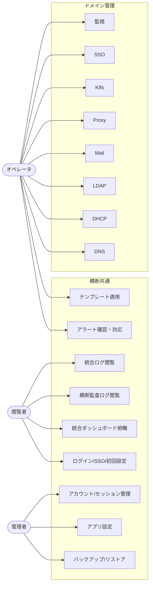

# ユースケース／ユーザーストーリー：Magnetite（統合再設計版）

| 項目 | 内容 |
|---|---|
| ドキュメントバージョン | 0.1（ドラフト） |
| 最終更新日 | 2026-07-05 |
| ステータス | ドラフト |

## 1. アクター一覧

| アクター | ロール | 説明 |
|---|---|---|
| 管理者（Admin） | Admin | 全権限。ドメイン制御・バックアップ/リストア・アプリ設定・アカウント/セッション管理を行う。 |
| オペレータ（Operator） | Operator | ドメインデータの閲覧＋作成/更新/削除、アラート対応・定型操作を行う。 |
| 閲覧者（Viewer） | Viewer | ダッシュボード・一覧・ログ・監査の閲覧のみ。 |
| SSO プロバイダ | 外部システム | OIDC によるログイン連携先（任意）。 |

> ロールは統一 RBAC（F-02）で全機能に適用される。以降の US は「最小ロール」を明記する。

## 2. ユースケース図

## 3. ユーザーストーリー

各ストーリーは「誰が・何を・なぜ」で記述し、関連機能 ID と最小ロール、AC の紐付けを併記する。

### 横断共通機能

#### US-01：SSO でログインする
> **利用者** として、**SSO（OIDC）で一度ログイン** したい。なぜなら **各ドメインで再ログインせず全機能に到達** したいからだ。
- 関連機能: F-01 / 最小ロール: 認証前 / AC: → AC-01

#### US-02：ローカルアカウントでログインする
> **利用者** として、**SSO 未導入でもローカルアカウントでログイン** したい。なぜなら **SSO 基盤がない環境でも運用を始めたい** からだ。
- 関連機能: F-01 / 最小ロール: 認証前 / AC: → AC-02

#### US-03：初回セットアップで初期管理者を作成する
> **導入担当** として、**初回起動時に初期 Admin アカウントを作成** したい。なぜなら **安全に運用を開始する起点が必要** だからだ。
- 関連機能: F-01 / 最小ロール: 初回のみ / AC: → AC-03

#### US-04：ロールに応じて操作を制限する
> **管理者** として、**ロール（Viewer/Operator/Admin）で操作可否を統一制御** したい。なぜなら **権限の一貫性と安全性を担保** したいからだ。
- 関連機能: F-02 / 最小ロール: Admin（付与）/ AC: → AC-04

#### US-05：アカウントとセッションを管理する
> **管理者** として、**ローカルアカウントの作成/削除とアクティブセッションの失効** をしたい。なぜなら **不正・退職者のアクセスを即時に断ちたい** からだ。
- 関連機能: F-10 / 最小ロール: Admin / AC: → AC-05

#### US-06：統合ダッシュボードで全体を俯瞰する
> **利用者** として、**全 8 ドメインの稼働状況・主要指標を 1 画面で確認** したい。なぜなら **障害や異常を素早く把握** したいからだ。
- 関連機能: F-03 / 最小ロール: Viewer / AC: → AC-06

#### US-07：横断監査ログで操作履歴を追う
> **監査担当** として、**全ドメインの操作履歴を統一形式で検索・閲覧** したい。なぜなら **「誰が・いつ・何をしたか」を一元的に追跡** したいからだ。
- 関連機能: F-04 / 最小ロール: Viewer / AC: → AC-07

#### US-08：アラートを確認して対応する
> **オペレータ** として、**横断的にアラートを一覧し、確認応答・解決** したい。なぜなら **ドメインを横断して障害対応を回したい** からだ。
- 関連機能: F-05 / 最小ロール: Operator / AC: → AC-08

#### US-09：構成をバックアップ・リストアする
> **管理者** として、**対応ドメインの構成をバックアップし、必要時にリストア** したい。なぜなら **設定破損や誤操作から復旧** したいからだ。
- 関連機能: F-06 / 最小ロール: Admin / AC: → AC-09

#### US-10：テンプレートで定型設定を一括適用する
> **オペレータ** として、**登録済みテンプレートから定型設定を一括適用** したい。なぜなら **繰り返し設定の手間とミスを削減** したいからだ。
- 関連機能: F-07 / 最小ロール: Operator / AC: → AC-10

#### US-11：統合ログビューアでログを確認する
> **利用者** として、**各ドメインの動作/クエリ/アクセスログを統一ビューアで確認** したい。なぜなら **問題調査をツールを切り替えずに行いたい** からだ。
- 関連機能: F-08 / 最小ロール: Viewer / AC: → AC-11

#### US-12：言語・テーマ・接続設定を変更する
> **利用者/管理者** として、**言語(ja/en)・テーマ(dark/light)・システム設定を変更** したい。なぜなら **各自の環境と好みに合わせて使いたい** からだ。
- 関連機能: F-09 / 最小ロール: Viewer（言語/テーマ）／Admin（システム設定）/ AC: → AC-12

### ドメイン管理機能

> 各ドメインは共通の CRUD パターン（一覧/作成/更新/削除/確認）＋固有操作で構成される。最小ロールは参照=Viewer、更新=Operator、破壊的/制御=Admin を基本とする。

#### US-13：DNS を管理する
> **オペレータ** として、**ゾーン/レコードの CRUD、テンプレート適用、RPZ 設定、クエリログ/テスト、バックアップ** を行いたい。なぜなら **名前解決基盤を安全に運用** したいからだ。
- 関連機能: F-11 / AC: → AC-13

#### US-14：DHCP を管理する
> **オペレータ** として、**プール/予約の CRUD、リース閲覧・解放、設定変更** を行いたい。なぜなら **アドレス割当を的確に管理** したいからだ。
- 関連機能: F-12 / AC: → AC-14

#### US-15：ディレクトリ(LDAP) を管理する
> **オペレータ** として、**ユーザ/グループ/OU の CRUD、ツリー閲覧、ACL、LDIF 入出力、変更履歴確認** を行いたい。なぜなら **組織のディレクトリを正確に維持** したいからだ。
- 関連機能: F-13 / AC: → AC-15

#### US-16：Mail を管理する
> **オペレータ** として、**メールユーザ/ドメイン/エイリアス/メーリングリストの CRUD、プロトコル/サーバ設定** を行いたい。なぜなら **メール基盤を統合管理** したいからだ。
- 関連機能: F-14 / AC: → AC-16

#### US-17：Proxy を管理する
> **オペレータ** として、**仮想ホスト/証明書/ACL ルール/IP ブロックの CRUD、アクセスログ・ヘルス確認** を行いたい。なぜなら **公開経路を安全に制御** したいからだ。
- 関連機能: F-15 / AC: → AC-17

#### US-18：コンテナ/K8s を管理する
> **オペレータ** として、**ホスト/クラスタ/アラートルール/バックアップ/テンプレートの管理** を行いたい。なぜなら **コンテナ基盤を一元運用** したいからだ。
- 関連機能: F-16 / AC: → AC-18

#### US-19：SSO/認証プロバイダを管理する
> **管理者** として、**SSO プロバイダ/クライアント/セッションの管理** を行いたい。なぜなら **統一認証基盤の管理面を運用** したいからだ。
- 関連機能: F-17 / AC: → AC-19

#### US-20：サーバ監視(Watch) を管理する
> **オペレータ** として、**監視ホスト/アラート/監視ルール/グループ/メンテナンス窓の管理とメトリクス閲覧** を行いたい。なぜなら **障害の予兆を捉え未然に対応** したいからだ。
- 関連機能: F-18 / AC: → AC-20

## 4. ユースケース詳細（構造を左右する代表フローのみ）

### UC-01：SSO ログイン（OAuth 2.0 Authorization Code + PKCE）

| 項目 | 内容 |
|---|---|
| 概要 | 利用者を外部 SSO で認証し、Magnetite のセッションを確立する。 |
| 事前条件 | `SSO` 接続が設定済み。利用者は未認証。 |
| 基本フロー | 1. ログイン画面で「SSO でログイン」→ 2. PKCE/state 生成し SSO 認可へリダイレクト → 3. SSO で認証 → 4. コールバックで state 検証・トークン交換・UserInfo 取得 → 5. ロール判定（groups/roles クレーム）→ 6. セッション作成・Cookie 設定 → 7. ダッシュボードへ。 |
| 代替フロー | state 不一致/トークン失敗 → エラー表示しログイン画面へ。SSO 未設定 → ローカルログインのみ表示。 |
| 事後条件 | 有効セッションが存在し、RBAC ロールが確定している。 |

### UC-02：横断的な破壊的操作の認可（削除/制御）

| 項目 | 内容 |
|---|---|
| 概要 | 削除・サービス制御など破壊的操作を統一 RBAC と確認ダイアログで保護する。 |
| 事前条件 | 認証済みセッション。対象操作の最小ロールが定義済み。 |
| 基本フロー | 1. 操作要求 → 2. ロール判定（更新=Operator/破壊的=Admin）→ 3. 確認ダイアログ提示 → 4. 承認 → 5. 実行 → 6. 横断監査ログ記録 → 7. トースト通知。 |
| 代替フロー | ロール不足 → 操作ボタン非活性＋権限エラー。キャンセル → 何もしない。 |
| 事後条件 | 操作が反映され、監査ログに記録されている。 |
