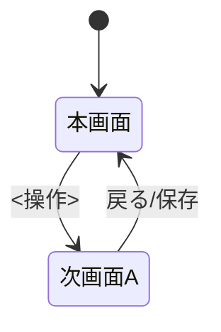

# 画面仕様：<画面名>（画面ID: S-01）

> この画面ごとにファイルをコピーして使用する（例: `screen_task_list.md`）。

| 項目 | 内容 |
|---|---|
| 画面ID | S-01 |
| 画面名 | <画面名> |
| 関連ユースケース | UC-01 / US-01 |
| 概要 | <この画面の目的を一文で> |

## 1. レイアウト（ワイヤーフレーム）

実物の精緻さより「何がどこにあるか」を優先する。ASCII か mermaid で記述する。

```
┌─────────────────────────────┐
│ [ロゴ]            検索🔍 [≡] │  ← ヘッダー
├─────────────────────────────┤
│  <コンテンツ領域>            │
│                              │
│                  [＋ 追加]   │  ← 主要アクション
└─────────────────────────────┘
```

## 2. 画面部品一覧

| 部品ID | 部品名 | 種別 | 初期表示 | 備考 |
|---|---|---|---|---|
| C-01 | 追加ボタン | ボタン | 常時表示 | 主要アクション |
| C-02 | 一覧リスト | リスト | データに依存 | 1件ずつ行で表示 |

## 3. 状態(State)ごとの表示 ※必ず全て埋める

UI仕様で最も漏れやすい箇所。各状態の表示を明記する。

| 状態 | 発生条件 | 表示内容 |
|---|---|---|
| 初期/空(Empty) | データ0件 | 「<空メッセージ文言>」と追加ボタンを表示 |
| 読み込み中(Loading) | データ取得中 | スケルトン／スピナーを表示 |
| 正常(Success) | データあり | 一覧を表示 |
| エラー(Error) | 取得失敗 | 「<エラー文言>」と再試行ボタンを表示 |
| 検証エラー(Validation) | 入力不正 | 該当フィールドにメッセージを表示 |

## 4. イベント定義（トリガー → 条件 → 結果）

E2Eテスト（全イベント網羅）の根拠となる。すべての操作を列挙する。

| # | 部品 | イベント | 事前条件 | 動作・結果 |
|---|---|---|---|---|
| E-01 | 追加ボタン | クリック | - | 追加画面/ダイアログを開く |
| E-02 | 保存ボタン | クリック | 名前未入力 | 「名前は必須です」を表示し、保存しない |
| E-03 | 保存ボタン | クリック | 入力済み | 保存し一覧へ戻る。トースト「保存しました」を表示 |

## 5. 入力検証ルール（入力項目がある場合）

| 項目 | 必須 | 制約 | エラー文言 |
|---|---|---|---|
| 名前 | 必須 | 1〜50文字 | 「名前は1〜50文字で入力してください」 |

## 6. 画面遷移



## 7. 補足（任意）

- アクセシビリティ: <キーボード操作、フォーカス順、コントラスト等>
- レスポンシブ: <最小画面幅、折り返し挙動>
