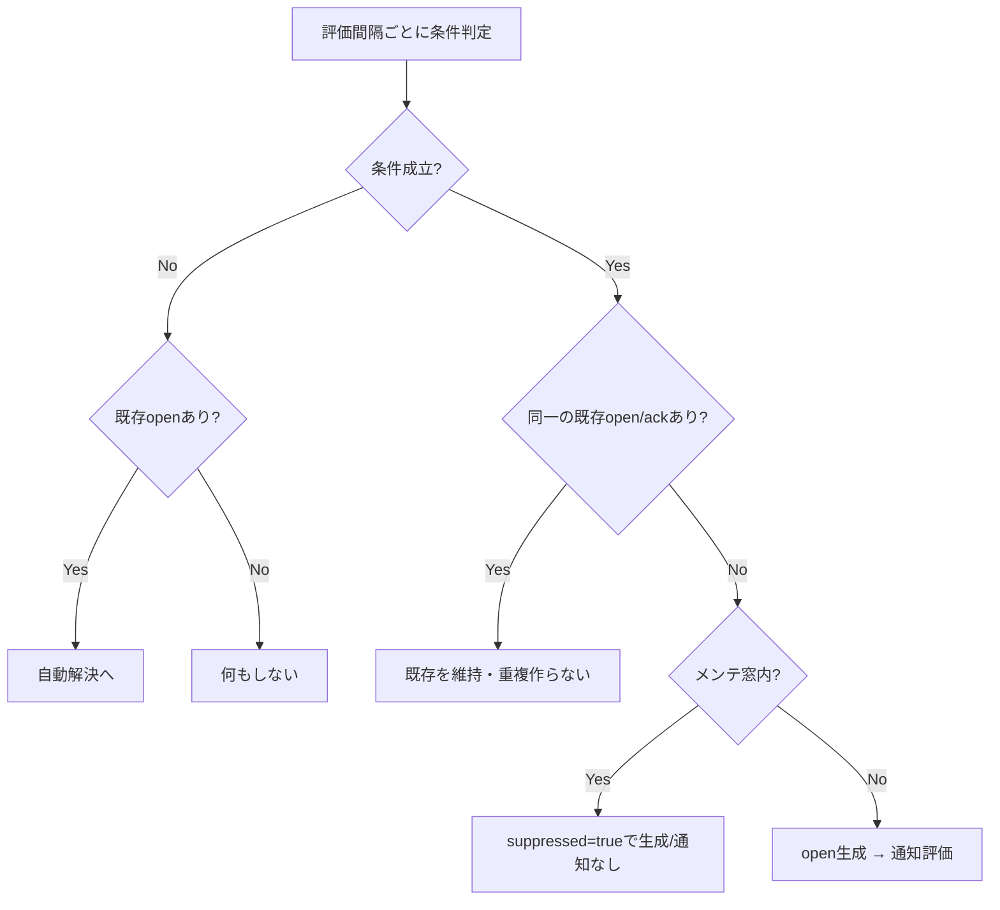
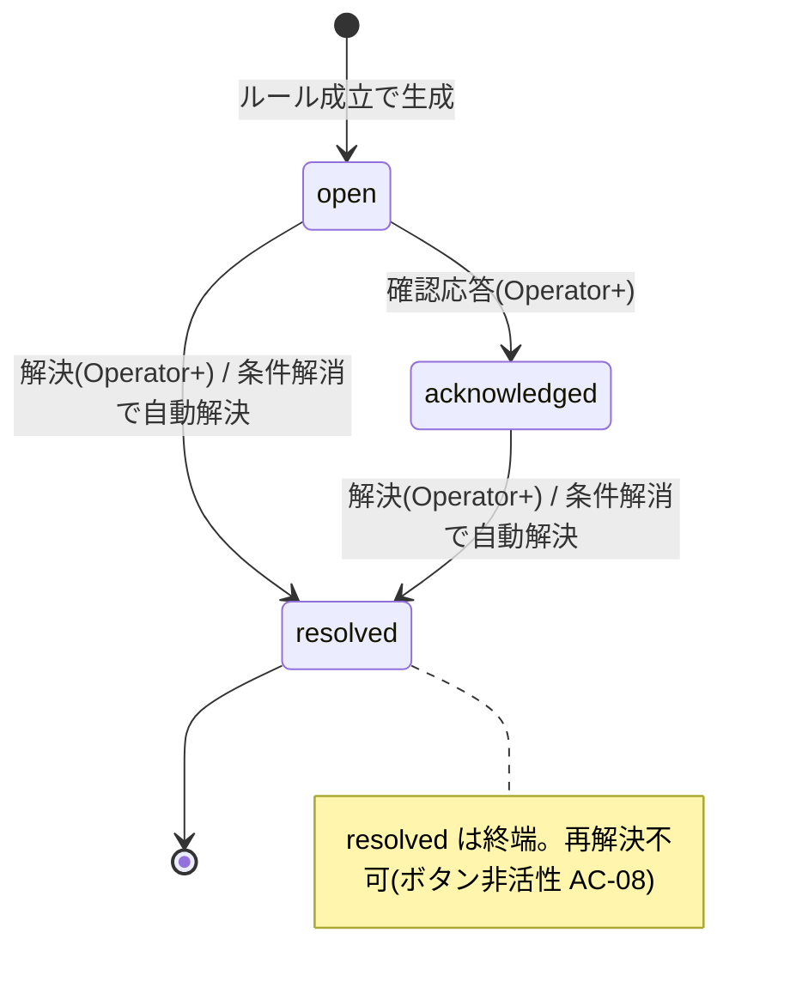
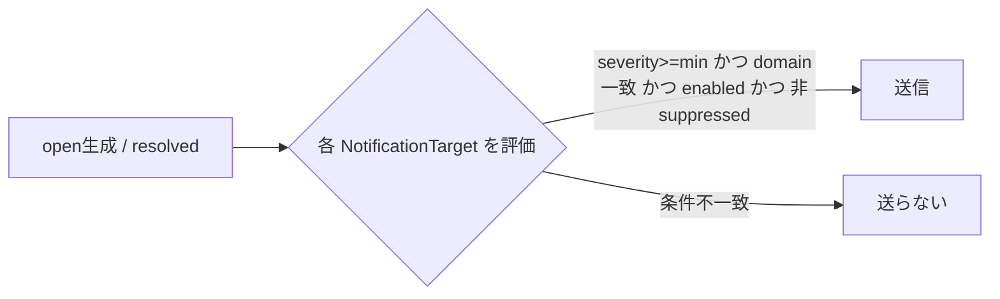

# ドメインロジック：アラート・ライフサイクルとルール評価

| 項目 | 内容 |
|---|---|
| ドキュメントバージョン | 0.1（ドラフト） |
| 最終更新日 | 2026-07-05 |
| 関連 | F-05, F-18, F-16 / AC-08, AC-20, AC-18 / 07 §3.3 Alert・§3.4 NotificationTarget |

> 本書はアラートの**生成・状態遷移・抑止・通知**の解釈/実行ルールを定義する（データは 07）。Watch/K8s 等が生成し、横断アラート（S-Alerts）が一元管理する統合基盤の中核。

## 1. 構成要素と責務

| 要素 | 責務 | 定義 |
|---|---|---|
| ルール（MonitorRule / AlertRule） | 条件判定してアラートを**生成**する側 | 07_data_watch / 07_data_k8s |
| Alert | 生成された事象。状態を持つ | 07 §3.3 |
| MaintenanceWindow | 期間内の対象のアラートを**抑止** | 07_data_watch |
| NotificationTarget | 状態変化を外部へ**通知** | 07 §3.4 |

## 2. ルール評価 → 生成

### 2.1 評価サイクルと評価源
アラートの生成源は「メトリクス型ルール」だけではない。次の**評価源**を横断で扱う（すべて 08_alerting の状態機械・dedup・抑止・通知に載る）。

| 評価源 | 生成契機 | 生成主体 |
|---|---|---|
| メトリクス型ルール（Watch `MonitorRule`） | `メトリクス 比較演算子 閾値` の成立（`for` 継続条件はルール定義） | 監視ルール評価タスク（09 §1） |
| ドメインアラートルール（K8s `AlertRule`） | ルールの条件成立（Host/Cluster 対象） | 監視ルール評価タスク（09 §1） |
| **証明書期限**（Proxy `Certificate.not_after`） | `not_after - 現在時刻 <= 期限接近しきい値`（`policy`）で warning、超過で critical | 時刻到達の掃引タスク（09 §1） |
| その他の時刻/状態到達 | デーモン health 異常など | health/reconcile（09 §4） |

- メトリクス型は最新値を判定。成立で **Alert を open として生成**（重大度 = ルール/評価源の `severity`）。
- 非メトリクス型（証明書期限等）は `rule_ref` を持たない場合がある（§2.2 の dedup キー参照）。

### 2.2 重複抑制（dedup）
- dedup キーは `(domain, rule_ref, source_ref)`。この組で **open/acknowledged のアラートが既に存在するなら新規生成しない**（重複を作らず既存を維持）。
- `rule_ref` が無い評価源（証明書期限等）は `(domain, source_ref)` を、`source_ref` も無い場合は `(domain, summary)` を**代替 dedup キー**とする。いずれのキーも決められない事象は生成しない（無限生成を防ぐ）。
- 条件が解消したら §3 の自動解決へ。

### 2.3 抑止（メンテナンス窓）
- 生成時点で対象が有効な MaintenanceWindow に含まれる場合、Alert は `suppressed=true` で生成/更新し、**通知を送らない**。UI は `メンテナンス中` バッジ（AC-20）。
- 窓終了後、条件が継続していれば `suppressed=false` に戻し通常フローへ。

## 3. 状態遷移（ライフサイクル）

> **`suppressed` は状態と直交する抑止フラグ**（open/acknowledged/resolved のいずれとも独立）。抑止中でも ack/resolve 操作自体は可能で、**通知のみ**を抑止する（§4）。抑止中に resolved 終端へ達した場合も回復通知は送らない（§4 の非 suppressed 条件による）。

| 遷移 | 契機 | 記録 |
|---|---|---|
| →open | ルール成立（§2） | 生成、通知評価 |
| open→acknowledged | 手動 acknowledge（Operator 以上） | `acknowledged_by/at`、監査記録（AC-08） |
| open/ack→resolved（手動） | 手動 resolve | `resolved_by/at`、監査記録 |
| open/ack→resolved（自動） | 条件解消を評価が検知 | `resolved_by=system`、通知評価 |
| resolved→（再解決） | — | **不可**（ボタン非活性 AC-08） |

- 一括操作：選択アラートへ ack/resolve をまとめて適用（結果件数を提示、AC-08 E-04）。権限は Operator 以上（08_authz Write）。

## 4. 通知（NotificationTarget）

- 通知契機：**open 生成時**、および **resolved 遷移時**（回復通知）。ack は既定で通知しない（設定可を残課題）。
- 送信条件：`Alert.severity >= target.min_severity` かつ（`target.domains` 空 or 対象ドメインを含む）かつ `target.enabled` かつ `Alert.suppressed=false`。
- 配送：Webhook 等へ送信。失敗時は再試行方針（回数/間隔は実装、残課題）。送達可否は運用ログ（LogEntry）へ。
- 機微値はペイロードに含めない。

## 5. エンジン固定 vs 委任の境界

- **エンジン固定**：状態機械（open/ack/resolved と終端）、dedup キー `(domain,rule_ref,source_ref)`、抑止の意味論、通知の送信条件式。
- **委任（データ/設定）**：ルールの条件・閾値・評価間隔・重大度（各ドメインが定義）、通知先・最小重大度・対象ドメイン、メンテナンス窓の対象/期間。
- **最小接続点**：Alert は必ず `domain` と（生成元があるなら）`rule_ref` を持つ（07 §3.3）。これによりドメインを跨いで一元管理できる。

## 6. 実行時エラー・エッジケース

| ケース | 挙動 |
|---|---|
| ルール削除後に残る open アラート | `rule_ref` を保持したまま存続。以後の自動解決は行わず、手動 resolve 可（07 §5.2） |
| 評価が一時的にメトリクス取得不能 | アラート生成せず、対象を Unknown 扱い（DomainStatus）。継続不能は別途 warning ルールで検知可 |
| メンテナンス窓の途中終了/延長 | 次評価で `suppressed` を再計算 |
| 通知先が全て無効/未設定 | アラートは生成/遷移するが通知は行われない（UI では確認可能） |

## 7. 未確定（実装フェーズ送り）
- 通知の再試行回数/間隔、ack 通知の要否。
- ルールの `for`（継続時間）条件の粒度、フラッピング抑制。
- 重大度の自動エスカレーション（open 長期化で昇格）の要否。
