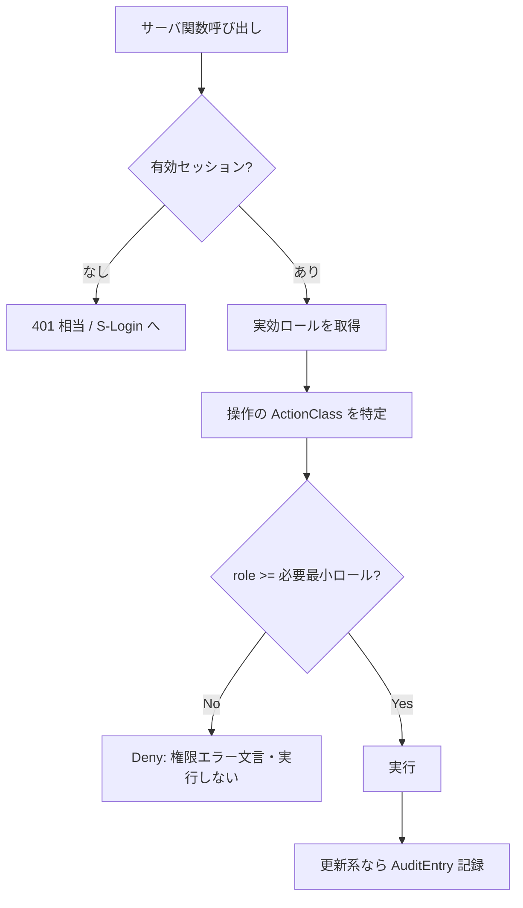

# ドメインロジック：統一認可（RBAC 解決）

| 項目 | 内容 |
|---|---|
| ドキュメントバージョン | 0.1（ドラフト） |
| 最終更新日 | 2026-07-05 |
| 関連 | F-01, F-02 / AC-01〜05 / 07 §3.7-3.9（LocalAccount/Session/Role） |

> 本書は「**誰が何をできるか**」の解釈・決定ルールを定義する（データは 07）。実装手段は書かない。全ドメイン・全横断機能に一様に適用される、統合プラットフォームの認可エンジン。

## 1. 原則

- **認証と認可を分離**：認証＝本人確認（ローカル/SSO、S-Login）。認可＝操作可否（本書）。
- **単一の実効ロール**：セッションは唯一の `Role`（Viewer < Operator < Admin）を持つ。ロールは順序づけられ、上位は下位を包含する。
- **default deny**：一致する許可がなければ拒否。
- **サーバ側で必ず判定**：UIの非活性化は補助であり、サーバ関数側で再判定する（ブラウザ改ざん耐性）。

## 2. 認可の入力と決定

認可判定は次の3つ組から `Allow`/`Deny` を返す。

```
decide(role: Role, action: ActionClass, scope: Scope) -> Decision
```

| 要素 | 値 | 説明 |
|---|---|---|
| `role` | Viewer / Operator / Admin | セッションの実効ロール |
| `action` | Read / Write / Destroy / Control / Admin | 操作の分類（§3） |
| `scope` | domain or portal | 対象（ドメイン管理 or ポータル管理） |

### 2.1 操作分類 → 必要最小ロール（確定）

| ActionClass | 内容 | 必要最小ロール |
|---|---|---|
| Read | 一覧/詳細/ログ/監査/ダッシュボードの閲覧 | **Viewer** |
| Write | 作成/更新/削除（通常データ）、アラート確認/解決、リース解放、テンプレート適用 | **Operator** |
| Destroy | 破壊的な一括操作（一括削除・カスケード削除） | **Admin** |
| Control | サービス/ドメイン制御、設定変更、設定リロード | **Admin** |
| Admin | アカウント/セッション管理、バックアップ作成/リストア、SSO プロバイダ/クライアント設定 | **Admin** |

> 「削除」は通常 Operator だが、参照を持つ対象のカスケード削除・全体一括は Destroy=Admin とする（各画面/AC の権限節が最終）。判定は「対象操作に付与された ActionClass」を用いる。

### 2.2 決定表

| role \ action | Read | Write | Destroy | Control | Admin |
|---|---|---|---|---|---|
| Viewer | Allow | Deny | Deny | Deny | Deny |
| Operator | Allow | Allow | Deny | Deny | Deny |
| Admin | Allow | Allow | Allow | Allow | Allow |

- Deny 時の表示：ボタンは非活性、直接要求されたら `この操作を行う権限がありません。`（AC-04）を返し実行しない。

## 3. 判定フロー



- Read でも**有効セッション必須**（未認証は全拒否）。
- 更新系（Write/Destroy/Control/Admin）成功時は必ず `AuditEntry` を残す（07 §3.2）。

## 4. ロール決定（認証経路別）

### 4.1 ローカル認証
- `LocalAccount.role` をそのままセッションの実効ロールにする。

### 4.2 SSO 認証（OIDC）— ロールクレーム写像
- OIDC の `groups` / `roles` クレームを**写像規則**で `Role` に変換する。
- 写像規則（設定 `AppConfig.sso` で定義）：クレーム値 → Role のマップ。例：`magnetite-admins→Admin`, `magnetite-operators→Operator`, それ以外/未一致→**Viewer（最小権限）**。
- 複数一致時は**最上位ロールを採用**。
- クレームが取得できない場合は Viewer にフォールバック（昇格しない）。

```mermaid
flowchart LR
    Claims[OIDC groups/roles] --> Map[写像規則(設定)]
    Map -->|複数一致| Max[最上位を採用]
    Map -->|未一致/欠如| V[Viewer]
    Max --> Role
    V --> Role
```

## 5. エンジン固定 vs 委任の境界

- **エンジン固定**：ロール順序（Viewer<Operator<Admin）、default deny、ActionClass→最小ロールの決定表、未認証全拒否。
- **委任（設定）**：SSO クレーム→ロールの写像規則、パスワードポリシー。
- **持たない**：きめ細かなドメイン別/リソース別 ACL（Magnetite の RBAC は3段に固定。LDAP 内部の ACL は別物＝08_ldap_logic）。

## 6. 実行時エラー・エッジケース

> セッションの**有効性判定・失効・期限・SSOトークン**の実行意味論は **09 §6.5** に定義する（本書はロール解決＝認可を担い、失効判定の受け皿は 09）。ロール変更は次リクエストで即時反映（09 §6.5 有効性判定 4.）。

| ケース | 挙動 |
|---|---|
| セッション失効直後の操作 | 次リクエストで無効化→再認証要求（AC-05） |
| ロール変更直後 | 以後のリクエストから新ロールで判定（既存セッションに即時反映） |
| 最後の Admin の降格/削除 | 拒否 `最後の管理者アカウントは削除できません。`（AC-05）。降格も同様にガード |
| SSO 写像で誰も Admin にならない構成 | ローカル Admin を併用（ブートストラップは初回セットアップ AC-03） |

## 7. 未確定（実装フェーズ送り）
- リソース単位の閲覧制限（特定ドメインのみ許可 等）を将来入れるか（現状はドメイン有効化で代替、§5 の通り RBAC は3段固定）。
- SSO 写像規則の設定UI（S-Settings への追加）詳細。
- 連続失敗ロック/レート制限（05 §5 と連動）。
