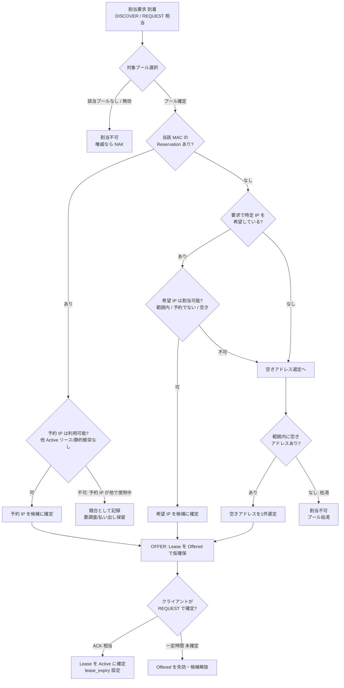
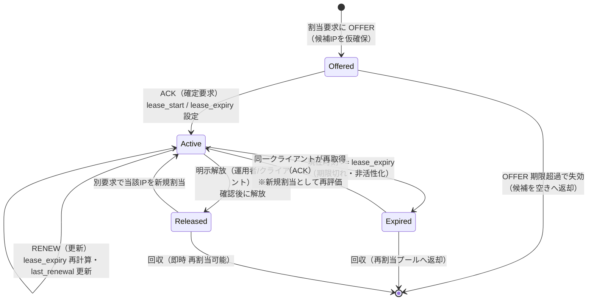
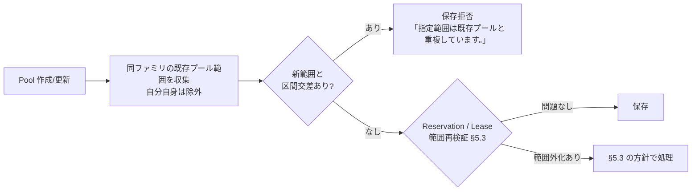

# DHCP ドメイン・ロジック仕様（Magnetite 統合再設計版）

| 項目 | 内容 |
|---|---|
| ドキュメントバージョン | 0.1（ドラフト） |
| 最終更新日 | 2026-07-05 |
| ステータス | ドラフト |
| データ定義 | [07_data_dhcp.md](07_data_dhcp.md)（Pool / Reservation / Lease / DhcpConfig の**フィールド**） |
| データ・ハブ | [07_data_model.md](07_data_model.md)（共通フィールド・横断共有・参照マップ） |
| 受け入れ基準 | [04_acceptance_criteria.md](04_acceptance_criteria.md)（**AC-14**：DHCP 固有） |

> 本書は DHCP ドメインの**解釈・実行ルール**（アドレス割当アルゴリズム、リースの状態遷移、期限判定、制約検証の判定手順）を定義する。
> **データの中身（何を持つか）は 07_data_dhcp.md**、**実行系一般（永続化方式・トランザクション・スケジューラの実装）は 09_runtime_spec** に分離し、本書では再定義しない。
> 記述は **What / Why**（何をどう判定・実行するか、なぜそうなるか）に限る。実装フレームワーク名・関数名・API パス・クレート名は書かない。
> 確定方針：**完全統合モノリス／単一組込みDBが唯一の正／統一認証・RBAC／マルチテナント無し（tenant フィールドなし）**。

---

## 0. 方針（確定）

- **エンジン固定 vs 委任の境界**：アドレス割当・空きアドレス選定・リース期限計算・状態遷移は**エンジン固定**（ユーザー定義の式やスクリプトに委任しない）。運用者が制御できるのは**データ（Pool / Reservation / DhcpConfig）の値**のみであり、アルゴリズムそのものは変更対象外とする。
  - 理由：DHCP はプロトコル準拠が要求される決定論的処理であり、割当規則を委任すると競合検出・一意性保証・監査可能性が壊れるため。
- **単一の権威**：本ドメインのプール・予約・リース・設定はすべて単一組込みDBを唯一の正とする。外部 DHCP プロセスや別ストアと二重管理しない。
- **判定の基準時刻**：期限切れ・有効性の判定はすべて **UTC の現在時刻**を基準に行う（`lease_expiry` と現在時刻の比較）。ローカルタイムでは判定しない。
- **アドレスファミリの独立**：IPv4 と IPv6 は**別系統**として扱う。範囲重複判定・空き選定・一意性はすべて同一アドレスファミリ内で完結し、v4 と v6 を跨いだ比較は行わない。
- **RBAC の前提**：参照系（統計・一覧の閲覧）は認証済みユーザー、作成/更新/削除および**リース解放は Operator 以上**、破壊的な一括操作・設定変更は Admin を必須とする（AC-04 / AC-CRUD 準拠）。本書のロジックは認可通過後に実行されることを前提とする。

---

## 1. 用語

| 用語 | 意味 |
|---|---|
| 割当要求 | クライアントからのアドレス要求。プロトコル上の DISCOVER（探索）／REQUEST（確定要求）に相当する論理イベント |
| OFFER | サーバーが候補アドレスを一時提示する応答。リースを `Offered` 状態で仮確保する |
| ACK | サーバーが割当を確定する応答。リースを `Active` 状態に遷移させる |
| NAK | サーバーが要求を拒否する応答（要求 IP が不正・範囲外・競合など） |
| 予約（Reservation） | 特定 MAC に IP を固定紐付けする静的割当。動的プールより優先される |
| 動的割当 | プールの配布範囲から空きアドレスを選んで払い出す通常割当 |
| リース有効 | `state = Active` かつ 現在時刻 `< lease_expiry` の状態 |
| 期限切れ | `lease_expiry` を現在時刻が経過し、非活性化した状態（`Expired`） |
| 権威（authoritative） | 当サーバーが対象サブネットの正式な管理主体であること。NAK を返してよいかに影響（`DhcpConfig.authoritative`） |

---

## 2. アドレス割当アルゴリズム

### 2.1 全体フロー（要求 → OFFER → ACK）

### 2.2 プール選択

割当要求に対し、まず払い出し元プールを 1 件確定する。

1. **アドレスファミリの決定**：要求のプロトコル（v4 / v6）に一致する範囲を持つプールのみを候補にする。`DhcpConfig.v4_enabled` / `v6_enabled` が無効なファミリの要求は割当対象外とする。
2. **有効プールへの限定**：`Pool.enabled = false` のプールは**新規払い出しの対象から除外**する（既存リースは §5 の扱いに従う）。
3. **範囲適合**：要求のネットワーク文脈（サブネット・要求 IP があればその所属）に合致するプールを選ぶ。合致プールが複数になる状況は制約 §4.1（Pool ↔ Pool 範囲重複禁止）により発生しない設計であり、正しく制約が守られていれば適合プールは高々 1 件に定まる。
4. 適合プールが無い、または全て無効の場合は**割当不可**。`authoritative = true` のときのみ拒否応答（NAK 相当）を返してよい。非権威なら黙って応答しない（他サーバーに委ねる）。

### 2.3 予約（Reservation）の優先

プール確定後、動的割当より**予約を必ず優先**する。

- 要求元 MAC に一致する `Reservation`（当該プール内、MAC は正規化 `aa:bb:cc:dd:ee:ff` で照合）が存在する場合、その `ip_address` を**唯一の割当候補**とする。動的な空き選定は行わない。
- 理由：予約は「この MAC には常にこの IP」という運用者の明示的意図であり、これを破って動的アドレスを割り当てると固定割当の意味が失われるため。
- 予約 IP が §2.5 の競合検出に抵触する場合（例：同 IP が別クライアントの Active リースで使用中）は、動的アドレスへフォールバックせず、**競合として扱い払い出しを保留**する。予約は本来その IP を占有する権利を持つため、勝手に別 IP を与えない。競合の解消は運用者の是正（衝突リースの解放など）を待つ。

### 2.4 空きアドレス選定（動的割当）

予約が無く、かつ割当可能な希望 IP も無い場合、当該プールの配布範囲から空きアドレスを 1 件選定する。

- **探索範囲**：`range_start_*` 〜 `range_end_*` の閉区間（両端含む）。
- **除外対象**（空きと見なさないアドレス）：
  1. 同一 IP に対し `state = Active` のリースが存在するアドレス（アクティブ占有）。
  2. 予約済み（いずれかの `Reservation.ip_address`）のアドレス — 予約の相手 MAC 以外には払い出さない。
  3. ゲートウェイ（`Pool.gateway`）等、運用上払い出してはならない予約的アドレス。
  4. `state = Offered` で有効期限内の仮確保アドレス（二重 OFFER 防止）。
- **選定方針**：上記を除いた空きから 1 件を選ぶ。同一アドレスの短期間での再割当を避けるため、**直近に解放/失効したアドレスは可能な限り後回しにする**（再利用を最も古いものから行う）ことを推奨する。具体的な選定順序（昇順・最古解放優先など）の確定は §7 実装送り。
- **枯渇時**：空きが 1 件も無ければ割当不可（プール枯渇）。`authoritative` なら NAK 相当を返してよい。

### 2.5 競合検出

候補アドレス（予約由来・希望 IP・動的選定のいずれか）を確定する前に、以下を必ず検査する。1 つでも該当すれば当該候補は割当不可とする。

| 競合種別 | 判定条件 | 扱い |
|---|---|---|
| 既存アクティブリース | 同一 IP に他クライアントの `state = Active` リースが存在 | 割当不可。予約由来なら §2.3 のとおり保留 |
| 静的予約との衝突 | 動的選定した IP が他 MAC の `Reservation.ip_address` と一致 | 割当不可。別の空きを選定 |
| 範囲外 | 候補 IP が当該プールの `range_start_*`〜`range_end_*` の外、またはサブネット外 | 割当不可（NAK 相当）。要求で指定された不正 IP はここで弾く |
| 二重 OFFER | 同一 IP に有効期限内の `Offered` リースが別要求向けに存在 | 割当不可。別候補を選定 |
| ファミリ不一致 | 候補 IP のアドレスファミリが要求プロトコルと不一致 | 割当不可 |

> **アクティブ一意制約**（07 §3）：同一 `ip_address` に対し `state = Active` のリースは同時に 1 件のみ。競合検出はこの不変条件を割当時に保証する手段である。

### 2.6 OFFER → ACK の確定

1. 候補確定後、リースを `Offered` 状態で**仮確保**する（`lease_start` 未確定/暫定、短い仮予約期限を持つ）。これにより同時要求による同一 IP の二重払い出しを防ぐ。
2. クライアントが当該 IP を確定要求（REQUEST 相当）してきたら **ACK**：リースを `Active` に遷移し、`lease_start = 現在時刻`、`lease_expiry = 現在時刻 + 実効リース期間`（§3.1）を設定する。
3. 一定時間内に確定要求が来なければ `Offered` を**失効**させ、候補アドレスを空きへ戻す（他要求へ再提供可能にする）。
4. 確定要求された IP が既に条件を満たさなくなっていた場合（間に別要求が Active 化した等）は再度 §2.5 を評価し、満たせなければ NAK 相当を返す。

---

## 3. リース・ライフサイクル状態機械

### 3.1 実効リース期間の計算

`Active` 化・更新時の `lease_expiry` は以下で決まる。

1. **基本期間**：当該 `Pool.lease_duration_secs` が指定されていればその値。未指定なら `DhcpConfig.default_lease_secs`。
2. **上限クランプ**：`DhcpConfig.max_lease_secs` が設定されていれば、基本期間を上限で切り詰める（`min(基本期間, max_lease_secs)`）。
3. `lease_expiry = 現在時刻(UTC) + 実効期間`。実効期間は必ず `> 0`。

> 期間値そのものはデータ（07）であり、本書は**適用順序（プール優先 → 既定へフォールバック → 上限クランプ）**のみを確定する。

### 3.2 状態遷移図

### 3.3 各状態の意味と遷移規則

| 状態 | 意味 | 主な入口 | 主な出口 |
|---|---|---|---|
| `Offered` | OFFER 済みで未確定の仮確保 | 割当要求への OFFER | ACK で `Active` ／ 仮予約期限超過で失効（消滅） |
| `Active` | 確定・有効（`現在時刻 < lease_expiry`） | ACK ／ RENEW | 期限到来で `Expired` ／ 明示解放で `Released` |
| `Expired` | 期限切れ・**非活性**（占有を主張しない） | `現在時刻 >= lease_expiry` | 同一クライアント再取得で `Active` ／ 回収で消滅 |
| `Released` | 明示解放済み（占有終了） | 運用者/クライアントの解放 | 回収 ／ 別要求による新規 `Active` |

- **更新（RENEW）**：`Active` の間にクライアントが更新要求すると `lease_expiry` を §3.1 で再計算し、`last_renewal = 現在時刻` を更新する。IP・プールは変わらない。状態は `Active` のまま。
- **失効（Expiration）**：`Active` かつ `現在時刻 >= lease_expiry` になった時点で論理的に `Expired`。失効は**時刻到達による受動的遷移**であり、運用者の操作を要さない。失効判定は「読み取り時に評価」か「定期的な回収処理で反映」かの実装選択があり、詳細（回収の周期・遅延許容）は §7 / 09 に送る。ただし**判定基準（`lease_expiry` と UTC 現在時刻の比較）は本書で固定**する。
- **回収（Reclaim）**：`Expired` / `Released` のリースが占有していた IP は、空きアドレスとして再割当プールへ返る。回収後の当該 IP は §2.4 の空き選定対象になる。

---

## 4. リース解放の意味論（AC-14）

### 4.1 明示解放（運用者操作）

- **確認後に解放**：運用者がリース解放を要求した場合、**確認ダイアログ承認後に**当該リースを `Released` に遷移させ、一覧から消える（AC-14）。解放操作は Operator 以上、監査ログに記録する。
- **対象は有効（Active）リースのみ**：解放操作の対象は原則 `Active` リースである。解放により当該 IP の占有が終了し、以後は空きアドレスとして扱える。

### 4.2 期限切れリースは非活性（解放操作の非活性化）

- **既に期限切れ（`Expired`）のリースに対する解放操作は非活性**とする（AC-14）。理由：`Expired` は既に占有を主張していない非活性状態であり、「解放」すべき有効な占有が存在しないため。UI 上は解放ボタンを非活性化し、直接要求されても実行しない。
- 同様に `Released` / `Offered`（未確定）に対する明示解放も意味を持たないため非活性とする。

### 4.3 解放後の再割当可否

| 解放前状態 | 解放後状態 | 当該 IP の再割当 |
|---|---|---|
| `Active`（明示解放） | `Released` | **即時に再割当可能**（回収され空きへ）。予約 IP なら次回も同 MAC に予約優先で戻る |
| `Expired`（自然失効） | `Expired` のまま | 回収され次第 再割当可能。明示解放操作は不要・非活性 |

- 解放/失効した IP を**別クライアントへ再割当**する際も §2.5 の競合検出を通す。予約対象 IP は解放後も予約が残る限り予約優先の対象であり続ける（動的に別 MAC へ払い出さない）。

---

## 5. 制約検証

作成・更新時にエンジンが固定で行う検証。違反時は保存せず、確定文言があればそれを提示する（AC-14）。

### 5.1 Pool ↔ Pool アドレス範囲重複禁止（AC-14）

- **規則**：プールの新規作成・更新時、指定した配布範囲（`range_start_*`〜`range_end_*` / `subnet_*`）が**既存プールの配布範囲と重複してはならない**。
- **判定**：同一アドレスファミリ内で、新旧の範囲区間が 1 アドレスでも交差すれば重複とみなす（閉区間同士の交差判定）。IPv4 と IPv6 は別系統で個別に判定する。更新時は自分自身を除外して判定する。
- **違反時メッセージ**：`指定範囲は既存プールと重複しています。`（AC-14）を提示し保存しない。
- 理由：範囲が重複すると §2.2 のプール選択が一意に定まらず、同一 IP が複数プールから払い出され競合するため。重複禁止はプール選択の一意性を成立させる前提条件。

### 5.2 Reservation の制約

- **Pool 範囲内**：`Reservation.ip_address` は所属プールのサブネット範囲に収まること（配布レンジ内/外の可否は運用ポリシー、07 §2 準拠）。範囲外の予約は保存拒否。
- **IP 一意**：同一プール内で `ip_address` は一意（同一 IP の二重予約禁止）。かつ他プールの配布範囲・他予約 IP と衝突しないこと。
- **MAC 一意**：同一プール内で `mac_address` は一意（同一 MAC への二重予約禁止）。MAC は `aa:bb:cc:dd:ee:ff` に正規化して比較する（大小文字・区切り差を吸収）。
- `(mac_address, ip_address)` は当該予約の 1:1 主対応。理由：予約は「1 MAC ↔ 1 IP」の固定紐付けであり、多重化すると予約優先（§2.3）が一意に定まらないため。

### 5.3 参照整合（削除・範囲変更）

07 §5.2 の逆引きに従う。

- **プール削除**：配下に `Reservation` または `Active` な `Lease` が存在する場合、削除を**ガード**する（拒否、または確認のうえ扱いを明示）。有効リースを残したままプール定義を消すと払い出し済みアドレスの管理主体が失われるため。削除可否・カスケードの最終挙動は 09 に従う。
- **範囲縮小**：プールのアドレス範囲を縮小し、既存の `Reservation.ip_address` や `Active Lease.ip_address` が範囲外になる変更は、対象を再検証する。**暫定既定：範囲外となる `Active Lease` または `Reservation` が存在する縮小は拒否**（`指定範囲に既存の割当/予約が含まれます。` を表示し保存しない）。許容＋再検証へ緩和するかは 09 の運用ポリシーで確定（本書はいずれの場合も再検証必須を固定）。これにより §2.4/§2.5 の「範囲外＝割当不可」前提が実行時に破れないことを保証する。
- **予約削除**：予約削除後、その固定割当由来だったリースは通常の動的払い出し扱いへ移行する（次回更新以降は動的アドレスとなり得る）。

---

## 6. 設定リロードの反映範囲

`DhcpConfig`・プール定義の変更を反映する際の**影響境界**を定義する。リロードの実装手順（ホットリロードの機構・永続化タイミング）は 09 に送り、本書は「何がいつ効くか」を確定する。

| 変更対象 | 新規払い出しへの反映 | 既存 `Active` リースへの反映 |
|---|---|---|
| `default_lease_secs` / `max_lease_secs` | 以後の ACK / RENEW から新値で期間計算（§3.1） | **遡って短縮/延長しない**。既存 `lease_expiry` は維持。次回 RENEW 時に新値が適用 |
| `Pool.lease_duration_secs` | 以後の当該プール払い出しに反映 | 既存リースの `lease_expiry` は維持。次回 RENEW から反映 |
| `dns_servers` / `gateway` / `domain_name` 等の配布オプション | 以後の OFFER/ACK で新値を配布 | 既存リースへ即時再配布はしない。クライアントの次回更新時に伝播 |
| `Pool.enabled = false` | 当該プールからの**新規払い出しを停止**（§2.2） | 既存 `Active` リースは即時無効化せず、満了まで有効。満了後は再割当されない |
| 範囲変更（`range_*`） | 以後の空き選定は新範囲で行う | 範囲外化した既存リース/予約は §5.3 で再検証 |
| `v4_enabled` / `v6_enabled` の無効化 | 当該ファミリの新規割当を停止 | 既存リースの扱いは 09 の停止ポリシーに従う |

- **原則**：リロードは**以後の割当・更新に対して前向きに効く**。既存の有効リースを遡って改変しない（クライアントとの契約=リースの安定性を保つため）。短縮を強制したい場合は明示解放（§4）で対処する。
- **エンジン固定の範囲**：割当アルゴリズム・状態遷移・期限計算・競合検出はリロード対象外（コードであってデータではない）。リロードで変わるのは**データ（Pool / Reservation / DhcpConfig の値）**のみ。

---

## 7. データモデル・他仕様との対応

| 本書の概念 | 参照先 |
|---|---|
| Pool / Reservation / Lease / DhcpConfig のフィールド | 07_data_dhcp.md §1〜§4 |
| 共通フィールド（id / created_at / updated_at / created_by） | 07_data_model.md §3.1 |
| 監査記録（解放・作成・更新・設定変更） | 07_data_model.md §3.2 AuditEntry（`domain = dhcp`） |
| ダッシュボード統計・使用率・リース件数 | 07_data_model.md §3.11 DomainStatus.metrics（運用状態・永続データではない） |
| 運用/動作ログ | 07_data_model.md §3.12 LogEntry |
| Pool↔Pool 重複・Reservation 制約（AC-14） | 07_data_dhcp.md §5.3、04_acceptance_criteria.md AC-14 |
| 参照整合（削除・範囲変更の逆引き） | 07_data_model.md §5.3、07_data_dhcp.md §5.2 |
| リロード機構・永続化・回収処理の実装 | 09_runtime_spec |
| リース解放の権限（Operator 以上）・画面挙動 | 04 AC-04 / AC-CRUD、screen_dhcp.md |

---

## 8. 未確定（実装フェーズ／後続送り）

- **空きアドレスの選定順序**：昇順スキャン／最古解放優先／ハッシュ分散など具体アルゴリズムの確定（§2.4）。再割当の親和性（同一クライアントへ同一 IP を返す努力）の程度も含む。→ 実装。
- **OFFER 仮予約の保持時間**：`Offered` を失効させるまでの猶予秒数（§2.6）。→ 実装／09。
- **失効の反映方式**：`Expired` への遷移を「読み取り時評価」か「定期回収処理」で行うか、回収の周期・遅延許容（§3.3）。→ 09。
- **プール削除時のカスケード可否**：有効リース/予約を持つプールの削除を全面拒否とするか、確認付きカスケードを許すか（§5.3）。→ 09 の運用ポリシー。
- **範囲縮小で範囲外化する予約/リースの扱い**：拒否 or 許容 + 再検証（§5.3）。→ 09。
- **配布レンジ外の予約 IP を許すか**：サブネット内だが `range_*` 外の予約を認めるか（07 §2 の注記）。→ 運用ポリシー確定。
- **DomainStatus.metrics の具体キー**：使用率・アクティブ数など DHCP 固有指標の項目名（07_data_model.md §6 と整合）。→ 実装／07 仕上げ。
- **リース更新（RENEW）の受理ポリシー**：期限切れ直後（猶予期間）の更新を Active 復帰として扱うか新規割当とするか（§3.2 `Expired → Active`）。→ 09。
