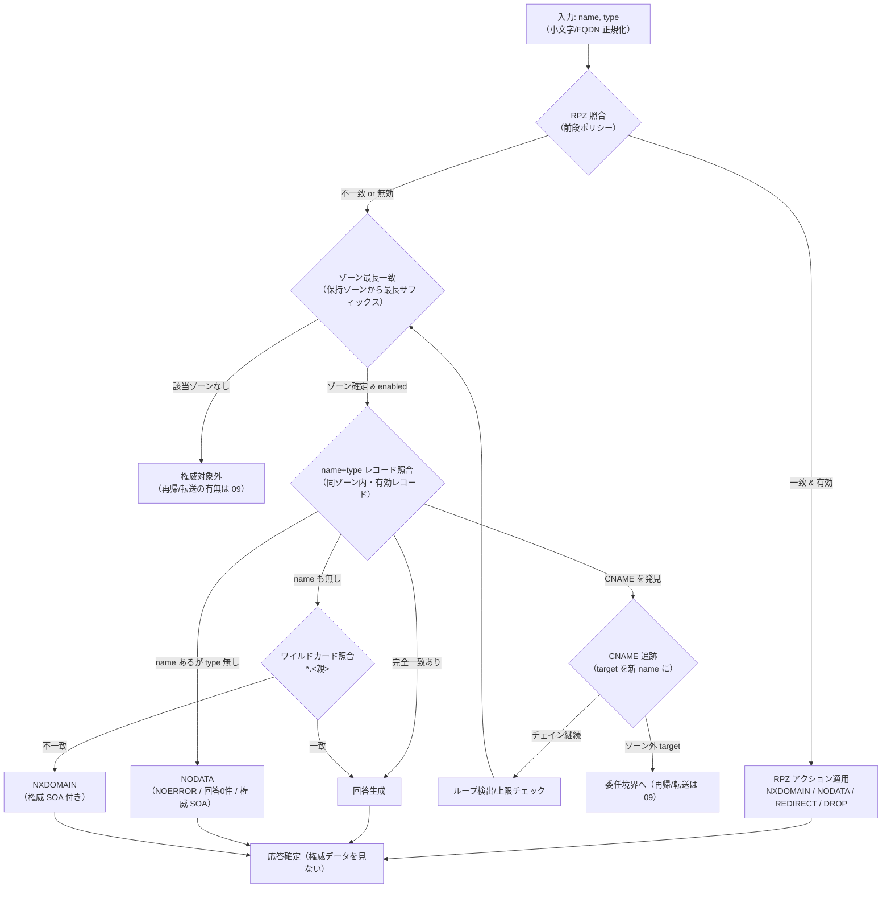
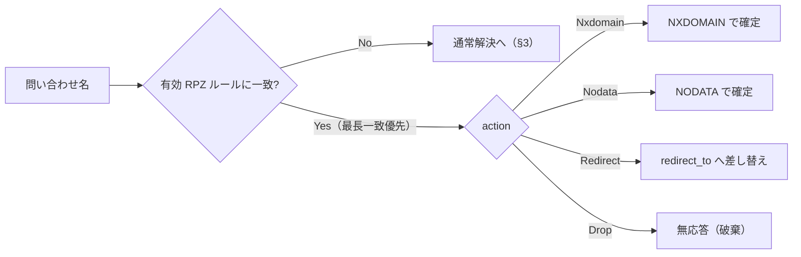
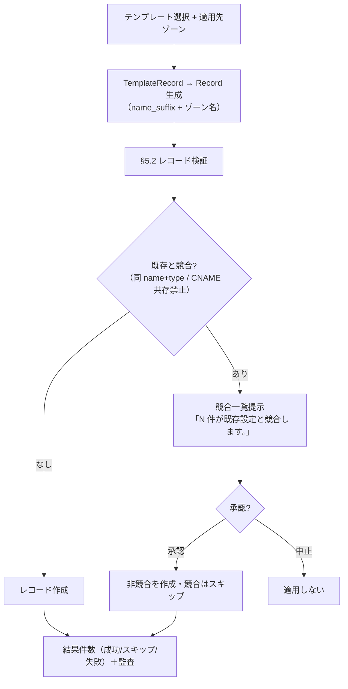

# DNS ドメイン・ロジック仕様（解釈／実行ルール）

| 項目 | 内容 |
|---|---|
| ドキュメントバージョン | 0.1（ドラフト） |
| 最終更新日 | 2026-07-05 |
| ステータス | ドラフト |
| 親ドキュメント | 07_data_model.md（§3 共有構造）／07_data_dns.md（DNS 固有データ定義） |
| 対応 AC | AC-13（DNS 固有）、AC-CRUD、AC-10（テンプレート適用）、AC-09（バックアップ） |

> 本書は DNS ドメインの**解釈・実行ルール（意味論）**を定義する。「何を持つか（データ定義）」は **07_data_dns.md** にあり、本書では**再定義しない**（参照のみ）。
> 本書は「**規則・判定・順序**」を扱い、**実装フレームワーク名・関数名・実デーモン連携（bind 等）は書かない**。それらは 09_runtime_spec 送り（§9 参照）。
> 確定方針（2026-07-05）：完全統合モノリス／単一組込みDBが唯一の正／統一認証・RBAC／`tenant` フィールドなし。

---

## 0. 方針（確定）

| 論点 | 確定 |
|---|---|
| エンジン固定 vs 委任の境界 | クエリ解決の意味論（ゾーン一致・レコード照合・CNAME 追跡・RPZ 適用）は**エンジン固定**（ユーザー定義式には委任しない）。利用者が構成できるのは**データ（Zone/Record/RpzRule）だけ**であり、解決アルゴリズム自体は変更不可とする。 |
| 権威の範囲 | 本システムが権威を持つのは**自身が保持する Zone 群**に限る。ゾーン外の名前解決（再帰・転送）は本書の主対象外とし、有無は 09 送り（§9）。 |
| RPZ の位置づけ | RPZ は**通常解決の前段**で評価するポリシー層。悪性ドメインを解決させないための遮断であり、権威データより優先する（§2）。 |
| 検証のタイミング | レコード/ゾーンの整合性検証は**作成・更新時（書き込み時）**に行い、不正な状態を永続化させない（§3）。解決時（読み取り時）は原則データを信頼する。 |
| 大文字小文字 | 名前比較は**大文字小文字を区別しない**（DNS 慣行）。比較前に小文字へ正規化する。 |
| 末尾ドット | 名前は末尾ドット正規化した FQDN として扱う（07_data_dns.md §2 準拠）。 |

---

## 1. 用語

| 用語 | 意味 |
|---|---|
| 権威（authoritative） | 本システムが当該名前空間について正式なデータを保持し、確定的に応答できる状態。 |
| ゾーン最長一致 | 問い合わせ名を含む複数のゾーンが存在しうる場合、名前空間として**最も深い（最長サフィックス）ゾーン**を採用すること。 |
| apex | ゾーン名そのものに一致するレコード位置（例 `example.com` ゾーンの `example.com`）。 |
| NODATA | 名前は存在するが、要求された型のデータが無い状態（応答コードは NOERROR、回答 0 件）。 |
| NXDOMAIN | 名前そのものが存在しない状態。 |
| RPZ | Response Policy Zone。悪性ドメイン等に対する応答ポリシー層（07_data_dns.md §4）。 |
| CNAME チェイン | CNAME が指す先がさらに CNAME であるような連鎖。 |
| ワイルドカード | `*.example.com` のように、同名レコードが無い場合に一段のラベルを代替するレコード。 |

---

## 2. 全体フロー（解決の意味論）

問い合わせは **入力（name, type）→ RPZ 前段 → ゾーン最長一致 → レコード照合 → CNAME 追跡 → 応答確定** の順で解釈する。RPZ が最優先で、ゾーン権威データより前に評価される点が要である。

---

## 3. クエリ解決の意味論

### 3.1 名前 → ゾーン最長一致

- 本システムが保持する `Zone`（07_data_dns.md §2）のうち、問い合わせ名を**サフィックスとして含む**ゾーンを候補とする。
- 候補が複数ある場合（親ゾーンと子ゾーンが両方存在する等）、**最長一致（最も深いゾーン）を採用**する。名前空間の権威境界はより深いゾーンが持つため。
- 採用ゾーンが `enabled = false` の場合、そのゾーンは**応答対象外**として扱い、権威を持たないものとみなす（07_data_dns.md §2）。
- どのゾーンにもサフィックス一致しない場合、本システムは当該名について**権威を持たない**。権威対象外の扱い（拒否／再帰／転送）は 09 送り（§9）。

### 3.2 name + type によるレコード照合

- 採用ゾーン内で、`name`（大文字小文字非区別・FQDN 正規化）と `record_type` の**両方が一致**する有効レコード（`enabled = true`）を回答候補とする。
- 同一 name+type に複数レコードが存在しうる（例 複数 A、複数 MX、複数 NS）。該当する有効レコードを**すべて**回答に含める（RRSet）。
- `ttl` は各レコードの値を用いる（07_data_dns.md §3）。同一 RRSet 内で TTL が食い違う場合の統一は実装判断（§9）。

### 3.3 CNAME チェイン追跡

- 照合の結果**該当 name に CNAME が存在する**場合、その `target`（07_data_dns.md §3.2）を**新たな問い合わせ名**として解決を継続する（要求 type が CNAME 自身でない限り）。
- CNAME は同名の他レコードと**共存できない**（§4.2）ため、CNAME が見つかった時点でその name には他型データが無いことが保証される。
- target が本システムの保持ゾーン内に落ちる場合は §3.1 から再帰的に解決する。target がゾーン外に出る場合は**委任境界**（§7）に達したものとし、以降の解決（再帰/転送）の有無は 09 送り。
- **ループ検出／追跡上限**：同一名の再訪、または一定段数を超えるチェインは異常として打ち切る（無限追跡の防止）。打ち切り時の応答コード・上限値は実行時方針として 09 送り。回答セクションには辿った CNAME 群と最終レコードを積み上げる。

### 3.4 ワイルドカード

- name の完全一致レコードが無い場合、同ゾーン内の**ワイルドカードレコード（`*.<親ラベル>`）**を照合する。
- ワイルドカードは**一段のラベル**を代替する（`*.example.com` は `a.example.com` に一致するが `a.b.example.com` には一般に一致しない、という DNS 慣行に従う）。
- ワイルドカードと完全一致が両立する場合は**完全一致を優先**する。
- 中間ラベルに実在ノードがある場合のワイルドカード非適用など、細部の RFC 準拠度は実装で詰める（§9）。

### 3.5 NXDOMAIN / NODATA の判定

| 状況 | 判定 | 応答 |
|---|---|---|
| 採用ゾーン内に name 自体が存在しない（ワイルドカードにも一致せず） | **NXDOMAIN** | 名前不在。権威 SOA を添える。 |
| name は存在する（他型レコードあり）が、要求 type のデータが無い | **NODATA** | 応答コード NOERROR・回答 0 件。権威 SOA を添える。 |
| name+type が一致（RRSet あり） | **回答あり** | 回答セクションに RRSet を格納。 |

- NXDOMAIN と NODATA の区別は「**名前が在るか**（他型でも存在するか）」で決まる。名前が在れば型欠如は NODATA、名前ごと無ければ NXDOMAIN。
- ネガティブ応答（NXDOMAIN/NODATA）には権威ゾーンの SOA を添える（ネガティブキャッシュ TTL は `soa.minimum`＝07_data_dns.md §2.1）。

### 3.6 権威応答の考え方

- 採用ゾーンについて本システムは権威であり、回答は**権威応答（AA 相当）**として確定する。回答/権威/追加の各セクションの構成は解決結果として提示する（§5・AC-13）。
- 権威 NS はゾーン内の `NS` レコード群、プライマリ NS は `soa.mname`（07_data_dns.md §2.1・§8.1 の整合制約に従う）。
- 委任（子ゾーンを別権威に委ねる `NS`）に達した場合の扱いは §7。

---

## 4. RPZ 適用（前段ポリシー）

### 4.1 照合順序と適用タイミング

- RPZ は**通常解決の前段**で評価する（§2 のフロー先頭）。**RPZ が一致・適用されたクエリは、ゾーン権威データを参照せずに応答を確定**する（権威データより優先）。
- 照合対象は問い合わせ名（正規化後）で、`RpzRule.domain`（FQDN／ワイルドカード可、07_data_dns.md §4）と突き合わせる。
- `enabled = false` の RPZ ルールは照合対象外。
- 複数ルールが一致しうる場合の適用順序（最長一致優先／登録順先勝ち等）は**確定順序を持つ**。既定は「**より限定的な一致（最長サフィックス）を優先**」とし、同格の場合の安定化キーは 09 で確定する（§9）。
- RPZ の適用/解除は**即時反映**され、監査に記録される（AC-13、07_data_dns.md §8.3）。

### 4.2 アクションの意味（優先／適用タイミング）

| アクション | 意味論 | 応答 |
|---|---|---|
| `Nxdomain` | 対象名を**存在しない**ものとして遮断。 | NXDOMAIN を返し、権威データを見ない。 |
| `Nodata` | 名前は在るが**該当型データ無し**として遮断。 | NOERROR・回答 0 件。 |
| `Redirect` | 応答を `redirect_to`（07_data_dns.md §4）の宛先へ**差し替え**る。`redirect_to` 必須。 | 差し替え先を回答として返す。 |
| `Drop` | 応答を**返さず破棄**する。 | クライアントへ無応答（タイムアウト）。 |

- いずれのアクションも**通常解決を打ち切る**点が共通。RPZ の役割は「悪性ドメインを解決させない／別へ逃がす」ことにある。
- `Redirect` で `redirect_to` が未設定のルールは検証で拒否する（§5・07_data_dns.md §4 の条件付き必須）。

---

## 5. レコード検証（作成／更新時）

書き込み時（作成・更新）に以下を検証し、不整合は保存せずに拒否する。エラー表示は AC-CRUD（各項目下に確定文言）に従う。文言確定は画面仕様（screen_dns.md）と整合させる。

### 5.1 ゾーンの検証

| 検証 | 規則 | 違反時 |
|---|---|---|
| SOA 必須 | ゾーンは `soa` を必ず持つ（07_data_dns.md §2）。`mname`/`rname` は FQDN 形式。 | 作成/更新を拒否。 |
| ゾーン名一意・形式 | `name` は一意・FQDN・RFC1035 ラベル規則・末尾ドット正規化。 | 拒否。 |
| SOA 数値整合 | `refresh > 0`、`retry > 0`（`< refresh` 推奨）、`expire > refresh`、`serial` は更新のたび単調増加を推奨（07_data_dns.md §2.1）。 | 範囲外は拒否（推奨違反は警告可）。 |
| NS 整合 | ゾーンは少なくとも 1 つの権威 `NS` を持つべきで、`soa.mname` はそのいずれかと整合する（07_data_dns.md §8.1）。 | 権威 NS が宙に浮く変更は再検証・警告/拒否。 |

### 5.2 レコードの検証

| 検証 | 規則 | 違反時 |
|---|---|---|
| 所属ゾーン実在 | `zone` は実在する `Zone.id` を指す。`name` は所属ゾーン名にサフィックス一致（apex はゾーン名自身）。 | 拒否。 |
| **CNAME 共存禁止** | ある name に `CNAME` がある場合、**同名に他型レコードを置けない**（逆も同様）。apex への CNAME も禁止（07_data_dns.md §3.1）。 | 共存させる作成/更新を拒否。 |
| MX 優先度 | `MX.preference` は u16。小さいほど優先（07_data_dns.md §3.2）。同名複数 MX は優先度で序列化。 | 型/範囲違反は拒否。 |
| SRV 優先度/構成 | `SRV` は `priority`/`weight`/`port`/`target` を持ち、`_service._proto.name` 命名に従う（07_data_dns.md §3.1/§3.2）。 | 命名/型違反は拒否。 |
| TTL 範囲 | `ttl` は非負の秒。上限/下限の具体値は方針で確定（既定 3600、07_data_dns.md §3）。負値・型不正は拒否。 | 拒否。 |
| データ型整合 | `data` 構造が `record_type` に対応（A=IPv4／AAAA=IPv6／CNAME=FQDN 等、07_data_dns.md §3.2）。 | 型不一致は拒否。 |

> CNAME 共存禁止の実行時副作用（§3.3 で CNAME 発見時に他型を探さない根拠）は、この書き込み時保証に依存する。

### 5.3 RPZ ルールの検証

| 検証 | 規則 | 違反時 |
|---|---|---|
| domain 形式 | FQDN／ワイルドカード可（07_data_dns.md §4）。 | 拒否。 |
| Redirect 条件 | `action = Redirect` のとき `redirect_to` 必須、他アクションでは未設定（§4.2）。 | 拒否。 |

---

## 6. クエリテスト実行の意味論（AC-13）

- 入力は `name` と `query_type`（DTO は 07_data_dns.md §1 注記により本データモデル対象外＝ランタイム扱い）。
- 実行は §2〜§4 の解決意味論を通し、**解決結果を提示**する。提示内容（AC-13「解決結果＝応答コード／回答レコード／所要時間」）：

| 提示項目 | 内容 |
|---|---|
| 応答コード | NOERROR / NXDOMAIN 等（RPZ 適用時はそのアクション結果）。 |
| 回答（answers） | name+type に一致した RRSet。CNAME 追跡時は辿った CNAME 群と最終レコードを積む（§3.3）。 |
| 権威（authority） | ネガティブ応答時の SOA、委任時の NS 等（§3.5/§3.6）。 |
| 追加（additional） | 必要な補助レコード（例 NS/MX の target に対する A/AAAA）。付与範囲は実装判断（§9）。 |
| 所要時間 | 解決に要した時間。単位/精度は実装判断（§9）。 |
| RPZ 適用有無 | RPZ で確定した場合はその旨（どのアクションで確定したか）を判別可能にする。 |

- クエリテストは**参照系**であり、権限は AC-CRUD の参照（Viewer 以上）に準ずる。データを変更しない。

---

## 7. テンプレート適用・ゾーン削除連鎖・委任境界

### 7.1 テンプレート適用（DNSレコード群の一括適用・競合／AC-10）

- テンプレート適用は、`Template.body.records`（07_data_dns.md §6）の各 `TemplateRecord` から、適用先ゾーンに対して**`Record` を生成**する操作（旧 apply_template 相当）。
- 生成レコード名 ＝ `name_suffix` ＋ 適用先ゾーン名（`name_suffix` 空＝apex）。生成レコードにも §5.2 の検証を適用する。
- **競合判定**：生成しようとする `Record` が既存の `Record` と同一 name+type で衝突する、または CNAME 共存禁止（§5.2）に抵触する場合、それを**競合**とみなす。
  - AC-10 に従い、適用前に**競合一覧**と `N 件が既存設定と競合します。` を提示する。
  - 適用結果は**成功／スキップ／失敗の件数**として提示し、変更を監査に記録する（AC-10）。競合レコードの扱い（スキップ／上書き）は方針として提示し、既定はスキップ（非破壊）とする。
- テンプレート適用は更新系操作であり、権限は Operator 以上（AC-CRUD）。

### 7.2 ゾーン削除時の配下レコード連鎖（AC-13）

- ゾーン削除時、`Record.zone` が当該ゾーンを指す**配下レコードの件数 N** を数える（07_data_dns.md §8.2）。
- **N ≥ 1** の場合、削除前に確認する：`このゾーンには N 件のレコードがあります。まとめて削除しますか？`（AC-13）。承認時は**ゾーンと配下レコードを一括削除（カスケード）**。
- **N = 0** の場合は通常の削除確認（AC-CRUD）で削除。
- いずれの場合も監査に記録する（07_data_dns.md §8.2）。クエリログ・監査等の追記系は削除連動しない（履歴保持）。
- 権威 `NS` を含むレコードを個別削除する場合は、`soa.mname` が宙に浮かないよう §5.1 の NS 整合を再検証する（少なくとも 1 つの権威 NS を残す）。

### 7.3 エンジン固定 vs 委任の境界

| 区分 | 誰が決めるか |
|---|---|
| 解決アルゴリズム（ゾーン一致・照合・CNAME・RPZ・NX/NODATA 判定） | **エンジン固定**（利用者は変更不可）。 |
| 応答内容（どのゾーン・レコード・RPZ ルールを持つか） | **データで委任**（利用者が Zone/Record/RpzRule を構成）。 |
| 委任境界（子ゾーンへの `NS` 委任・ゾーン外 target） | 本システムは委任 `NS` までを権威提示。その先の解決（再帰/転送）は本書の対象外＝**09 送り**。 |

---

## 8. データモデル・他仕様との対応

| 本書の概念 | 参照 |
|---|---|
| Zone / Soa / 最長一致・権威境界 | 07_data_dns.md §2・§2.1 |
| Record / RecordType / RecordData（照合・CNAME・型検証） | 07_data_dns.md §3・§3.1・§3.2 |
| RpzRule / RpzAction（前段ポリシー） | 07_data_dns.md §4・§4.1 |
| クエリログ（解決履歴の記録） | 07_data_dns.md §5（→ 07_data_model.md §3.12 LogEntry） |
| テンプレート body（一括適用） | 07_data_dns.md §6（→ §3.5 Template）／AC-10 |
| バックアップ実体（構成一括） | 07_data_dns.md §7（→ §3.6 Backup）／AC-09 |
| ゾーン削除カスケード・NS 整合（削除逆引き） | 07_data_dns.md §8.2 |
| 監査・権限（参照=Viewer／更新=Operator／破壊=Admin） | 07_data_model.md §3.2・§3.9／AC-04・AC-CRUD |
| クエリテスト提示・RPZ 即時反映 | AC-13 |

---

## 9. 未確定（実装／後続フェーズ送り）

- **実デーモン連携の有無**（bind 等の外部 DNS 実装を用いるか、内製の権威応答か）は本書では確定しない → **09_runtime_spec 送り**。実際のワイヤ形式・ネットワーク待受も 09。
- **再帰・転送・キャッシュ**：権威外の名前解決、上流フォワーダ、キャッシュ層（ヒット/TTL 満了）の実行意味論 → 09。
- **CNAME 追跡の上限段数**・ループ検出打ち切り時の応答コード → 09（本書は「上限を設け打ち切る」規則のみ確定）。
- **RPZ 同格一致の安定化キー**（最長一致で並ぶ場合の決定順）→ 09。
- **TTL の上限/下限の具体値**、RRSet 内 TTL 不一致時の統一規則 → 09。
- **クエリテストの所要時間の単位・精度**、additional セクションへの補助レコード自動付与範囲 → 09。
- **ワイルドカード適用の RFC 準拠細部**（中間実在ノードとの相互作用等）→ 09。
- ドメイン別 `metrics` の具体キー（ダッシュボード統計：ゾーン数／直近クエリ数等）→ 07_data_model.md §3.11・§6 の未確定と連動。
