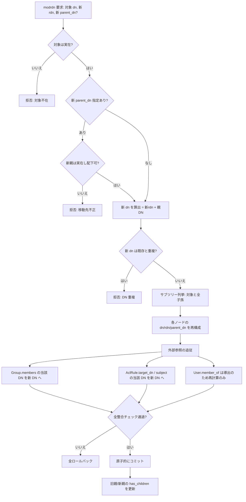
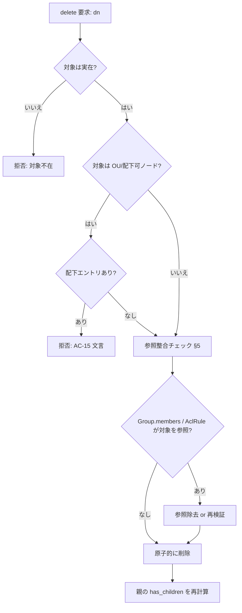
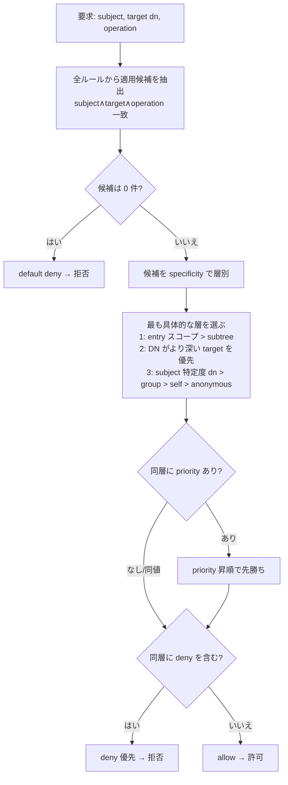
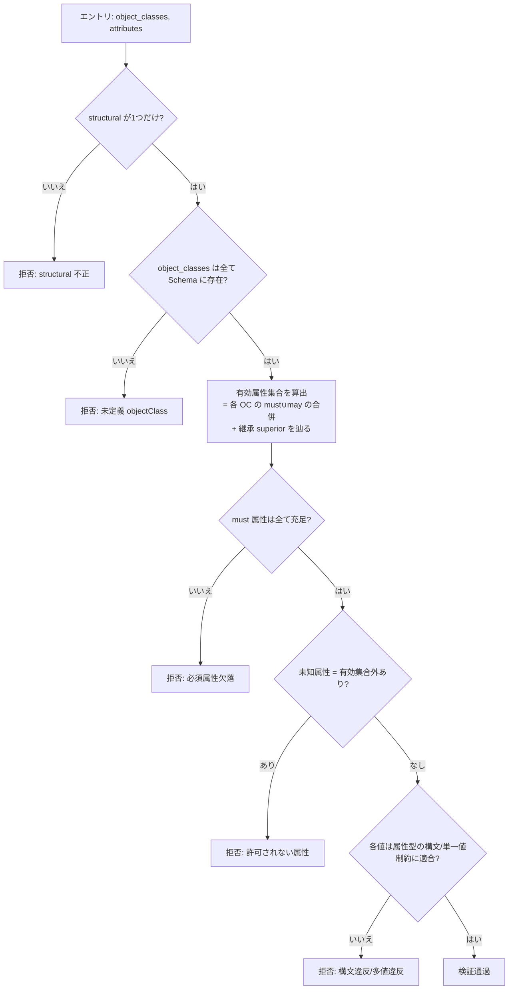
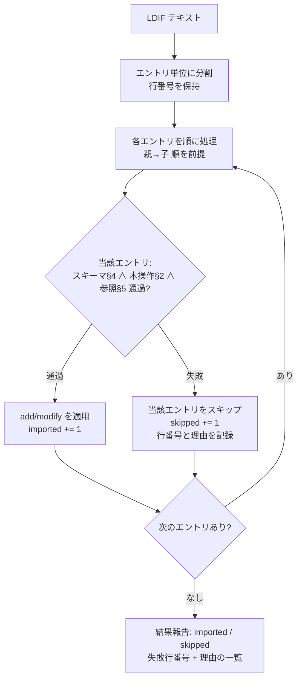

# LDAP ドメイン・ロジック仕様（解釈／実行ルール）

| 項目 | 内容 |
|---|---|
| ドキュメントバージョン | 0.1（ドラフト） |
| 最終更新日 | 2026-07-05 |
| ステータス | ドラフト |
| データ定義 | [07_data_ldap.md](07_data_ldap.md)（種別・参照。**本書はデータを再定義しない**） |
| ハブ | [07_data_model.md](07_data_model.md) §3（共有構造）／§5.3（参照マップ） |
| 受け入れ基準 | [04_acceptance_criteria.md](04_acceptance_criteria.md) AC-15 |

> 本書は LDAP ドメインの**解釈・実行ルール**（DIT 木操作の意味論、ACL 評価順序、スキーマ検証、LDIF 入出力、参照整合の実行判定）を定義する。**フィールド・型・参照の静的定義は 07 が担い、本書では再掲しない**。
> 記述レベルは **What/Why**（何を・なぜそう判定するか）。実装フレームワーク名・関数名・API パスは書かない（それらは実装フェーズ）。
> 方針前提：**完全統合モノリス／単一組込みDBが唯一の正／統一認証・統一RBAC／tenant 無し**。DIT は「別プロセスの LDAP サーバ」ではなく、単一DB内の木構造データとして自エンジンが解釈・実行する。

---

## 0. 方針（確定）

### 0.1 エンジン固定 vs 委任の境界

| 区分 | 扱い | 理由 |
|---|---|---|
| DIT の親子整合（parent_dn ↔ dn） | **エンジン固定** | 木の一貫性はデータの正しさそのもの。委任すると孤児ノードを生む |
| DN／RDN の再構成（改名の連鎖） | **エンジン固定** | 部分適用は参照崩壊に直結するため原子的にエンジンが行う |
| スキーマ検証（must/may・構文・structural 単一性） | **エンジン固定** | ディレクトリの意味的整合。エントリごとに緩めない |
| 参照整合（member 実在・ACL 対象・使用中 Schema） | **エンジン固定** | 削除/改名の安全性。委任不可 |
| ACL 評価の**順序規則**（most-specific 優先・deny 優先・default deny） | **エンジン固定** | セキュリティ判定の再現性を保証 |
| 個々の ACL ルール**内容**（誰に何を許すか） | **委任（運用者定義）** | 運用ポリシーは組織ごとに異なる。エンジンは順序と効果決定のみ担う |
| objectClass／属性型の**追加定義**（カスタムスキーマ） | **委任（運用者定義）** | 標準セット（inetOrgPerson 系等）は固定、拡張は運用者が定義可 |

> 「委任」領域でも、エンジンは投入された定義を**検証してから**受理する（0.1 の固定領域に反する定義は拒否）。委任は「内容の自由」であって「整合の免除」ではない。

### 0.2 権限境界（統一RBAC・AC-04／AC-15）

| 操作分類 | 必要ロール |
|---|---|
| 参照（ツリー閲覧・エントリ/スキーマ/ACL/変更履歴の取得、LDIF エクスポート） | Viewer 以上 |
| 更新（add／modify／modrdn／delete、メンバー増減、ACL 作成/更新/削除、LDIF インポート、有効/無効切替） | Operator 以上 |
| **パスワードリセット** | **Admin のみ**（AC-15） |

> ログイン識別（`LocalAccount`／`Session`：ハブ §3.7/§3.8）と、DIT 上の `User`（LDAP 管理対象）は**別物**。DIT の `User.enabled` を無効化してもポータルへのログイン可否には影響しない（逆も同様）。

---

## 1. 用語

| 用語 | 意味 |
|---|---|
| DIT | ディレクトリ情報ツリー。DN の階層で親子を表す単一の木 |
| DN／RDN | 絶対識別名／相対識別名（DN の最左要素）。07 §2.1 |
| add / modify / modrdn / delete | エントリ操作の4基本種別（追加／属性変更／改名・移動／削除） |
| structural / auxiliary / abstract | objectClass の種別（07 §2.6.2 の `kind`） |
| subject / target / operation / effect | ACL の4要素（主体／対象／操作／効果 allow・deny）。07 §2.5 |
| most-specific | DN 階層でより深い（対象に近い）ルールを優先する評価規則 |
| default deny | 明示的に許可されない限り拒否する既定効果 |

---

## 2. DIT 木操作の意味論

すべての木操作は**原子的**（全成功か全失敗か）に実行し、途中状態を残さない。操作前にスキーマ検証（§4）と参照整合（§5）を通過したもののみ確定する。

### 2.1 add（エントリ追加）

| 判定 | ルール | 失敗時 |
|---|---|---|
| 親存在 | `parent_dn` が指す親エントリが**実在必須**（base DN 直下は例外的に親=base） | 親不在は拒否（孤児禁止） |
| DN 一意 | 追加する `dn` が既存と重複しないこと | 重複は拒否 |
| RDN 整合 | `rdn` が `dn` の最左要素と一致（07 §2.1 制約） | 不一致は拒否 |
| 親の種別 | 親が配下を持てる種別（OU／コンテナ等）であること | 末端エントリ配下への追加は拒否 |
| スキーマ | §4 の検証を通過（structural 1つ・must 充足・構文適合） | §4 に従い拒否 |

追加成立後、親の `has_children` を真に更新する（導出値の追従）。

### 2.2 modify（属性変更）

| 判定 | ルール |
|---|---|
| 対象存在 | 対象 `dn` が実在すること。不在は拒否 |
| DN 不変 | modify は属性のみ変更。`dn`/`rdn` は変えない（改名は modrdn の責務、§2.3） |
| スキーマ再検証 | 変更後の属性集合が §4 を満たすこと（must 属性の削除・構文違反は拒否） |
| RDN 属性 | RDN を構成する属性値（例 `uid=`）の削除・変更は modify では不可（改名に相当するため modrdn 経由） |

変更成立時、`when_changed` を更新する。共通 `updated_at`（ハブ §3.1）とは別系統（07 §2.1 注記）。

### 2.3 modrdn／改名・移動の連鎖（本ドメインの中核）

改名（RDN 変更）および移動（親変更）は、対象**単体では完結しない**。対象を根とするサブツリー全体の DN と、外部からの DN 参照すべてを**原子的に追従**させる。

**追従対象（07 §3.2 の逆引きに対応）**

| 追従先 | 内容 |
|---|---|
| 配下エントリの `dn` | サブツリー全ノードの DN 末尾を新 DN へ付け替え |
| 配下エントリの `parent_dn` | 直下の子の `parent_dn` を対象の新 DN へ更新（孫以下は連鎖） |
| 対象自身の `rdn`/`dn` | 新 RDN・新 DN に更新。RDN 属性値（例 `uid`）も整合させる |
| `Group.members` | 当該 DN および配下 DN を参照する全メンバー値を新 DN に置換 |
| `AclRule.target_dn` | 当該 DN／サブツリーを対象とするルールの対象 DN を追従 |
| `AclRule.subject`（`dn:`/`group:`） | 主体 DN が改名対象なら追従 |
| `User.member_of` | 導出値（Group.members の逆引き）のため**再計算**のみ |

> **原子性が要**：一部の参照だけ更新して失敗すると、ダングリング DN（存在しない DN を指すメンバー／ACL）が残る。追従は 1 トランザクションで行い、途中失敗は全ロールバック。

### 2.4 delete（削除）

| 判定 | ルール | 文言 |
|---|---|---|
| 対象存在 | 実在必須。不在は拒否 | — |
| **OU 配下ガード** | 配下エントリ（User/Group/子 OU）が1件でもあれば**削除拒否**（07 §3.2／AC-15） | `この OU には配下エントリがあります。先に移動または削除してください。` |
| 末端エントリ削除 | 配下を持たない User/Group は削除可。ただし参照整合（§5）を先に処理 | — |
| 参照追従 | 削除される DN を指す `Group.members`／`AclRule` の当該参照を除去または再検証（§5.1） | — |

> OU 削除は**カスケードしない**（DNS ゾーンの「まとめて削除」確認とは異なる方針）。配下は運用者が明示的に移動/削除する。これは誤操作による組織単位一括消失を防ぐため。

---

## 3. ACL 評価

ACL は「主体（subject）が対象（target DN／スコープ）に対し操作（operation）を行えるか」を allow/deny で判定する。評価は**再現可能な確定順序**で行い、同一入力に対し常に同一結果を返す。

### 3.1 マッチング要素と評価の段階

各ルール（07 §2.5）について、次の順に**当該ルールが適用対象か**を判定する。

1. **subject 一致**：要求主体が `dn:`（当該ユーザ）／`group:`（所属グループ、ネスト所属を含む）／`self`（対象＝主体自身）／`anonymous`（未特定）に合致するか。
2. **target 一致**：要求対象 DN が `target_dn` に一致、または `scope=subtree` のとき `target_dn` の配下に含まれるか（`scope=entry` は当該エントリのみ）。
3. **operation 一致**：要求操作が `operations`（read/write/add/delete/search/compare）に含まれるか。

3 段すべてに合致したルールのみが「適用候補」となる。

### 3.2 効果決定の順序（most-specific 優先＋deny 優先＋default deny）

適用候補が複数あるときの優先順位を、以下の**確定した多段規則**で解決する。

**優先規則（上から順に適用し、決着したら以降は見ない）**

| 順位 | 規則 | 理由 |
|---|---|---|
| 1 | **most-specific 優先** | 対象に近い（entry > subtree、深い DN、特定度の高い subject）ルールが一般ルールを上書き。ローカルな例外設定を効かせるため |
| 2 | **priority（明示順）** | 同一 specificity 層で競合する場合、`priority` 昇順で先勝ち（07 §2.5、既定 0）。同値は `created_at` 昇順で安定化（ハブ §5.3 の first-match 方針に整合） |
| 3 | **deny 優先** | 同層・同 priority で allow と deny が併存する場合は **deny を採用**。安全側に倒す |
| 4 | **default deny** | 上記いずれにも該当する許可が無ければ**拒否**。明示 allow が無い限り通さない |

> specificity と priority のどちらを先に見るかを固定することが本節の要点：**まず対象への近さ（most-specific）で層を絞り、同層内で priority、最後に安全側の deny**。この順序を崩すと「広い deny が狭い allow を意図せず潰す／その逆」が起き、判定が運用者の直感とずれる。

### 3.3 評価の適用範囲

- ACL 評価は**エンジン固定**（§0.1）。運用者はルールの内容を定義できるが、評価順序・default deny は変更できない。
- 統一RBAC（§0.2）による操作可否判定が**先**に立つ。RBAC で拒否された操作は ACL 評価に到達しない（ACL は DIT 内の主体×対象の細粒度制御であり、ポータル操作権限とは層が異なる）。

---

## 4. スキーマ検証

作成（add）・更新（modify）・LDIF インポートの各エントリに対し、確定した順で検証する。違反は当該操作を拒否し、**部分適用しない**。

### 4.1 検証項目と順序

| 検証 | ルール（07 §2.6 参照） | 拒否理由 |
|---|---|---|
| structural 単一性 | `object_classes` 中の structural はちょうど1つ（`structural_class` と一致） | 0個または2個以上は不正 |
| objectClass 実在 | すべての objectClass が Schema.ObjectClass に定義済み | 未定義クラスは受理不可 |
| auxiliary 併用 | auxiliary は0個以上可。abstract は単独指定不可（他クラスの上位としてのみ） | abstract 直接指定は拒否 |
| 継承解決 | 各 OC の `superior` を `top` まで辿り、must/may を合併 | 継承チェーン断絶は不正 |
| **must 充足** | 合併後の must 属性がすべて `attributes` に値を持つ | 欠落は拒否 |
| **may 逸脱** | `attributes` の属性名が must∪may の**有効集合内**であること | 集合外属性は拒否 |
| 構文適合 | 各属性値が対応 AttributeType の `syntax`（Directory String / IA5 / Integer 等）に適合 | 構文違反は拒否 |
| 単一値制約 | `single_valued=true` の属性は値を1つのみ | 多値は拒否 |

### 4.2 実行時エラー時の挙動

- 検証失敗は当該エントリ操作を**丸ごと拒否**（属性の一部だけ書き込むことはしない）。
- 木操作（§2）／参照整合（§5）の検証も同一トランザクション内で行い、**いずれかが失敗すれば全ロールバック**。
- LDIF インポートでは、失敗エントリを**スキップして次へ継続**する（§6）。単発操作（画面からの add/modify）では**その操作全体を失敗**として返す（部分成功を作らない）。

---

## 5. 参照整合（実行時判定）

07 §3 の参照定義を、実行時にどう検証・拒否・追従するかを確定する。すべて**エンジン固定**（§0.1）。

| 参照 | 実行ルール | 違反時 |
|---|---|---|
| `Group.members → User(dn)`（実在） | メンバー追加時、対象 DN が実在すること。通常 User、ネスト時 Group 可 | 不在 DN の追加は拒否 |
| 最後の member 削除 | groupOfNames 系は空 member を許さない前提（07 §2.3 注記）。最後の1件削除は**拒否 or グループ削除への誘導**（挙動は §7 で確定） | — |
| `AclRule.target_dn`（実在） | ルール作成/更新時、対象 DN またはサブツリー式が実在または妥当であること | 不正対象は拒否 |
| `AclRule.subject`（`dn:`/`group:`） | 主体 DN／グループが実在すること | 不在主体は拒否 or 警告（§7） |
| DN 削除時の被参照 | 削除される DN を指す `Group.members`／`AclRule.subject`／`target_dn` を**除去または再検証**（§2.4） | ダングリング参照を残さない |
| DN 改名時の被参照 | §2.3 の連鎖追従で全参照を新 DN へ更新 | 原子的追従、失敗は全ロールバック |
| **使用中 Schema 削除不可** | `object_classes`/`attributes` で参照中の ObjectClass/AttributeType、および他スキーマの `superior`・must/may から参照される定義は**削除拒否**（07 §3.2） | 参照が残る間は削除不可 |
| objectClass ↔ Schema 整合 | エントリの objectClass はすべて Schema に実在（§4 で担保） | 未定義は add/modify を拒否 |

> `User.member_of` は導出（Group.members の逆引き）であり、直接編集しない。所属変更は必ず Group.members 側で行い、逆引きは再計算する。

---

## 6. LDIF 入出力の意味論

### 6.1 エクスポート

- 対象サブツリー（既定は base DN 配下全体）を DIT の**深さ優先・親→子**順で列挙し、エントリ単位で LDIF を出力する（親が子より先に現れ、インポート時の親存在制約を満たす順序）。
- `password_ref`（07 §2.2）等の機微値は**出力しない**（値非返却の原則）。エクスポートは構造・非機微属性の可搬コピー用途。

### 6.2 インポート（AC-15 整合）

| ルール | 内容（AC-15） |
|---|---|
| 処理単位 | **エントリ単位**で成功/失敗を判定する |
| 失敗時継続 | 失敗エントリは**スキップして処理継続**（1件の失敗で全体を止めない） |
| 順序前提 | 親→子順を前提。親が同一 LDIF 内で後続なら、親不在として当該子はスキップ（親が先行すれば成功） |
| 報告 | 各エントリの成功/失敗を**件数＋行番号付き**で報告（imported / skipped の件数、失敗した行番号と理由） |
| 検証の一貫性 | インポート各エントリにも §4 スキーマ検証・§5 参照整合・§2 木操作ルールを**同一に適用**（LDIF 経由でも整合は緩めない） |
| 部分適用 | 成功エントリは確定、失敗エントリは無適用。**エントリ内**の部分適用は行わない（§4.2） |

> エクスポートとインポートは可搬性のための一括操作であり、個別操作（§2）と**同じ検証**を通す。LDIF だからと整合チェックを省略しない点が意味論の要。

---

## 7. 未確定（実装フェーズ送り）

- **groupOfNames の空 member**：最後のメンバー削除を「拒否」「空 member 許容」「グループ削除へ誘導」のいずれにするか（07 §2.3 注記の実装挙動）。
- **ACL subject 不在時の扱い**：作成時に主体 DN が未作成の場合、拒否するか警告付きで受理するか（前方参照の許容範囲）。
- **DN／属性値の正規化規則**：大文字小文字・空白・エスケープ（RFC 4514）の正規化と一致比較の具体規則。
- **サブツリー式（AclRule.target_dn）の文法**：ワイルドカード／フィルタ式を許すか、完全 DN 前方一致のみか。
- **variable な属性構文セット**：サポートする syntax（OID）の具体リストと各バリデーション強度。
- **変更履歴（changelog）の生成粒度**：木操作1回＝1エントリか、連鎖追従を集約するか。監査（AuditEntry：ハブ §3.2）との重複/分担。
- **LDIF の modrdn／delete 表現の受理範囲**：インポートで changetype: modrdn/delete を解釈するか、add/modify のみか。
- **エクスポート範囲の指定**：部分サブツリー・objectClass フィルタの可否。
- **ドメイン `metrics` の具体キー**（07 §6／ダッシュボード）：entry/user/group/ou 数以外の指標。

## 8. データモデル・他仕様との対応

| 本書の概念 | 参照 |
|---|---|
| DirectoryEntry / dn / rdn / parent_dn / has_children | 07 §2.1 |
| User / Group / OrgUnit（特化ビュー） | 07 §2.2〜§2.4 |
| AclRule（subject/target/operations/effect/scope/priority） | 07 §2.5 |
| Schema（ObjectClass / AttributeType・must/may・superior・kind・syntax） | 07 §2.6 |
| 削除影響の逆引き（OU 配下ガード・改名連鎖・使用中 Schema） | 07 §3.2／ハブ §5.3 |
| OU 配下ガード文言・LDIF 件数/行番号・パスワードリセット権限 | AC-15 |
| RBAC（Viewer/Operator/Admin）境界 | ハブ §3.9／AC-04 |
| 監査（AuditEntry）・運用ログ（LogEntry）連携 | ハブ §3.2／§3.12 |
