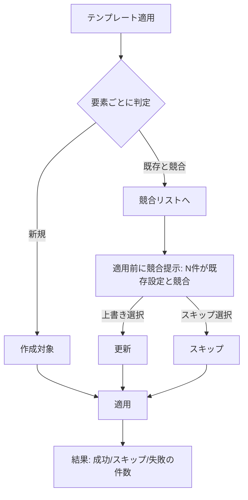

# ドメインロジック：横断オペレーション（リストア整合・テンプレート適用）

| 項目 | 内容 |
|---|---|
| ドキュメントバージョン | 0.1（ドラフト） |
| 最終更新日 | 2026-07-05 |
| 関連 | F-06, F-07 / AC-09, AC-10 / 07 §3.5 Template・§3.6 Backup |

> 本書は横断の**破壊的/一括操作**（バックアップからのリストア、テンプレートの一括適用）の解釈/実行ルールを定義する（データは 07）。統合により全ドメイン共通の意味論として一元化する。

## 1. バックアップ／リストア

### 1.1 バックアップ作成
- 対象（`domain` or `all`）の現構成を取得し、`format_version` を付与して保存（07 §3.6）。メタ（作成日時/サイズ/種別 manual|auto）を記録。
- 自動バックアップは設定のスケジュール/世代数に従い、超過世代を古い順に削除。
- 権限：Admin（08_authz Admin）。作成を監査記録。

### 1.2 リストア互換判定（実行前チェック）
リストアは破壊的（現構成を上書き）なため、実行前に**互換判定**を行う。

```mermaid
flowchart TD
    R[リストア要求] --> P{Admin?}
    P -- No --> DENY[権限エラー]
    P -- Yes --> V{バックアップ検証}
    V -- 破損/署名不一致 --> E1[不可: 形式が不正]
    V -- format_version 非互換 --> E2[不可: 非互換]
    V -- OK --> C[確認ダイアログ 上書き警告]
    C -- 承認 --> AP[適用(トランザクション的)]
    C -- 取消 --> X[中止]
    AP -- 成功 --> OK[結果表示 + 監査記録]
    AP -- 途中失敗 --> RB[ロールバック/部分適用の扱い]
```

- 互換判定の観点：
  1. **完全性**：アーティファクトが読める/壊れていない。→ NG は `このバックアップはリストアできません（形式が不正です）。`（AC-09）
  2. **バージョン互換**：`format_version` が現行で解釈可能（同一メジャー等）。→ NG は同文言（非互換）で拒否。
  3. **対象整合**：対象ドメインが現在有効（無効化ドメインへのリストアは警告/拒否）。
- 判定 OK の場合のみ確認ダイアログ（上書き警告）→ 承認で適用。

### 1.3 適用の原子性
- リストアは**可能な限り原子的**に適用する（全適用 or 無適用）。部分適用しかできない場合は、適用済み範囲と失敗点を結果に明示し、監査へ残す。
- 適用後、参照整合（07 §5）を再検証し、壊れた参照があれば警告として提示。

## 2. テンプレート適用

### 2.1 適用フロー
- 対象 `domain` のテンプレート（07 §3.5、`body` はドメイン別スキーマ）を、選択した適用先へ**一括適用**する。
- 適用は各要素について「新規作成 or 既存更新（＝競合）」を判定する。



### 2.2 競合検出と結果
- 競合＝適用先に同一キー（ドメイン固有の一意キー：DNSレコード名+型、LDAP DN 等）が既存。
- 適用前に**競合一覧と件数**を提示：`N 件が既存設定と競合します。`（AC-10）。ユーザは上書き/スキップを選ぶ。
- 適用後、**成功/スキップ/失敗の件数**を表示（AC-10）。失敗要素は理由付きで列挙し、他要素の適用は継続（部分適用可）。
- ドメイン固有の検証（07/08_<domain>_logic）を各要素に適用してから確定する。
- 権限：Operator（08_authz Write）。適用を監査記録。

## 3. エンジン固定 vs 委任の境界

- **エンジン固定**：リストアの互換判定手順・確認必須・原子性方針・監査記録、テンプレート適用の競合検出→提示→結果集計のフロー。
- **委任（ドメイン）**：`format_version` の互換範囲、テンプレート `body` のスキーマと一意キー定義、要素単位のドメイン検証（各 08_<domain>_logic / 07_data_<domain>）。

## 4. 実行時エラー・エッジケース

| ケース | 挙動 |
|---|---|
| リストア中に別操作で対象が変更 | 適用は取得時スナップショット基準。競合検知時は中止し再試行を促す |
| テンプレート適用の一部が検証違反 | 当該要素を失敗として記録・スキップし、残りを適用。結果に理由表示 |
| 無効化ドメインへの適用/リストア | 新規操作を停止（07 §5.2）。有効化を促す |
| 大量要素の適用 | 進捗表示、二重実行防止（S-Backup/各テンプレ画面 §3 の処理中状態） |

## 5. 未確定（実装フェーズ送り）
- リストアの厳密な原子性保証レベル（完全トランザクション or ベストエフォート＋補償）。
- `format_version` の互換ポリシー（メジャー一致 / マイグレーション許容）。
- テンプレートのバージョニング・差分適用（dry-run プレビュー）の要否。
