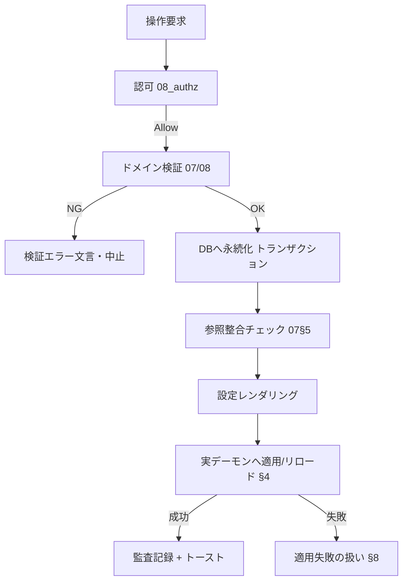

# ランタイム実行仕様：Magnetite（統合再設計版）

| 項目 | 内容 |
|---|---|
| ドキュメントバージョン | 0.1（ドラフト） |
| 最終更新日 | 2026-07-05 |
| ステータス | ドラフト |

実行系が、定義済みデータ（07）と中核ロジック（08）を**どう解釈・実行・永続化するか**を定義する。モノリス化で旧「プロセス分離／ゲートウェイ／プロセスマネージャ」が担っていた意味論の**受け皿**。

## 0. 方針（確定 2026-07-05）

- **単一組込みDBが設定の唯一の正**。全ドメイン設定・横断データ・セッション・監査・運用ログを保持。
- **設定の正＋実デーモン駆動**：Magnetite は設定を保持・検証し、**実デーモン**（例：bind/kea/OpenLDAP/postfix/nginx 等）へ設定をレンダリングして適用・リロードする。**実トラフィックはデーモンが処理**する。Magnetite はコントロールプレーン。
- **セッションはDB永続化**：プロセス再起動でもログインを維持。
- **設定はホットリロード**可能（範囲は §7）。
- 実行時エラーは**アプリをクラッシュさせず**、専用表示＋ログ＋監査で安全に扱う（05 §4）。

## 1. 実行モデル

- **要求処理**：ブラウザ → SSR/サーバ関数（Axum）→ ドメイン内部モジュール（関数呼び出し。ゲートウェイHTTPは廃止）→ 単一DB。認証トークンはブラウザに出さない。
- **内部構成（論理）**：`認可(08_authz)` → `ドメインモジュール(07/08)` → `永続化(単一DB)` → `適用(デーモン連携 §4)` → `監査/通知`。
- **バックグラウンド常駐タスク**：
  | タスク | 役割 | 参照 |
  |---|---|---|
  | セッションクリーンアップ | 期限切れセッション/SsoSession の失効 | §6.5 |
  | 監視データ収集 | 監視ホストの値収集・`status`/`last_seen` 更新・Metric 蓄積 | 07_data_watch / §4 |
  | 監視ルール評価 | 閾値判定→Alert生成 | 08_alerting |
  | 時刻到達の掃引 | 期限切れ IpBlock の失効反映・証明書期限接近の評価（→ Alert 生成）・メンテナンス窓の開始/終了反映 | §4 / 08_alerting §2 |
  | デーモン health / reconcile | 稼働確認・設定ドリフト検出と再適用 | §4 |
  | 自動バックアップ | スケジュール実行・世代管理 | 08_ops_logic |
  | 通知配送 | NotificationTarget へ送信・再試行 | 08_alerting |

## 2. 起動と初期化

```
起動シーケンス
1. AppConfig 読み込み・検証（server/sso/domains/policy）
2. 単一DB オープン（スキーマ/インデックス整備）
3. コンポーネント初期化（認可・セッションストア(DB)・監査・通知）
4. 有効ドメイン（DomainConfig.enabled）ごとにモジュール初期化
5. 各ドメイン：DB の設定を実デーモンへ初期適用（§4 reconcile 初回）
6. 常駐タスク起動（§1）
7. HTTP リスナー起動（SSR/サーバ関数/SSOコールバック/静的配信）＋ graceful shutdown
```

- **初回セットアップ**：ローカルアカウント0件なら初期Admin作成へ誘導（AC-03）。それまで管理操作は不可。
- デーモン初期適用に失敗したドメインは `DomainStatus=Error` として起動継続（該当ドメインUIにエラー表示、他は正常）。

## 3. 設定適用パイプライン（中核）

ドメイン設定の変更（作成/更新/削除）は次の一連で確定する。



- **正はあくまでDB**。デーモンはDBから導出（レンダリング）される従属状態。DBとデーモンが食い違ったら DB を正として reconcile する。
- 適用は可能な限り「DBコミット→デーモン適用」の順。デーモン適用失敗時は §8。

## 4. ドメイン ⇔ 実デーモン連携

各ドメインモジュールは共通の連携インターフェース（意味論）を持つ。

| 操作 | 意味論 |
|---|---|
| `render` | DB の設定 → デーモン設定（ゾーンファイル/リースDB/LDIF/postfix map/nginx conf 等）へ変換 |
| `apply/reload` | デーモンへ反映（設定再読込 or 該当エントリ反映）。無停止リロードを基本 |
| `status/health` | デーモンの稼働・整合を取得 → DomainStatus |
| `reconcile` | 定期/起動時にDBとデーモンの差分を検出し、DBを正として再適用（ドリフト是正） |

- **クエリテスト等の実行系照会**（DNS解決テスト AC-13 等）：実デーモンへ問い合わせて結果を提示する（Magnetiteは解決を再実装しない。08_dns_logic の解決意味論は「デーモンの振る舞いの期待仕様」として扱う）。
- **ドメイン別の適用単位**（例：DNSはゾーン単位リロード、DHCPはリース/予約の反映、LDAPはエントリ適用、Mailはmap再生成、Proxyはvhost reload）は各実装で定義（未確定 §12）。
- デーモン到達不能時：当該ドメインを `Error/Unknown`、操作は失敗として扱い再試行導線を出す（§8）。

## 5. サブシステム連携（08 の呼び出し点）

| 呼び出し元 | 呼ぶ 08 | タイミング |
|---|---|---|
| 全サーバ関数 | 08_authz | 実行前の認可判定 |
| 監視ルール評価タスク／各ドメイン | 08_alerting | Alert生成・状態遷移・抑止・通知 |
| バックアップ/リストア・テンプレ適用 | 08_ops_logic | 破壊的/一括操作時 |
| LDAP操作 | 08_ldap_logic | 木操作/ACL/スキーマ/LDIF |
| DHCP操作 | 08_dhcp_logic | 割当/リース/解放 |
| DNS操作/テスト | 08_dns_logic | 検証/RPZ/解決期待 |

## 6. 永続化データの完全一覧（単一DB）

> 「動的状態は実行時側」で逃がさない。永続化対象を網羅する。

| 区分 | 対象 | 備考 |
|---|---|---|
| 認証 | LocalAccount / Session / （SSO subject 情報） | Session は**DB永続化**（再起動耐性）。SSOトークンは Session 内、機微はマスク/暗号化方針 |
| 設定 | AppConfig（server/sso/domains/policy） | ホットリロード対象は §7 |
| 横断 | AuditEntry（追記不変）/ Alert / NotificationTarget / Template / Backup メタ＋artifact | §3系（07） |
| ドメイン | 各 07_data_<domain> の全エンティティ（Zone/Record/Lease/Entry/…） | **設定の正**。デーモンは従属 |
| 運用 | LogEntry（operation/query/access） | 保持は policy。リング/期間上限 |
| 稼働 | DomainStatus（キャッシュ的） | 導出値。再計算可能なら揮発でも可 |

- 監査ログは追記のみ。バックアップ artifact は DB or ファイルに保存（07 §3.6、実体は §12）。

## 6.5 セッション/トークンのライフサイクル

> 07 §3.8・08_authz §6・AC-05/AC-19 が参照する「失効・期限・SSOトークン」の実行意味論の受け皿。

### 有効性判定（毎リクエスト）
セッションは次を**すべて**満たすとき有効。1つでも欠けたら 401 相当で S-Login へ。
1. `session_id` が DB に存在し `revoked_at` が未セット。
2. `現在時刻 < expires_at`（期限切れは無効）。
3. SSO 経路（`auth_method=sso`）で `sso_tokens` の期限が切れている場合は、リフレッシュトークンで更新を試み、不能なら無効。
4. ロールは毎回 DB から解決（ロール変更は次リクエストで即時反映。08_authz §6）。

### 失効トリガ（`revoked_at` をセット）
| 契機 | 対象 | 参照 |
|---|---|---|
| ログアウト操作 | 当該セッション | S-00 ヘッダー（ログアウト） |
| 管理者による失効 | 指定セッション/一括 | S-Account / AC-05 |
| LocalAccount 削除/無効化 | 当該アカウントの全 Session | 07 §5.2 / AC-05 |
| SSO Provider/OidcClient/subject 削除 | 関連 SsoSession | 07_data_sso §5.3 / AC-19 |
| 期限到来 | Session/SsoSession | セッションクリーンアップ（§1） |

- 失効は**即時反映**（次リクエストで無効）。失効操作は監査記録。SSOトークンは失効時に破棄（機微値は監査に残さない）。
- クリーンアップタスクは期限切れを定期的に物理削除するが、有効性判定は上記条件で毎回行うため、削除前でも期限切れは無効。

## 7. 設定の適用・ホットリロード範囲

| 設定 | 反映 |
|---|---|
| 言語/テーマ（個人） | 即時（クライアント） |
| policy（更新間隔/保持日数/パスワードポリシー） | 保存で即時反映 |
| domains.enabled（ドメイン有効化） | 即時（サイドバー/機能の表示切替。無効化ドメインは新規操作停止＝07§5.2） |
| sso（issuer/client等） | 保存で再構成（進行中セッションは維持、以後のSSOログインに反映） |
| server（host/port/base_url） | **再起動要**（リスナー再バインド） |
| ドメイン設定データ（ゾーン等） | §3 パイプラインでデーモンへ適用/リロード |

- 設定変更は監査記録。機微値は監査に残さない（05 §5）。

## 8. 実行時エラー処理（編集時検証を通過後に踏む場合）

| エラー種別 | 挙動 |
|---|---|
| デーモン適用失敗（DBは成功） | DBは正のまま、当該ドメインを `Error`。UIに `設定は保存しましたが反映に失敗しました。再試行してください。` を表示し、reconcile 再試行導線。監査に失敗を記録 |
| デーモン到達不能 | 操作を失敗として扱い（DBコミット前なら中止）、`Error/Unknown`。health 回復後に reconcile |
| 参照整合違反に実行到達 | 07§5 の削除ガード文言（AC由来）で拒否。既存データ破壊を避ける |
| リストア途中失敗 | 08_ops_logic の原子性方針（全適用/無適用、部分は明示）＋デーモン再適用。壊れた参照は警告提示 |
| セッション失効直後の操作 | 401相当→再認証（08_authz §6） |
| 通知配送失敗 | 再試行（回数/間隔は §12）。失敗は運用ログへ。アラート状態自体は変えない |
| 予期しない例外 | パニックフック＋ログ、リクエストは安全にエラー応答（アプリ継続、05§4） |

## 9. ログの再定義（旧 stdout/stderr の受け皿）

- 旧「プロセスの stdout/stderr リングバッファ」は廃止。代わりに：
  - **operation ログ**：Magnetite 内部モジュールの動作ログ。
  - **query/access ログ**：実デーモンから取り込む（DNSクエリログ・Proxyアクセスログ等）。取り込み方式は §12。
- すべて `LogEntry`（07 §3.12）に正規化し、統合ログビューア（S-Logs）で横断表示。監査ログ（AuditEntry）とは別系統。

## 10. 起動連携・デプロイ

- **単一バイナリ**（`magnetite-server` ＋ AppConfig）。旧 ProcessConfig/自動再起動は廃止。
- 実デーモンのライフサイクル（起動/停止）を Magnetite が管理するか、外部（systemd 等）に委ねるかは**運用モデルの選択**（§12 未確定。既定は外部管理＋Magnetiteは設定適用とhealthに専念）。
- graceful shutdown：進行中要求を捌き、常駐タスクを停止してから終了。

## 11. 他仕様との対応

| 本書の領域 | 参照 |
|---|---|
| 認可の実行 | 08_authz / AC-04 |
| アラート実行 | 08_alerting / 07§3.3 / S-Alerts |
| リストア/テンプレ実行 | 08_ops_logic / S-Backup |
| ドメイン適用意味論 | 08_{ldap,dhcp,dns}_logic / 07_data_<domain> |
| セッション/認証 | 07§3.7-3.8 / S-Login / S-Account |
| 設定/リロード | 07§3.10 / F-09 / S-Settings |
| ログ | 07§3.12 / S-Logs |

## 12. 未確定（実装フェーズ送り）

- ドメイン別の具体的な**デーモン種別と連携方式**（設定ファイル生成 vs 管理API vs DB直結）、適用単位・無停止リロードの可否。
- 実デーモンのライフサイクル管理主体（Magnetite / systemd 等）。
- クエリ/アクセスログの**取り込み方式**（ファイル追尾/デーモンAPI/syslog）。
- Session の機微値（SSOトークン）のDB保存時の暗号化方式。
- バックアップ artifact の保存先（DB BLOB / ファイル）と自動世代数の既定。
- 通知配送の再試行回数/間隔、デーモン reconcile の周期。
- 未 08 化ドメイン（Proxy/Mail/SSO/Watch詳細/K8s）の実行意味論。
