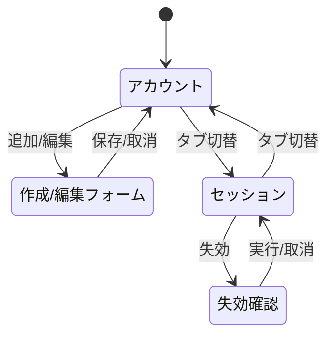

# 画面仕様：アカウント／セッション管理（画面ID: S-Account）

| 項目 | 内容 |
|---|---|
| 画面ID | S-Account |
| 画面名 | アカウント／セッション管理 |
| 関連ユースケース | US-05 / F-10, F-02 |
| 関連AC | AC-05, AC-04 |
| 概要 | Magnetite への**ログイン用**ローカルアカウント（＋ロール）と、アクティブセッションを管理する（Admin）。 |

> 本画面は「ログイン識別」の管理面。LDAP/Mail/SSO 等が扱う*ドメインのユーザ*とは分離される（設計確定 2026-07-05）。

## 1. レイアウト

```
── アカウントタブ ──                 ── セッションタブ ──
┌────────────────────────┐          ┌────────────────────────────┐
│ アカウント     [＋ 追加]│          │ 実行者 | ログイン元 | 開始 | 操作│
│ ユーザ名|ロール|状態|操作│          │ admin  | 10.0.0.5  | 09:40|[失効]│
│ admin   |Admin |有効|✎🗑│          │ oper1  | 10.0.0.9  | 08:12|[失効]│
│ oper1   |Oper  |有効|✎🗑│          │  … 一括失効 …                  │
└────────────────────────┘          └────────────────────────────┘
```

## 2. 画面部品一覧

| 部品ID | 部品名 | 種別 | 初期表示 | 備考 |
|---|---|---|---|---|
| C-01 | アカウント一覧 | テーブル | データ依存 | ユーザ名/ロール/状態/最終ログイン |
| C-02 | 追加ボタン | ボタン | Admin | ローカルアカウント作成 |
| C-03 | 編集（ロール/状態） | 行アクション | Admin | ロール変更・有効/無効 |
| C-04 | 削除 | 行アクション | Admin | ConfirmDialog経由 |
| C-05 | セッション一覧 | テーブル | データ依存 | 実行者/ログイン元IP/開始時刻 |
| C-06 | 失効ボタン | 行アクション | Admin | 個別/一括セッション失効 |
| C-07 | パスワードリセット | 行アクション | Admin | ローカルアカウントのみ |

## 3. 状態(State)ごとの表示

| 状態 | 発生条件 | 表示内容 |
|---|---|---|
| 空(Empty) | セッション0件等 | `アクティブなセッションはありません。` |
| 読み込み中(Loading) | 取得中 | スケルトン行 |
| 正常(Success) | データあり | 一覧表示 |
| 検証エラー(Validation) | 作成時入力不正 | 該当項目に文言（下記5） |
| エラー(Error) | 取得/操作失敗 | `操作に失敗しました。` と [再試行] |
| 権限不足 | Admin以外 | 本画面はサイドバーに非表示（AC-04） |

## 4. イベント定義

| # | 部品 | イベント | 事前条件 | 動作・結果 |
|---|---|---|---|---|
| E-01 | 追加 | クリック | Admin | 作成フォーム（ユーザ名/初期パスワード/ロール）を開く |
| E-02 | 保存 | クリック | 入力妥当 | アカウント作成→一覧更新→監査記録 |
| E-03 | ロール変更 | 変更保存 | Admin | ロール更新→即時にRBAC反映→監査記録 |
| E-04 | 有効/無効切替 | クリック | Admin | 無効化で当該アカウントのログインを拒否 |
| E-05 | 削除 | クリック | Admin | 確認後に削除。ただし E-06 に従う |
| E-06 | 削除（最後のAdmin） | 承認 | 最後のAdmin | `最後の管理者アカウントは削除できません。`（AC-05）で拒否 |
| E-07 | パスワードリセット | クリック | Admin・ローカル | 新パスワードを設定（ポリシー検証） |
| E-08 | セッション失効 | クリック | Admin | 対象セッションを無効化（次回リクエストで無効）→監査記録 |
| E-09 | 一括失効 | クリック | Admin | 選択（または自分以外全て）を一括失効 |

## 5. 入力検証ルール

| 項目 | 必須 | 制約 | エラー文言 |
|---|---|---|---|
| ユーザ名 | 必須 | 1〜64文字・一意 | `ユーザ名を入力してください。`／`同じユーザ名が既に存在します。` |
| 初期パスワード | 必須 | 8文字以上・英数字含む | `パスワードは8文字以上で、英字と数字を含めてください。` |
| ロール | 必須 | Viewer/Operator/Admin | `ロールを選択してください。` |

## 6. 画面遷移



## 7. 補足

- SSO ログインのユーザはローカルアカウント一覧には現れない（外部IdP管理）。ロールは OIDC クレームから判定（S-Login 補足参照）。本画面のアカウントは**ローカル認証経路**専用。
- セッションはインメモリ管理（移行元踏襲）。失効の意味論・有効期限は 09_runtime_spec。
- 自分自身のセッション一括失効は確認を強める（`自分を含むすべてのセッションを失効すると再ログインが必要です。`）。
