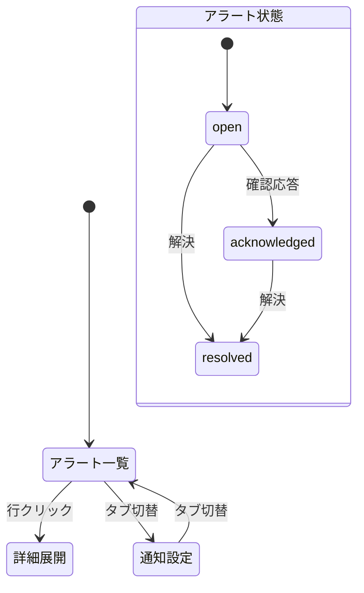

# 画面仕様：横断アラート＆通知（画面ID: S-Alerts）

| 項目 | 内容 |
|---|---|
| 画面ID | S-Alerts |
| 画面名 | 横断アラート ／ 通知設定 |
| 関連ユースケース | US-08 / F-05 |
| 関連AC | AC-08 |
| 概要 | 全ドメインのアラートを横断的に一覧・確認応答・解決し、通知（Webhook等）先を管理する。 |

## 1. レイアウト

```
┌──────────────────────────────────────────────┐
│ アラート    [状態: open▾] [重大度▾] [ドメイン▾] │  [通知設定]│
├──────────────────────────────────────────────┤
│ 重大度 | ドメイン | 概要        | 発生     | 状態  | 操作     │
│ ●crit  | 監視     | ホストX無応答| 10:02   | open  |[確認][解決]│
│ ●warn  | Proxy    | 証明書期限   | 09:40   | ack   |[解決]     │
│ ○info  | DNS      | ゾーン転送   | 09:10   |resolved|          │
└──────────────────────────────────────────────┘
```

通知設定タブ：Webhook/通知先の一覧・追加・削除（S-00 のCRUDパターンを継承）。

## 2. 画面部品一覧

| 部品ID | 部品名 | 種別 | 初期表示 | 備考 |
|---|---|---|---|---|
| C-01 | 状態フィルタ | ドロップダウン | 既定=open | open/acknowledged/resolved/全 |
| C-02 | 重大度フィルタ | ドロップダウン | 全 | critical/warning/info |
| C-03 | ドメインフィルタ | ドロップダウン | 全 | - |
| C-04 | アラートテーブル | テーブル | データ依存 | 重大度・発生時刻でソート |
| C-05 | 確認応答ボタン | 行アクション | open行のみ | acknowledge |
| C-06 | 解決ボタン | 行アクション | open/ack行 | resolve |
| C-07 | 一括操作 | ボタン | 選択時 | 選択アラートを一括ack/解決（Operator以上） |
| C-08 | 通知設定タブ | タブ | 常時 | Webhook/通知先CRUD |

## 3. 状態(State)ごとの表示

| 状態 | 発生条件 | 表示内容 |
|---|---|---|
| 空(Empty) | 該当0件 | `対象のアラートはありません。` |
| 読み込み中(Loading) | 取得中 | スケルトン行 |
| 正常(Success) | データあり | 一覧表示。未確認は太字＋色 |
| エラー(Error) | 取得失敗 | `アラートの取得に失敗しました。` と [再試行] |
| 権限不足 | Viewer | 確認/解決ボタン非活性（AC-04） |

## 4. イベント定義

| # | 部品 | イベント | 事前条件 | 動作・結果 |
|---|---|---|---|---|
| E-01 | 確認応答 | クリック | open・Operator以上 | 状態 open→acknowledged。実行者/日時記録→監査（AC-08） |
| E-02 | 解決 | クリック | open/ack・Operator以上 | 状態→resolved。監査記録 |
| E-03 | 解決（resolved再解決） | - | 既にresolved | ボタン非活性（AC-08異常） |
| E-04 | 一括操作 | クリック | 行選択・Operator以上 | 選択分を一括で状態遷移。結果件数をトースト |
| E-05 | フィルタ | 変更 | - | 条件で再取得 |
| E-06 | 通知先 追加/削除 | クリック | Operator以上 | S-00 CRUDに準拠。Webhook URL検証 |
| E-07 | 行 | クリック | - | 詳細（発生条件・対象・履歴）を展開 |

## 5. 入力検証ルール（通知設定）

| 項目 | 必須 | 制約 | エラー文言 |
|---|---|---|---|
| Webhook URL | 必須 | http/https の URL | `有効な URL を入力してください。` |
| 通知名 | 必須 | 1〜50文字・一意 | `名称を入力してください。` |
| 対象重大度 | 必須 | 1つ以上選択 | `通知する重大度を選択してください。` |

## 6. 画面遷移



## 7. 補足

- アラートの**生成**は各ドメイン/監視ルール（F-18等）が行い、本画面は横断的な**閲覧と状態管理**を担う。
- ヘッダーの未確認数バッジ（S-00）は open 件数と連動。
- メンテナンス窓（監視）中に抑止されたアラートは `抑止中` として区別表示（AC-20連携）。
