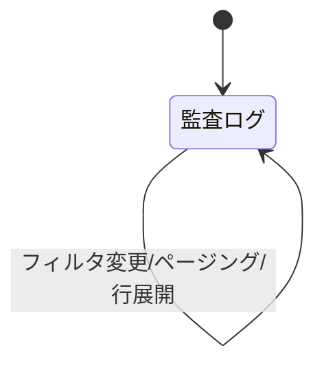

# 画面仕様：横断監査ログ（画面ID: S-Audit）

| 項目 | 内容 |
|---|---|
| 画面ID | S-Audit |
| 画面名 | 横断監査ログ |
| 関連ユースケース | US-07 / F-04 |
| 関連AC | AC-07 |
| 概要 | 全ドメイン・横断共通機能の操作履歴を統一形式で検索・閲覧する（閲覧専用）。 |

## 1. レイアウト

```
┌──────────────────────────────────────────────────────┐
│ 監査ログ    [期間▾] [ドメイン▾] [操作種別▾] [実行者___]│
├──────────────────────────────────────────────────────┤
│ 日時          | 実行者 | ドメイン | 操作 | 対象 | 結果 | │
│ 07-05 10:12   | admin  | DNS      | 削除 | zone:a| 成功 |▸│
│ 07-05 10:08   | oper1  | DHCP     | 解放 | lease:| 成功 |▸│
│  … ページング …                                        │
└──────────────────────────────────────────────────────┘
   行展開(▸) → IP / 変更差分 / 詳細メッセージ
```

## 2. 画面部品一覧

| 部品ID | 部品名 | 種別 | 初期表示 | 備考 |
|---|---|---|---|---|
| C-01 | 期間フィルタ | 日付範囲 | 既定=直近24h | プリセット（今日/7日/30日/カスタム） |
| C-02 | ドメインフィルタ | ドロップダウン | 全ドメイン | 横断共通機能も選択肢に含む |
| C-03 | 操作種別フィルタ | ドロップダウン | 全種別 | 作成/更新/削除/制御/ログイン等 |
| C-04 | 実行者フィルタ | テキスト | 空 | ユーザ名部分一致 |
| C-05 | 監査テーブル | テーブル | データ依存 | 逆時系列。行展開で詳細 |
| C-06 | ページング | ナビ | 2ページ以上 | - |
| C-07 | エクスポート | ボタン | 常時 | 現フィルタ結果をCSV出力（任意/残課題可） |

## 3. 状態(State)ごとの表示

| 状態 | 発生条件 | 表示内容 |
|---|---|---|
| 空(Empty) | 該当0件 | `条件に一致する監査ログはありません。`（AC-07） |
| 読み込み中(Loading) | 取得中 | スケルトン行 |
| 正常(Success) | データあり | 一覧＋ページング |
| エラー(Error) | 取得失敗 | `監査ログの取得に失敗しました。` と [再試行] |

## 4. イベント定義

| # | 部品 | イベント | 事前条件 | 動作・結果 |
|---|---|---|---|---|
| E-01 | 各フィルタ | 変更 | - | 条件で再取得。ページを1に戻す |
| E-02 | 行 | クリック/展開 | - | IP・変更差分・詳細メッセージを展開表示 |
| E-03 | 列見出し（日時） | クリック | - | 昇順/降順トグル |
| E-04 | ページング | クリック | 2ページ以上 | 前/次ページ取得 |
| E-05 | エクスポート | クリック | - | 現在の絞り込み結果をCSVでダウンロード |

## 5. 入力検証ルール

| 項目 | 必須 | 制約 | エラー文言 |
|---|---|---|---|
| カスタム期間 | 任意 | 開始≦終了 | `開始日は終了日より前にしてください。` |

## 6. 画面遷移



## 7. 補足

- 監査ログは**追記のみ・改変不可**（閲覧のみ提供、編集/削除UIは持たない）。
- 記録項目：日時 / 実行者 / ロール / ドメイン / 操作種別 / 対象ID / 結果 / IP / 詳細（変更差分）。データ定義は 07。
- 保持期間・容量方針は 05_non_functional に規定。
- Viewer 以上で閲覧可（監査担当を含む）。
