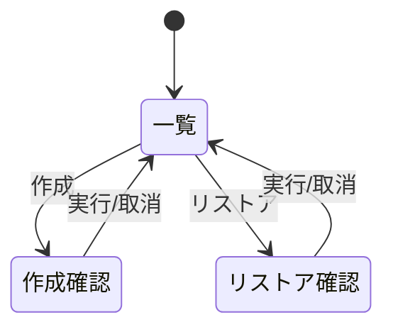

# 画面仕様：横断バックアップ／リストア（画面ID: S-Backup）

| 項目 | 内容 |
|---|---|
| 画面ID | S-Backup |
| 画面名 | 横断バックアップ／リストア |
| 関連ユースケース | US-09 / F-06 |
| 関連AC | AC-09 |
| 概要 | 対応ドメインの構成をバックアップ・一覧・リストアする横断機能（Admin限定）。 |

## 1. レイアウト

```
┌──────────────────────────────────────────────┐
│ バックアップ    [ドメイン▾]        [＋ 作成]    │
├──────────────────────────────────────────────┤
│ 作成日時        | 対象     | サイズ | 種別 | 操作 │
│ 07-05 02:00     | DNS      | 12KB  | 自動 |[⟲][🗑]│
│ 07-04 18:22     | 全ドメイン| 1.2MB | 手動 |[⟲][🗑]│
└──────────────────────────────────────────────┘
  [⟲]=リストア  [🗑]=削除
```

## 2. 画面部品一覧

| 部品ID | 部品名 | 種別 | 初期表示 | 備考 |
|---|---|---|---|---|
| C-01 | ドメインフィルタ | ドロップダウン | 全対象 | バックアップ対応ドメインのみ |
| C-02 | 作成ボタン | ボタン | Adminで活性 | 対象ドメインを選び作成 |
| C-03 | バックアップ一覧 | テーブル | データ依存 | 作成日時降順。メタデータ表示 |
| C-04 | リストアボタン | 行アクション | Admin | ConfirmDialog経由 |
| C-05 | 削除ボタン | 行アクション | Admin | ConfirmDialog経由 |

## 3. 状態(State)ごとの表示

| 状態 | 発生条件 | 表示内容 |
|---|---|---|
| 空(Empty) | 0件 | `バックアップがありません。` と作成ボタン |
| 読み込み中(Loading) | 取得中 | スケルトン行 |
| 正常(Success) | データあり | 一覧表示 |
| 処理中(Progress) | 作成/リストア実行中 | プログレス表示・二重実行防止 |
| エラー(Error) | 取得/実行失敗 | `処理に失敗しました。` と [再試行] |
| 権限不足 | Admin以外 | 一覧は閲覧可、作成/リストア/削除は非活性（AC-04） |

## 4. イベント定義

| # | 部品 | イベント | 事前条件 | 動作・結果 |
|---|---|---|---|---|
| E-01 | 作成ボタン | クリック | Admin | 対象選択→バックアップ作成→一覧に追加→監査記録 |
| E-02 | リストア | クリック | Admin | `<対象>を <作成日時> の状態にリストアします。現在の設定は上書きされます。よろしいですか？` を確認 |
| E-03 | リストア承認 | クリック | - | リストア実行→結果トースト→監査記録 |
| E-04 | リストア（非互換） | 承認 | 破損/非互換 | `このバックアップはリストアできません（形式が不正です）。`（AC-09） |
| E-05 | 削除 | クリック | Admin | 確認後に削除→監査記録 |

## 5. 入力検証ルール

| 項目 | 必須 | 制約 | エラー文言 |
|---|---|---|---|
| 対象ドメイン | 必須 | 対応ドメインから選択 | `バックアップ対象を選択してください。` |

## 6. 画面遷移



## 7. 補足

- バックアップ対応ドメイン（DNS/K8s 等）はデータモデル（07）で定義。非対応ドメインはフィルタに現れない。
- 自動バックアップのスケジュールは設定（F-09）で管理。保持世代数・容量は 05_non_functional。
- リストアは破壊的操作のため必ず確認ダイアログ＋監査記録。
