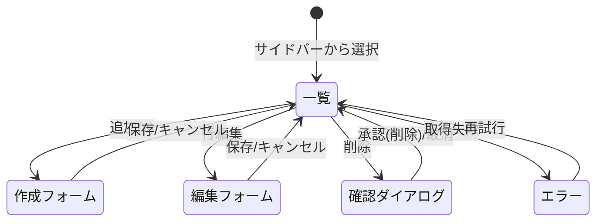

# 画面仕様：共通CRUD編集パターン ＆ アプリシェル（画面ID: S-00）

> 全ドメインの一覧/作成/更新/削除画面が継承する**標準パターン**。各ドメイン固有画面（screen_<domain>.md）は本仕様を前提とし、**差分（固有カラム・固有項目・固有操作）のみ**を記述する。

| 項目 | 内容 |
|---|---|
| 画面ID | S-00 |
| 画面名 | 共通CRUD編集パターン／認証済みアプリシェル |
| 関連ユースケース | UC-02 / US-04, US-13〜US-20（全ドメインCRUD） |
| 関連AC | AC-04, AC-CRUD |
| 概要 | サイドバー＋ヘッダーの共通シェル内で、データ種別を一覧・作成・更新・削除する標準操作を定義する。 |

## 0. アプリシェル（全認証済み画面の外枠）

```
┌──────────────────────────────────────────────────────────┐
│ [≡] Magnetite         [🔔 alerts] [🌐 ja/en] [🌓] [👤 user▾] │ ← ヘッダー
├───────────┬──────────────────────────────────────────────┤
│ サイドバー │  <コンテンツ領域＝各画面>                       │
│ ▸ダッシュ  │                                               │
│ ▸監査ログ  │                                               │
│ ▸アラート  │                                               │
│ ─ドメイン─ │                                               │
│ ▸DNS      │                                               │
│ ▸DHCP     │                                               │
│ ▸LDAP …   │                                               │
│ ─管理─     │                                               │
│ ▸設定      │                                               │
│ ▸アカウント│                                               │
└───────────┴──────────────────────────────────────────────┘
```

- **サイドバー**：折りたたみ式。「横断（ダッシュボード/監査/アラート/バックアップ/ログ）」「8ドメイン」「管理（設定/アカウント）」の3グループ。現在地をハイライト。ロールで表示項目を出し分け（Viewer は管理グループ非表示）。
- **ヘッダー**：アラート未確認数バッジ、言語切替(ja/en)、テーマ切替(dark/light)、ユーザーメニュー（表示名・ロール・ログアウト）。
  - **ログアウト**（イベント）：ユーザーメニュー→ログアウト→現在セッションを失効（SSO時はトークン破棄）→`S-Login` へ遷移→監査記録（AC-05b／09 §6.5）。
  - アラートバッジのクリックで `S-Alerts` へ、未確認数は open 件数と連動（08_alerting）。
- 認証チェック：未認証時はどの画面要求でも `S-Login` へリダイレクト（AC-01/02）。

## 1. レイアウト（共通CRUD：一覧画面）

```
┌──────────────────────────────────────────────┐
│ <データ種別名>            [🔍 検索____] [＋ 追加] │ ← ページヘッダー
├──────────────────────────────────────────────┤
│ [フィルタ▾]  [状態▾]                件数: N     │
├──────────────────────────────────────────────┤
│ □ | 名称        | 属性A | 属性B | 状態 | 操作    │ ← データテーブル
│ □ | item-1     | …    | …    | ●正常| [✎][🗑] │
│ □ | item-2     | …    | …    | ○停止| [✎][🗑] │
├──────────────────────────────────────────────┤
│ [◀ 前]   1 / M ページ   [次 ▶]                 │ ← ページング
└──────────────────────────────────────────────┘
```

作成/更新は**右スライドオーバー or モーダル**でフォーム表示（画面遷移せず一覧の文脈を保持）。

```
┌── <データ種別> の作成/編集 ──────────┐
│ 名称   [__________________]          │
│ 属性A  [__________________]          │
│ 属性B  [▾ 選択 ]                     │
│ …（ドメイン固有項目）                 │
│                    [キャンセル] [保存] │
└──────────────────────────────────────┘
```

## 2. 画面部品一覧

| 部品ID | 部品名 | 種別 | 初期表示 | 備考 |
|---|---|---|---|---|
| C-01 | 追加ボタン | ボタン | Operator以上で活性 | 主要アクション。Viewerは非活性 |
| C-02 | 検索ボックス | テキスト入力 | 常時 | 名称等の部分一致 |
| C-03 | フィルタ | ドロップダウン | 常時 | ドメイン固有の絞り込み |
| C-04 | データテーブル | テーブル | データ依存 | ソート可・行選択可 |
| C-05 | 行操作（編集/削除） | アイコンボタン | 行ごと | 削除はConfirmDialogを経由 |
| C-06 | ページング | ナビ | 2ページ以上で活性 | 前/次・現在ページ |
| C-07 | 作成/編集フォーム | スライドオーバー | 追加/編集時 | 保存/キャンセル |
| C-08 | ConfirmDialog | ダイアログ | 削除等の破壊的操作時 | 文言はイベント表参照 |
| C-09 | トースト | 通知 | 操作結果時 | 成功/失敗 |

## 3. 状態(State)ごとの表示 ※必ず全て埋める

| 状態 | 発生条件 | 表示内容 |
|---|---|---|
| 空(Empty) | データ0件 | `データがありません。` と（Operator以上に）追加ボタンを表示 |
| 読み込み中(Loading) | データ取得中 | データテーブル領域にスケルトン行を表示 |
| 正常(Success) | データあり | 一覧＋ページング表示 |
| エラー(Error) | 取得失敗 | `データの取得に失敗しました。` と [再試行] ボタンを表示 |
| 検証エラー(Validation) | フォーム入力不正 | 該当フィールド直下に確定文言（各ドメイン検証表）を赤字表示し保存不可 |
| 権限不足(Forbidden) | Viewerが更新系を要求 | 操作ボタン非活性。直接要求時 `この操作を行う権限がありません。`（AC-04） |
| 保存中(Submitting) | 保存要求処理中 | 保存ボタンをスピナー化し二重送信を防止 |

## 4. イベント定義（トリガー → 条件 → 結果）

| # | 部品 | イベント | 事前条件 | 動作・結果 |
|---|---|---|---|---|
| E-01 | 追加ボタン | クリック | Operator以上 | 作成フォーム（空）を開く |
| E-02 | 検索ボックス | 入力（デバウンス） | - | 一覧を絞り込み再取得。ページを1に戻す |
| E-03 | フィルタ | 変更 | - | 条件で一覧を再取得 |
| E-04 | テーブル列見出し | クリック | - | 昇順/降順トグルで並び替え |
| E-05 | 行 編集 | クリック | Operator以上 | 該当データを読み込み編集フォームを開く |
| E-06 | 保存ボタン | クリック | 必須項目未充足 | 該当項目に検証文言を表示し保存しない |
| E-07 | 保存ボタン | クリック | 入力妥当 | 保存→一覧更新→フォーム閉→トースト `保存しました。`→監査記録 |
| E-08 | 行 削除 | クリック | Operator以上 | ConfirmDialog `<対象>を削除します。よろしいですか？` を表示 |
| E-09 | ConfirmDialog 承認 | クリック | - | 削除実行→一覧更新→トースト `削除しました。`→監査記録。参照ありは E-10 |
| E-10 | 削除（参照あり） | 承認 | 他データから参照されている | 削除を拒否し `他の設定から参照されているため削除できません。` を表示（参照マップは07） |
| E-11 | ページング | クリック | 2ページ以上 | 前/次ページを取得して表示 |
| E-12 | キャンセル | クリック | フォーム編集中 | 変更破棄確認（変更ありの場合）後フォームを閉じる |
| E-13 | 再試行 | クリック | エラー状態 | データを再取得 |

> ショートカット：`/`＝検索フォーカス、`n`＝新規作成（Operator以上）、`Esc`＝フォーム/ダイアログを閉じる。

## 5. 入力検証ルール（共通の枠。具体項目は各ドメイン画面で定義）

| 項目種別 | 必須 | 制約 | エラー文言（既定） |
|---|---|---|---|
| 名称/識別子 | 必須 | 1〜N文字、種別ごとの文字種 | `名称を正しく入力してください。` |
| 一意キー | 必須 | 既存と重複不可 | `同じ名称が既に存在します。` |
| 数値（ポート/閾値等） | 任意 | 範囲内の整数 | `<範囲>の数値を入力してください。` |
| 選択（enum） | 必須 | 定義値のいずれか | `いずれかを選択してください。` |

> 各ドメインの具体的な項目・制約・文言は screen_<domain>.md の「5. 入力検証」で確定する。

## 6. 画面遷移



## 7. 補足

- **アクセシビリティ**：テーブルはキーボードで行移動可、操作アイコンにaria-label、フォームはラベルと入力を関連付け、ダイアログは開いた時にフォーカスを移し `Esc` で閉じる。フォーカスリングを常に可視化。
- **レスポンシブ**：最小幅768px想定。狭幅ではサイドバーをオーバーレイ折りたたみ、テーブルは主要列のみ表示し詳細は行展開。
- **i18n**：全文言はja/enキーで管理（確定文言は日本語を正とし、en訳を対にする）。
- **監査**：全更新系イベント（E-07/E-09/E-10）は横断監査ログ（F-04）へ記録する。
