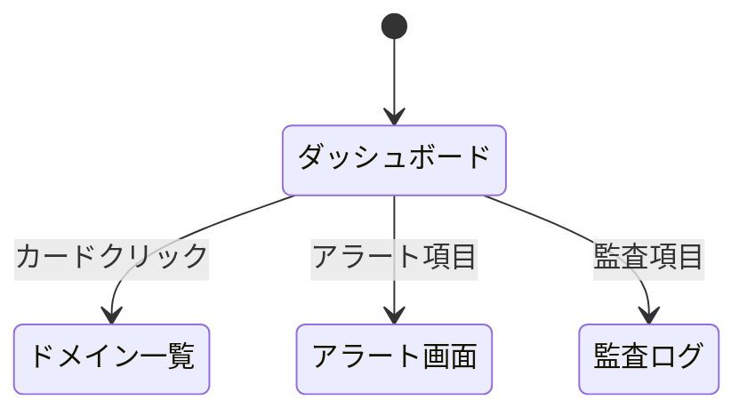

# 画面仕様：統合ダッシュボード（画面ID: S-Dash）

| 項目 | 内容 |
|---|---|
| 画面ID | S-Dash |
| 画面名 | 統合ダッシュボード |
| 関連ユースケース | US-06 / F-03 |
| 関連AC | AC-06 |
| 概要 | 全8ドメインの稼働状況と主要指標を1画面で俯瞰する、ログイン直後の起点画面。 |

## 1. レイアウト

```
┌──────────────────────────────────────────────┐
│ ダッシュボード              最終更新: hh:mm:ss ⟳ │
├──────────────────────────────────────────────┤
│ ┌ドメインカード┐ ┌ドメインカード┐ ┌───────┐  │
│ │ DNS   ●正常 │ │ DHCP  ●正常 │ │ LDAP  │  │
│ │ ゾーン 12   │ │ 稼働率 98%  │ │ ●警告 │  │
│ │ 直近5分 42q │ │ リース 87   │ │ …     │  │
│ └────────────┘ └────────────┘ └───────┘  │
│  … 8ドメイン分のカードをグリッド表示 …        │
├──────────────────────────────────────────────┤
│ 未確認アラート (N)          最近の監査 (最新5件) │
│ ● critical ホストX 応答なし   user 操作 ドメイン │
│ ● warning  証明書まもなく期限  …               │
└──────────────────────────────────────────────┘
```

## 2. 画面部品一覧

| 部品ID | 部品名 | 種別 | 初期表示 | 備考 |
|---|---|---|---|---|
| C-01 | ドメインカード×8 | カード | 常時 | 状態バッジ＋主要指標2〜3項目。クリックで当該ドメインの起点画面（S-<DOMAIN>-01）へ |
| C-02 | 更新インジケータ | ラベル＋ボタン | 常時 | 自動更新間隔と手動更新 |
| C-03 | 未確認アラート一覧 | リスト | データ依存 | 重大度順・最大N件。クリックでアラート画面へ |
| C-04 | 最近の監査 | リスト | データ依存 | 最新5件。クリックで監査ログへ |

## 3. 状態(State)ごとの表示

| 状態 | 発生条件 | 表示内容 |
|---|---|---|
| 空(Empty) | アラート/監査が0件 | 各パネルに `未確認のアラートはありません。`／`監査ログはまだありません。` |
| 読み込み中(Loading) | 初回取得中 | カード・パネルをスケルトン表示 |
| 正常(Success) | 取得成功 | カードと各パネルを表示 |
| 部分エラー(Partial) | 一部ドメイン取得失敗 | 当該カードに `状態を取得できませんでした` バッジ＋[再試行]（他カードは正常表示） |
| エラー(Error) | 全体取得失敗 | `ダッシュボードを取得できませんでした。` と [再試行] |

- ドメイン状態バッジ：●正常 / ●警告 / ●異常 / ○不明（4値）。

## 4. イベント定義

| # | 部品 | イベント | 事前条件 | 動作・結果 |
|---|---|---|---|---|
| E-01 | ドメインカード | クリック | - | 当該ドメインの起点画面 S-<DOMAIN>-01（例 S-DNS-01）へ遷移。以降サイドバーで各一覧へ |
| E-02 | 自動更新 | タイマー | 画面表示中 | 一定間隔で状態を再取得しカードを更新 |
| E-03 | 手動更新 | クリック | - | 即時再取得。最終更新時刻を更新 |
| E-04 | 未確認アラート項目 | クリック | - | アラート画面（該当で絞り込み）へ |
| E-05 | 監査項目 | クリック | - | 監査ログ画面（該当で絞り込み）へ |
| E-06 | カード再試行 | クリック | 部分エラー | 当該ドメインのみ再取得 |

## 5. 入力検証ルール

なし（閲覧専用画面）。更新間隔の変更は設定（F-09）側で行う。

## 6. 画面遷移



## 7. 補足

- Viewer 以上で閲覧可能。破壊的操作は持たない。
- 自動更新間隔の既定は 05_non_functional に規定（暫定30秒）。
- a11y：カードはリンクとして扱い、状態バッジは色＋テキスト（色覚非依存）。
