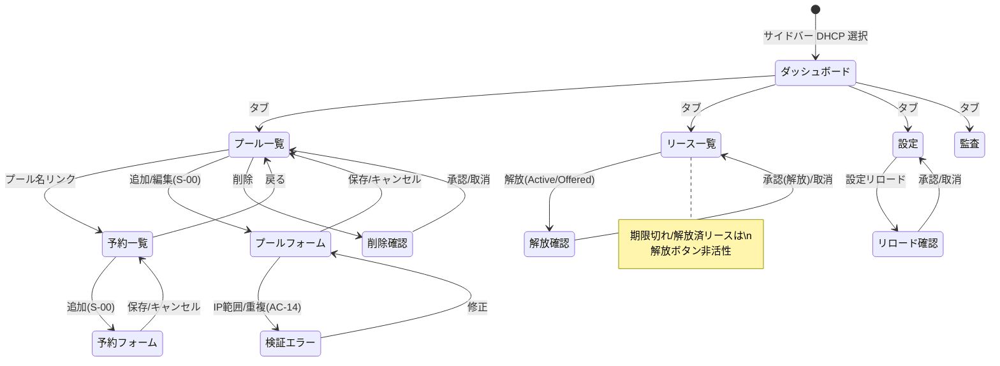

# 画面仕様：DHCP 管理（画面ID: S-DHCP）

> 本仕様は **S-00（共通CRUD編集パターン／アプリシェル）** を前提とし、DHCP 固有の差分のみを記述する。
> 一覧・作成・編集・削除・検索・ソート・トースト・監査記録などの標準挙動は **S-00 に準拠**する（各表で「S-00に準拠」と明記した項目は再掲しない）。
> 完全統合モノリス方針により、DHCP はアプリ内部モジュールであり、**サービス個別認証は撤廃**。認証は統一（ローカル＋SSO）、RBAC は統一ロール（参照=Viewer／更新=Operator／破壊的=Admin）に従う。

| 画面ID | 画面名 | 関連機能 / AC | 概要 |
|---|---|---|---|
| S-DHCP-01 | DHCP ダッシュボード | F-12 / AC-14 | サーバー統計とプール使用率を参照表示（更新系なし） |
| S-DHCP-02 | プール一覧・編集 | F-12 / AC-14 | IPv4/IPv6 配布プールの CRUD。IP範囲・重複検証を持つ（S-00準拠＋固有差分） |
| S-DHCP-03 | 予約（固定割当）一覧・編集 | F-12 / AC-14 | プール配下の MAC→IP 固定割当の CRUD（S-00準拠＋固有差分） |
| S-DHCP-04 | リース一覧 | F-12 / AC-14 | 払い出し状況の検索・ページング・**個別解放**。作成/編集なし |
| S-DHCP-05 | DHCP 設定 | F-12 / AC-14 | 設定 JSON の参照と**ホットリロード**。編集は設定ファイル管理側 |
| S-DHCP-06 | DHCP 監査 | F-12 / AC-14 | DISCOVER/OFFER/ACK 等の監査イベント参照（横断監査の DHCP ビュー・参照のみ） |

- ドメインナビ「DHCP」配下に上記 6 画面をタブ／サブメニューとして配置する（S-00 サイドバー）。
- 監査（S-DHCP-06）・ログ・アラート・バックアップは**横断共通機能の参照ビュー**であり、DHCP 側では読み取り専用。ログ表示は横断ログ（F-04系）に統合する。

---

## S-DHCP-01 DHCP ダッシュボード

| 項目 | 内容 |
|---|---|
| 画面ID | S-DHCP-01 |
| 関連機能 / AC | F-12 / AC-14 |
| 概要 | サーバー稼働統計とプールごとの使用率を参照表示する（Viewer 以上・更新系なし）。 |

### 1. レイアウト

```
┌──────────────────────────────────────────────┐
│ DHCP ダッシュボード                    [更新] │
├──────────────────────────────────────────────┤
│ [Active] [総リース] [DISCOVER] [ACK]          │ ← 統計カード x4
├──────────────────────────────────────────────┤
│ プール使用率                                   │
│ 名前 | 総ｱﾄﾞﾚｽ | 払出済 | 空き | 使用率(バッジ) │ ← 参照テーブル
└──────────────────────────────────────────────┘
```

### 2. 画面部品一覧（固有差分）

| 部品ID | 部品名 | 種別 | 初期表示 | 備考 |
|---|---|---|---|---|
| D-01 | 統計カード群 | stat-card ×4 | 常時 | Active/総リース/DISCOVER/ACK |
| D-02 | 使用率テーブル | テーブル | データ依存 | プールごとの総/払出済/空き/使用率 |
| D-03 | 使用率バッジ | ラベル | 行ごと | 90%超=危険 / 70%超=注意 / 他=正常 |
| D-04 | 更新ボタン | ボタン | 常時 | 統計を再取得（E-D01） |

### 3. 状態ごとの表示（S-00 準拠、固有差分）

| 状態 | 発生条件 | 表示内容 |
|---|---|---|
| 空(Empty) | プール0件 | `プールがありません。` |
| 正常(Success) | データあり | 統計カード＋使用率テーブル |
| エラー(Error) | 取得失敗 | `DHCP 統計の取得に失敗しました。` と [再試行] |

### 4. イベント定義（固有）

| # | 部品 | イベント | 事前条件 | 動作・結果 |
|---|---|---|---|---|
| E-D01 | 更新ボタン | クリック | - | 統計・使用率を再取得 |
| E-D02 | 自動更新 | 10秒タイマー | 画面表示中 | 統計を再取得（バックグラウンド） |

---

## S-DHCP-02 プール一覧・編集

| 項目 | 内容 |
|---|---|
| 画面ID | S-DHCP-02 |
| 関連機能 / AC | F-12 / AC-14 |
| 概要 | 配布プールを一覧・作成・更新・削除する。**S-00 の CRUD に準拠**し、IP範囲項目と重複検証が固有差分。 |

### 1. レイアウト（S-00 一覧＋スライドオーバー準拠）

```
┌──────────────────────────────────────────────┐
│ プール          [🔍 検索] [状態▾]  [＋ 追加]  │
├──────────────────────────────────────────────┤
│ 名前(リンク) | サブネット | 範囲 | GW | 状態 | 操作│
│ pool-1       |192.168.1.0/24|.10-.200|.1|有効|[✎][🗑]│
└──────────────────────────────────────────────┘
   名前リンク → S-DHCP-03（予約一覧）へ遷移
```

### 2. 画面部品一覧（固有差分のみ／標準は S-00 C-01〜C-09）

| 部品ID | 部品名 | 種別 | 初期表示 | 備考 |
|---|---|---|---|---|
| D-10 | プール名リンク | リンク | 行ごと | クリックで予約一覧（S-DHCP-03）へ |
| D-11 | 有効/無効バッジ | ラベル | 行ごと | enabled=有効 / 無効 |
| D-12 | 範囲入力(v4開始/終了) | テキスト入力 | フォーム | 固有検証あり（IP形式・範囲・重複） |
| D-13 | サブネット入力 | テキスト入力 | フォーム | CIDR 形式（例 192.168.1.0/24） |
| D-14 | DNS/GW/ドメイン | 入力群 | フォーム | 任意項目 |
| D-15 | リース期間(秒) | 数値入力 | フォーム | 任意・正整数 |

### 3. 状態ごとの表示

S-00 に準拠。検証エラーは「5. 入力検証」の確定文言をフィールド直下に赤字表示（S-00 検証エラー状態）。

### 4. イベント定義（S-00 準拠、固有差分）

標準の追加/編集/保存/削除/検索/ソートは **S-00（E-01〜E-13）に準拠**。固有差分は以下。

| # | 部品 | イベント | 事前条件 | 動作・結果 |
|---|---|---|---|---|
| E-D10 | プール名リンク | クリック | - | S-DHCP-03（当該 pool_id の予約一覧）へ遷移 |
| E-D11 | 保存 | クリック | 範囲がIP形式不正 | `有効な IP アドレスを入力してください。` を表示し保存しない |
| E-D12 | 保存 | クリック | 開始IP > 終了IP | `範囲の開始 IP は終了 IP 以下にしてください。` を表示し保存しない |
| E-D13 | 保存 | クリック | 既存プール／予約と範囲重複 | **`指定範囲は既存プールと重複しています。`**（AC-14）を表示し保存しない |
| E-D14 | 行 削除 | 承認 | 有効リースが存在 | ConfirmDialog `有効なリースを持つプールを削除します。よろしいですか？`。承認で削除→監査記録 |

### 5. 入力検証（固有・確定文言）

| 項目 | 必須 | 制約 | エラー文言 |
|---|---|---|---|
| プール名 | 必須 | 1〜N文字・一意 | `名称を正しく入力してください。`（S-00） |
| サブネット(v4) | 任意 | CIDR 形式 | `有効なサブネット（CIDR）を入力してください。` |
| 範囲開始/終了IP | 任意 | IPv4/IPv6 形式・サブネット内 | `有効な IP アドレスを入力してください。` |
| 範囲の大小 | - | 開始 ≦ 終了 | `範囲の開始 IP は終了 IP 以下にしてください。` |
| 範囲の重複 | - | 既存プール／予約と非重複 | **`指定範囲は既存プールと重複しています。`** |
| リース期間(秒) | 任意 | 正整数 | `正の整数（秒）を入力してください。` |

---

## S-DHCP-03 予約（固定割当）一覧・編集

| 項目 | 内容 |
|---|---|
| 画面ID | S-DHCP-03 |
| 関連機能 / AC | F-12 / AC-14 |
| 概要 | 特定プール配下の MAC→IP 固定割当を一覧・作成・削除する。**S-00 の CRUD に準拠**。 |

### 1. レイアウト

```
┌──────────────────────────────────────────────┐
│ [← 戻る] プール <name> の予約   [＋ 追加]      │
├──────────────────────────────────────────────┤
│ MACアドレス | IPアドレス | ホスト名 | 操作      │
│ aa:bb:...   | 192.168.1.50|host-a  | [🗑]      │
└──────────────────────────────────────────────┘
```

### 2. 画面部品一覧（固有差分）

| 部品ID | 部品名 | 種別 | 初期表示 | 備考 |
|---|---|---|---|---|
| D-20 | 戻るボタン | リンク | 常時 | S-DHCP-02（プール一覧）へ |
| D-21 | MAC 入力 | テキスト入力 | フォーム | MAC 形式検証 |
| D-22 | 予約 IP 入力 | テキスト入力 | フォーム | 所属プール範囲内・重複不可 |

### 4. イベント定義（S-00 準拠、固有差分）

| # | 部品 | イベント | 事前条件 | 動作・結果 |
|---|---|---|---|---|
| E-D20 | 戻るボタン | クリック | - | プール一覧（S-DHCP-02）へ遷移 |
| E-D21 | 保存 | クリック | MAC 形式不正 | `有効な MAC アドレスを入力してください。` を表示し保存しない |
| E-D22 | 保存 | クリック | IP がプール範囲外／既存予約と重複 | **`指定範囲は既存プールと重複しています。`**（AC-14）を表示し保存しない |

### 5. 入力検証（固有・確定文言）

| 項目 | 必須 | 制約 | エラー文言 |
|---|---|---|---|
| MAC アドレス | 必須 | MAC 形式・一意 | `有効な MAC アドレスを入力してください。` |
| 予約 IP | 必須 | プール範囲内・重複不可 | `指定範囲は既存プールと重複しています。` |
| ホスト名 | 任意 | ホスト名形式 | `有効なホスト名を入力してください。` |

---

## S-DHCP-04 リース一覧

| 項目 | 内容 |
|---|---|
| 画面ID | S-DHCP-04 |
| 関連機能 / AC | F-12 / AC-14 |
| 概要 | 現在のリース払い出し状況を検索・ページングし、**個別解放**を行う。作成/編集は持たない。 |

### 1. レイアウト

```
┌──────────────────────────────────────────────┐
│ リース        [🔍 検索] [状態▾] [プール▾][更新]│
├──────────────────────────────────────────────┤
│ IP | ホスト名 | 状態(バッジ) | 有効期限 | 操作  │
│ .50| host-a  | ●Active     | 12:30   |[解放]  │
│ .51| host-b  | ○Expired    | 09:00   |[解放*] │ ← *期限切れは非活性
├──────────────────────────────────────────────┤
│ [◀ 前]  p / M  [次 ▶]                         │
└──────────────────────────────────────────────┘
```

### 2. 画面部品一覧（固有差分）

| 部品ID | 部品名 | 種別 | 初期表示 | 備考 |
|---|---|---|---|---|
| D-30 | 状態フィルタ | ドロップダウン | 全 | Active/Offered/Expired/Released |
| D-31 | プールフィルタ | ドロップダウン | 全 | pool_id で絞り込み |
| D-32 | 状態バッジ | ラベル | 行ごと | Active=正常 / Offered=遷移中 / Expired・Released=停止 |
| D-33 | 解放ボタン | 行アクション | Active/Offered行かつOperator以上 | **期限切れ(Expired)/解放済(Released)は非活性** |
| D-34 | ページング | ナビ | 2ページ以上 | サーバーページング（page/per_page） |

### 3. 状態ごとの表示（固有差分）

| 状態 | 発生条件 | 表示内容 |
|---|---|---|
| 空(Empty) | 該当0件 | `該当するリースはありません。` |
| 正常(Success) | データあり | 一覧＋状態バッジ＋ページング |
| エラー(Error) | 取得失敗 | `リースの取得に失敗しました。` と [再試行] |
| 権限不足(Forbidden) | Viewer | 解放ボタン非活性（AC-04） |

### 4. イベント定義（固有）

| # | 部品 | イベント | 事前条件 | 動作・結果 |
|---|---|---|---|---|
| E-D30 | 検索ボックス | 入力(デバウンス) | - | IP/ホスト名で絞り込み。ページを1に戻し再取得 |
| E-D31 | 状態/プールフィルタ | 変更 | - | 条件で再取得 |
| E-D32 | 解放ボタン | クリック | Active/Offered・Operator以上 | ConfirmDialog `IP <ip> のリースを解放します。よろしいですか？` を表示 |
| E-D33 | 解放 確認ダイアログ承認 | クリック | - | **リース解放を実行**→一覧 refetch→トースト `リースを解放しました。`→監査記録 |
| E-D34 | 解放ボタン | 表示評価 | 状態が Expired/Released | ボタンを**非活性**（解放対象外のため） |
| E-D35 | ページング | クリック | 2ページ以上 | 前/次ページを取得（サーバーページング） |
| E-D36 | 更新ボタン | クリック | - | 現在条件でリースを再取得 |

### 5. 入力検証

入力フォームなし（検索文字列のみ・検証不要）。

---

## S-DHCP-05 DHCP 設定

| 項目 | 内容 |
|---|---|
| 画面ID | S-DHCP-05 |
| 関連機能 / AC | F-12 / AC-14 |
| 概要 | サーバー設定 JSON を参照し、**ホットリロード**を実行する。設定内容の編集は行わない（参照＋リロードのみ）。 |

### 1. レイアウト

```
┌──────────────────────────────────────────────┐
│ DHCP 設定           [設定リロード] [更新]      │
├──────────────────────────────────────────────┤
│  { 設定 JSON を整形表示（読み取り専用） }       │
└──────────────────────────────────────────────┘
```

### 2. 画面部品一覧（固有差分）

| 部品ID | 部品名 | 種別 | 初期表示 | 備考 |
|---|---|---|---|---|
| D-40 | 設定ビューア | 整形表示(pre) | 常時 | JSON を pretty print・読み取り専用 |
| D-41 | 設定リロードボタン | ボタン | Operator以上で活性 | ホットリロード実行 |
| D-42 | 更新ボタン | ボタン | 常時 | 設定を再取得 |

### 4. イベント定義（固有）

| # | 部品 | イベント | 事前条件 | 動作・結果 |
|---|---|---|---|---|
| E-D40 | 設定リロード | クリック | Operator以上 | ConfirmDialog `設定をリロードします。よろしいですか？` を表示 |
| E-D41 | リロード 確認承認 | クリック | - | **設定リロードを実行**→設定 refetch→トースト `設定をリロードしました。`→監査記録 |
| E-D42 | 更新ボタン | クリック | - | 設定 JSON を再取得 |
| E-D43 | 権限不足 | - | Viewer | リロードボタン非活性（AC-04） |

---

## S-DHCP-06 DHCP 監査

| 項目 | 内容 |
|---|---|
| 画面ID | S-DHCP-06 |
| 関連機能 / AC | F-12 / AC-14 |
| 概要 | DHCP の監査イベント（DISCOVER/OFFER/REQUEST/ACK 等）を検索・ページング参照する。横断監査機能の DHCP ビューであり**参照専用**。 |

### 1. レイアウト

```
┌──────────────────────────────────────────────┐
│ DHCP 監査   [🔍 検索] [イベント種別▾] [更新]   │
├──────────────────────────────────────────────┤
│ 日時 | 種別(バッジ) | IP | ホスト名 | 詳細      │
├──────────────────────────────────────────────┤
│ [◀ 前]  p / M  [次 ▶]                         │
└──────────────────────────────────────────────┘
```

### 2. 画面部品一覧（固有差分）

| 部品ID | 部品名 | 種別 | 初期表示 | 備考 |
|---|---|---|---|---|
| D-50 | イベント種別フィルタ | ドロップダウン | 全 | DISCOVER/OFFER/REQUEST/ACK/NAK/RELEASE |
| D-51 | 種別バッジ | ラベル | 行ごと | イベント種別を色分け表示 |
| D-52 | ページング | ナビ | 2ページ以上 | サーバーページング |

### 4. イベント定義（固有）

| # | 部品 | イベント | 事前条件 | 動作・結果 |
|---|---|---|---|---|
| E-D50 | 検索/種別フィルタ | 入力・変更 | - | 条件で再取得。ページを1に戻す |
| E-D51 | ページング | クリック | 2ページ以上 | 前/次ページ取得 |
| E-D52 | 更新ボタン | クリック | - | 監査イベントを再取得 |

> 参照専用のため作成/更新/削除イベント・入力検証は持たない。破壊的操作なし。

---

## 6. 画面遷移（DHCP ドメイン全体）



## 7. 補足（DHCP 固有）

- **RBAC 統一**：参照系（統計/一覧/リース/設定閲覧/監査）= Viewer 以上。更新系（プール・予約 CRUD、リース解放、設定リロード）= Operator 以上。プール削除など破壊的操作は Admin 相当を要する運用も許容（S-00 の権限出し分けに従う）。サービス個別認証は撤廃済み。
- **監査記録**：リース解放（E-D33）・設定リロード（E-D41）・プール/予約の CRUD は横断監査ログ（F-04系）へ記録する。
- **横断機能との関係**：アラート／バックアップ／テンプレート／ログは横断共通機能を参照する。DHCP 画面内では新規生成せず、S-DHCP-06 監査を含め読み取り専用ビューとして表示する。
- **単一組織前提**：組織スコープ切替は持たない。全プール/リースは単一組織配下として扱う。
- **i18n / アクセシビリティ / レスポンシブ**：S-00 の規定に準拠（確定文言は日本語を正とし en 訳を対にする。テーブルはキーボード操作可、ダイアログは開いた時フォーカス移動・Esc で閉じる）。
