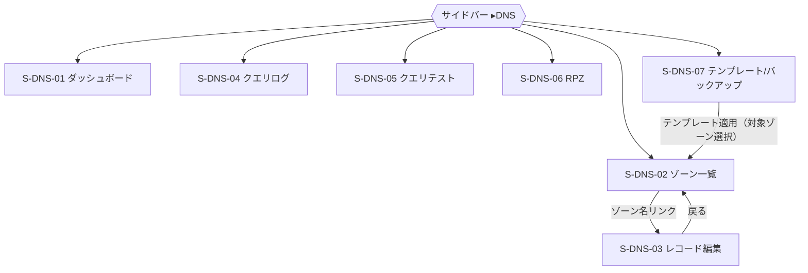
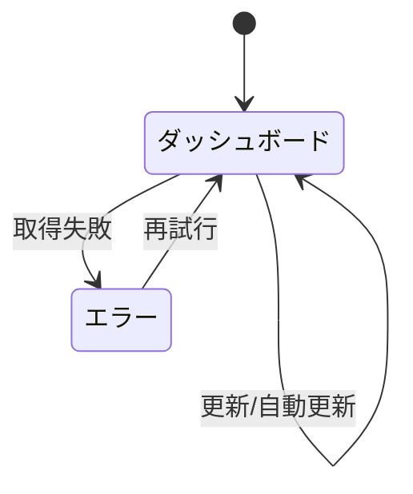
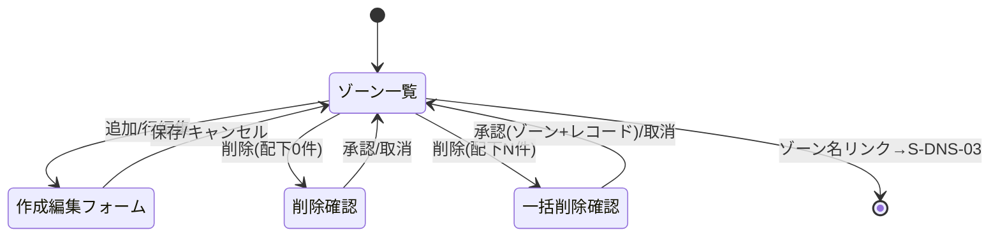
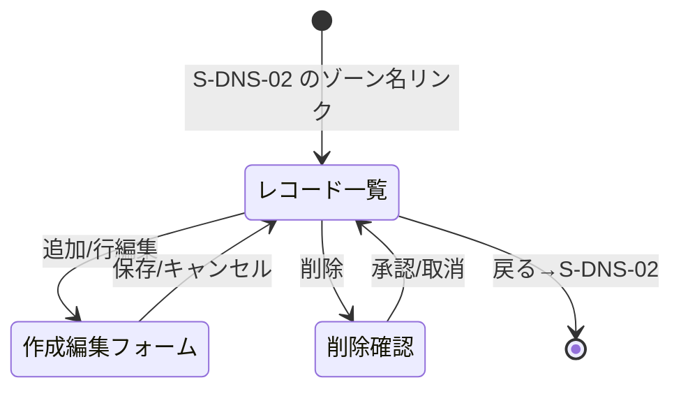
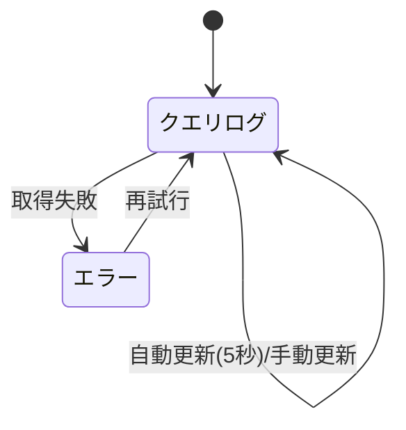
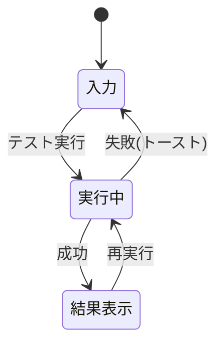
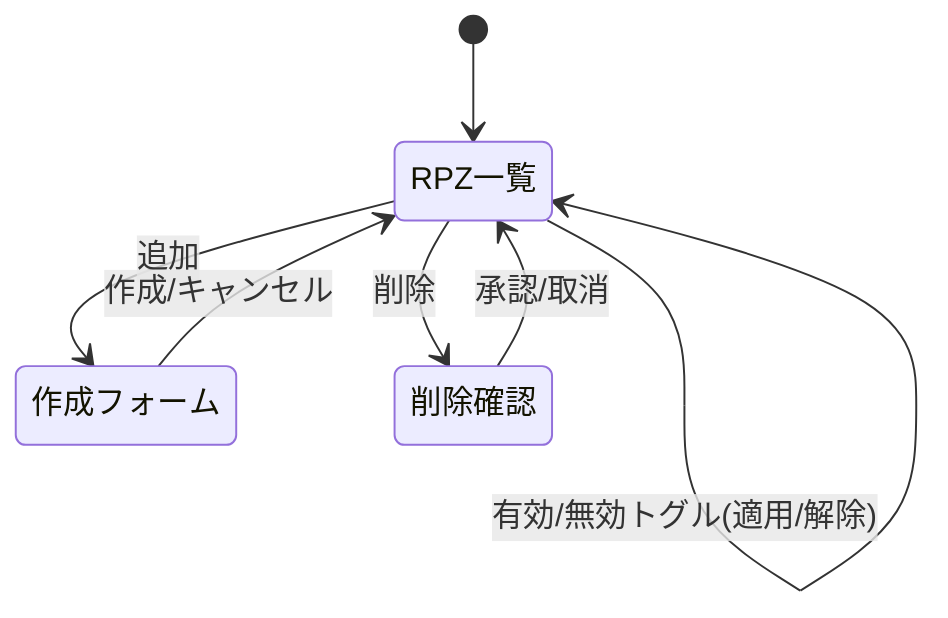
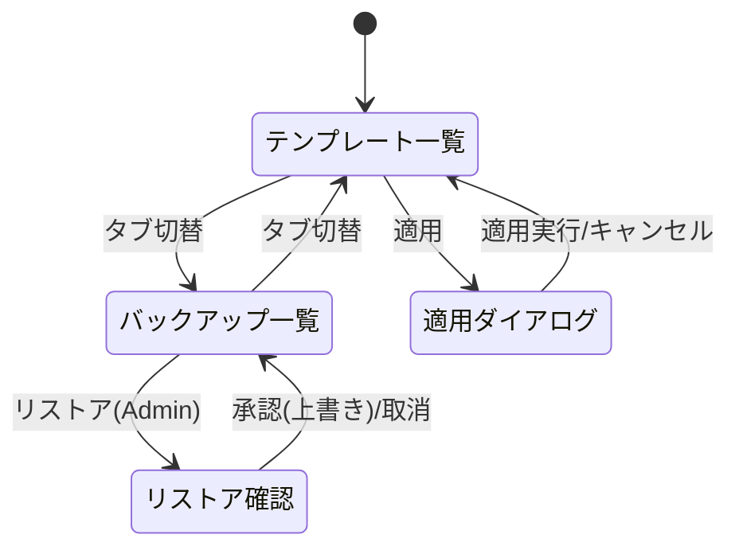

# 画面仕様：DNS 管理（画面群ID: S-DNS-nn）

| 項目 | 内容 |
|---|---|
| 画面群ID | S-DNS-01 〜 S-DNS-07（接頭辞 `S-DNS-nn`） |
| 画面群名 | DNS 管理 |
| 関連要件 | F-11（DNS 管理：ゾーン/レコード CRUD・テンプレート・RPZ・クエリログ/テスト・バックアップ） |
| 関連AC | AC-13（DNS 固有）／AC-CRUD（共通CRUD）／AC-04（権限） |
| 継承元 | S-00（共通CRUD＋アプリシェル）。標準の一覧/作成/更新/削除・状態・共通イベント・アクセシビリティ・i18n・監査は **S-00 に準拠**し、本書では **DNS 固有部分のみ** を記す。 |
| 概要 | DNS ドメイン（アプリ内部モジュール）のゾーン・レコード・テンプレート・RPZ・クエリログ/テスト・バックアップを統一シェル内で管理する。 |

## 前提（確定方針の反映）

- **完全統合モノリス**：DNS は独立プロセスではなくアプリ内部モジュール。API ゲートウェイ／`DnsClient`／サービストークン取得（`dns_ctx` 等）は撤廃し、画面はアプリ内部のドメインサービスを直接呼ぶ（移行元の `DnsClient` 経由・JWT は継承しない）。
- **認証統一**：セッション認証は統一認証（ローカル＋SSO）に一本化。**DNS 個別のサービストークンは撤廃**。
- **RBAC 統一**：参照=Viewer／更新（作成・更新・削除・テンプレート適用・RPZ・バックアップ作成）=Operator／**破壊的・制御（リストア）=Admin**。権限不足の表示・非活性は S-00 に準拠（AC-04 `この操作を行う権限がありません。`）。
- **単一組織前提**：テナント境界は持たない。
- **横断共通機能は参照のみ**：監査ログ=**S-Audit**、アラート=**S-Alerts**、バックアップ運用の全体方針=**S-Backup**、ログ閲覧=**S-Logs** を参照。DNS のクエリログ（S-DNS-04）は「DNS サーバーが処理した名前解決クエリの履歴」であり、横断監査ログ（S-Audit）とは別物である点に注意。DNS バックアップ（S-DNS-07）も横断バックアップ（S-Backup）とは別のドメイン固有バックアップとして扱う。

## 固有画面一覧

| 画面ID | 画面名 | ルート（参考） | 種別 | S-00 継承 |
|---|---|---|---|---|
| S-DNS-01 | DNS ダッシュボード | `/dns` | 統計表示（CRUD外） | シェルのみ |
| S-DNS-02 | ゾーン一覧／編集 | `/dns/zones` | 標準CRUD＋固有 | 一覧/作成/更新/削除に準拠 |
| S-DNS-03 | レコード編集 | `/dns/zones/:zone_id/records` | 標準CRUD＋固有 | 一覧/作成/更新/削除に準拠 |
| S-DNS-04 | クエリログ | `/dns/query-logs` | 閲覧（自動更新） | 一覧表示のみ準拠 |
| S-DNS-05 | クエリテスト | `/dns/query-test` | 実行＋結果表示 | シェルのみ |
| S-DNS-06 | RPZ 管理 | `/dns/rpz` | 標準CRUD＋固有 | 一覧/作成/削除に準拠 |
| S-DNS-07 | テンプレート／バックアップ | `/dns/templates`, `/dns/backup` | 標準CRUD＋固有操作 | 一覧/作成/削除に準拠 |

> テンプレートとバックアップは操作の性質（定型レコード群の管理と一括適用／設定全体の保全とリストア）が近く、いずれも「一覧＋固有操作」中心のため 1 画面仕様（S-DNS-07）にまとめ、タブで切り替える。移行元は別ページだが、統合後は DNS の「運用（保全・雛形適用）」として集約する。

## 画面群 全体遷移



---

# S-DNS-01：DNS ダッシュボード

| 項目 | 内容 |
|---|---|
| 画面ID | S-DNS-01 ／ 関連 F-11 |
| 概要 | DNS サーバーの統計（ゾーン数・レコード数・クエリ統計・キャッシュ）を集計表示する。CRUD は持たない。 |

## 1. レイアウト（固有）

```
┌───────────────────────────────────────────────┐
│ DNS ダッシュボード                     [🔄 更新] │
├───────────────────────────────────────────────┤
│ [ゾーン数] [レコード数] [総クエリ数] [キャッシュ] │ ← 統計カード 1段目
│ [ローカル応答][キャッシュヒット][転送][失敗(赤)] │ ← 統計カード 2段目
└───────────────────────────────────────────────┘
```

## 2. 画面部品（固有）

| 部品ID | 部品名 | 種別 | 初期表示 | 備考 |
|---|---|---|---|---|
| D-01 | 統計カード（1段目） | カード | 取得後 | ゾーン数/レコード数/総クエリ数/キャッシュサイズ |
| D-02 | 統計カード（2段目） | カード | 取得後 | ローカル応答/キャッシュヒット/転送/失敗。失敗は異常色 |
| D-03 | 更新ボタン | ボタン | 常時 | 再集計。全ロールで実行可（参照系） |

## 3. 状態（固有差分）

| 状態 | 発生条件 | 表示内容 |
|---|---|---|
| 空(Empty) | ゾーン0件 | 各カードは `0` を表示（空扱いにしない） |
| エラー(Error) | 取得失敗 | `ダッシュボード統計の取得に失敗しました。` と [再試行]（S-00準拠） |

## 4. イベント（固有）

| # | 部品 | イベント | 事前条件 | 動作・結果 |
|---|---|---|---|---|
| E-01 | 画面 | 初期表示 | 認証済 | 統計を取得して各カードへ反映 |
| E-02 | 更新ボタン | クリック | - | 統計を再取得 |
| E-03 | 画面 | 自動更新（10秒タイマー） | ブラウザ表示中 | 10 秒ごとに再取得。非表示タブでは停止 |

## 5. 入力検証

入力項目なし。

## 6. 画面遷移



## 7. 補足

- 自動更新はタイマーで実装。可視性 API に従い、非表示タブでは停止して負荷を抑える。

---

# S-DNS-02：ゾーン一覧／編集

| 項目 | 内容 |
|---|---|
| 画面ID | S-DNS-02 ／ 関連 F-11・AC-13 |
| 概要 | DNS ゾーン（SOA を含む）を一覧・作成・更新・削除する。標準 CRUD は S-00 に準拠し、SOA 項目・ゾーン名検証・**配下レコードを伴う削除**を固有として定義する。 |

## 1. レイアウト（固有差分）

一覧・作成/編集フォーム・確認ダイアログの枠組みは **S-00 に準拠**。固有カラムと SOA フォーム項目のみ示す。

```
一覧 固有カラム: | ゾーン名(→レコードへリンク) | Primary NS(mname) | 管理者(rname) | Serial | 状態(有効/無効) |
```

```
┌── ゾーンの作成/編集（スライドオーバー） ──────────┐
│ ゾーン名   [example.com________]                  │
│ Primary NS [ns1.example.com_____]  (mname)        │
│ 管理者Email[admin.example.com___]  (rname/ドット表記)│
│ ▸ SOA 詳細（折りたたみ・既定値で初期化）           │
│    Serial [1] Refresh [3600] Retry [900]          │
│    Expire [604800] Minimum(TTL) [86400]           │
│ 有効 [✓]                                          │
│                          [キャンセル] [保存]       │
└───────────────────────────────────────────────────┘
```

## 2. 画面部品（固有）

| 部品ID | 部品名 | 種別 | 初期表示 | 備考 |
|---|---|---|---|---|
| D-01 | ゾーン名リンク | リンク | 行ごと | S-DNS-03（レコード編集）へ遷移 |
| D-02 | Primary NS 入力 | テキスト | フォーム | SOA mname（FQDN） |
| D-03 | 管理者Email 入力 | テキスト | フォーム | SOA rname（ドット表記メール） |
| D-04 | SOA 詳細（折りたたみ） | 数値入力群 | 折りたたみ既定 | Serial/Refresh/Retry/Expire/Minimum。既定値で初期化 |
| D-05 | 状態バッジ | バッジ | 行ごと | 有効／無効 |

## 3. 状態（固有差分）

| 状態 | 発生条件 | 表示内容 |
|---|---|---|
| 空(Empty) | ゾーン0件 | `DNS ゾーンがありません。`（Operator以上に追加ボタン） |
| エラー(Error) | 取得失敗 | `ゾーン一覧の取得に失敗しました。` と [再試行] |
| 確認（配下レコードあり） | 削除対象に配下レコードあり | `このゾーンには N 件のレコードがあります。まとめて削除しますか？`（AC-13） |

## 4. イベント（固有）

標準の作成/更新/削除フローは S-00（E-01〜E-13）に準拠。以下は DNS 固有分。

| # | 部品 | イベント | 事前条件 | 動作・結果 |
|---|---|---|---|---|
| E-01 | ゾーン名リンク | クリック | - | S-DNS-03 へ遷移（対象ゾーンのレコード一覧） |
| E-02 | 行 削除 | クリック（配下レコード0件） | Operator以上 | 通常の確認 `このゾーンを削除します。よろしいですか？`（S-00 E-08） |
| E-03 | 行 削除 | クリック（配下レコードN件） | Operator以上 | 確認 `このゾーンには N 件のレコードがあります。まとめて削除しますか？`（AC-13）を表示 |
| E-04 | 上記確認 承認 | クリック | - | ゾーンと配下レコードを一括削除→一覧更新→トースト `削除しました。`→監査記録（S-Audit） |
| E-05 | 保存 | クリック（検証違反） | - | 該当項目に検証文言（§5）を表示し保存しない |

## 5. 入力検証（固有）

| 項目 | 必須 | 制約 | エラー文言 |
|---|---|---|---|
| ゾーン名 | 必須 | ラベル 1〜63 文字、`a-z0-9-` とドット区切り、各ラベル先頭末尾は英数字、末尾ドット可 | `ゾーン名の形式が正しくありません。（例: example.com）` |
| ゾーン名（重複） | 必須 | 既存ゾーンと重複不可 | `同じ名前のゾーンが既に存在します。` |
| Primary NS（mname） | 必須 | FQDN 形式 | `プライマリネームサーバーを FQDN で入力してください。` |
| 管理者Email（rname） | 必須 | ドット表記メール（例: `admin.example.com`） | `管理者メールをドット表記で入力してください。（例: admin.example.com）` |
| Serial/Refresh/Retry/Expire/Minimum | 必須 | 0〜4294967295 の整数（u32） | `0〜4294967295 の数値を入力してください。` |

## 6. 画面遷移



## 7. 補足

- SOA 詳細は上級者向け。既定値（Serial=1/Refresh=3600/Retry=900/Expire=604800/Minimum=86400）で初期化し、通常は折りたたんだまま作成可能とする。

---

# S-DNS-03：レコード編集

| 項目 | 内容 |
|---|---|
| 画面ID | S-DNS-03 ／ 関連 F-11 |
| 概要 | 特定ゾーン配下のリソースレコード（A/AAAA/CNAME/MX/TXT/NS/PTR/SRV/CAA）を一覧・作成・更新・削除する。**レコード種別ごとの値入力と検証**が固有。 |

## 1. レイアウト（固有差分）

一覧・フォーム・確認は S-00 準拠。ページヘッダに **[戻る]** と対象ゾーン名を表示。

```
┌ [← 戻る] DNS ゾーン {zone名} のレコード      [＋ 追加] ┐
一覧 固有カラム: | 名前(FQDN) | 種別(バッジ) | 値(種別別に整形) | TTL | 状態 |
```

```
┌── レコードの作成/編集 ──────────────────────────┐
│ 名前  [www.example.com___]   種別 [A ▾]          │
│ 〈値〉種別に応じて入力欄が切替（§下表）            │
│ TTL   [3600] 秒              有効 [✓]             │
│                        [キャンセル] [保存]         │
└──────────────────────────────────────────────────┘
```

種別ごとの値入力欄（`data` へ変換）：

| 種別 | 入力欄 | data 構造 |
|---|---|---|
| A / AAAA | アドレス | `{ "address": "<IP>" }` |
| CNAME | ターゲット | `{ "target": "<FQDN>" }` |
| MX | 優先度・交換先 | `{ "preference": <u16>, "exchange": "<FQDN>" }` |
| TXT | テキスト | `{ "text": "<文字列>" }` |
| NS | ネームサーバー | `{ "nsdname": "<FQDN>" }` |
| PTR | ポインタ先 | `{ "ptrdname": "<FQDN>" }` |
| SRV / CAA | 値（生文字列） | `{ "value": "<文字列>" }` |

## 2. 画面部品（固有）

| 部品ID | 部品名 | 種別 | 初期表示 | 備考 |
|---|---|---|---|---|
| D-01 | 戻るリンク | リンク | 常時 | S-DNS-02 へ戻る |
| D-02 | 種別セレクト | セレクト | フォーム | 選択で値入力欄を切替 |
| D-03 | 値入力欄（動的） | 種別依存 | フォーム | 種別に応じ単一/複合入力を切替 |
| D-04 | TTL 入力 | 数値 | 既定3600 | 秒 |
| D-05 | 種別バッジ | バッジ | 行ごと | レコード種別 |
| D-06 | 値表示（整形） | 等幅テキスト | 行ごと | 種別ごとに整形表示 |

## 3. 状態（固有差分）

| 状態 | 発生条件 | 表示内容 |
|---|---|---|
| 空(Empty) | 配下レコード0件 | `このゾーンにはレコードがありません。` |
| エラー(Error) | 取得失敗 | `レコード一覧の取得に失敗しました。` と [再試行] |
| 検証エラー | 種別と値が不整合 | 値欄直下に §5 の確定文言を赤字表示 |

## 4. イベント（固有）

標準 CRUD は S-00 準拠。固有分：

| # | 部品 | イベント | 事前条件 | 動作・結果 |
|---|---|---|---|---|
| E-01 | 戻るリンク | クリック | - | S-DNS-02 へ遷移 |
| E-02 | 種別セレクト | 変更 | - | 値入力欄を当該種別のフォームへ切替（入力済み値は種別互換時のみ保持） |
| E-03 | 保存 | クリック（種別別検証違反） | - | 値欄に §5 の文言を表示し保存しない |

## 5. 入力検証（固有）

| 項目 | 必須 | 制約 | エラー文言 |
|---|---|---|---|
| 名前 | 必須 | ゾーン配下の FQDN／相対名 | `レコード名の形式が正しくありません。` |
| 種別 | 必須 | A/AAAA/CNAME/MX/TXT/NS/PTR/SRV/CAA のいずれか | `レコード種別を選択してください。` |
| 値（A） | 必須 | IPv4 ドット10進 | `IPv4 アドレスを入力してください。（例: 192.0.2.1）` |
| 値（AAAA） | 必須 | IPv6 | `IPv6 アドレスを入力してください。（例: 2001:db8::1）` |
| 値（CNAME/NS/PTR） | 必須 | FQDN | `FQDN を入力してください。（例: host.example.com）` |
| 値（MX） | 必須 | 優先度=0〜65535 整数、交換先=FQDN | `優先度（0〜65535）と交換先 FQDN を入力してください。` |
| 値（TXT） | 必須 | 1文字以上 | `テキストを入力してください。` |
| TTL | 必須 | 0〜4294967295 の整数（u32） | `TTL は 0〜4294967295 の数値で入力してください。` |

## 6. 画面遷移



## 7. 補足

- 種別変更時、旧種別で入力した値は新種別と項目構成が異なる場合クリアする（誤った `data` 送信を防ぐ）。

---

# S-DNS-04：クエリログ

| 項目 | 内容 |
|---|---|
| 画面ID | S-DNS-04 ／ 関連 F-11 |
| 概要 | DNS サーバーが処理した名前解決クエリの履歴を閲覧する（自動更新対応・閲覧専用）。**横断監査ログ S-Audit とは別物**。 |

## 1. レイアウト（固有）

```
┌ DNS クエリログ            [☑ 自動更新]   [🔄 更新] ┐
├──────────────────────────────────────────────────┤
│ 時刻 | クライアント | クエリ名 | 種別 | 応答コード | ソース | 遅延 │
│ …    | 198.51.100.7 | a.exa..  | [A]  | [NOERROR]  | cache  | 32μs │
└──────────────────────────────────────────────────┘
```

## 2. 画面部品（固有）

| 部品ID | 部品名 | 種別 | 初期表示 | 備考 |
|---|---|---|---|---|
| D-01 | 自動更新チェック | チェックボックス | ON | 既定で自動更新有効 |
| D-02 | 更新ボタン | ボタン | 常時 | 手動再取得 |
| D-03 | 応答コードバッジ | バッジ | 行ごと | NOERROR=正常色／NXDOMAIN=中立色／その他=異常色 |
| D-04 | 遅延表示 | テキスト | 行ごと | マイクロ秒（μs） |

## 3. 状態（固有差分）

| 状態 | 発生条件 | 表示内容 |
|---|---|---|
| 空(Empty) | ログ0件 | `クエリログがありません。` |
| エラー(Error) | 取得失敗 | `クエリログの取得に失敗しました。` と [再試行] |

## 4. イベント（固有）

| # | 部品 | イベント | 事前条件 | 動作・結果 |
|---|---|---|---|---|
| E-01 | 画面 | 初期表示 | 認証済 | 直近ログ（既定 200 件）を取得 |
| E-02 | 自動更新チェック | 変更 | - | ON の間、5 秒ごとに再取得。OFF で停止 |
| E-03 | 更新ボタン | クリック | - | 手動再取得 |

## 5. 入力検証

入力項目なし。

## 6. 画面遷移



## 7. 補足

- 閲覧専用。作成/編集/削除 UI は持たない。自動更新は非表示タブで停止。

---

# S-DNS-05：クエリテスト

| 項目 | 内容 |
|---|---|
| 画面ID | S-DNS-05 ／ 関連 F-11 |
| 概要 | 任意の名前・種別に対する名前解決テストを実行し、応答（回答/権威/追加・応答コード・遅延・応答サーバー）を表示する。 |

## 1. レイアウト（固有）

```
┌ DNS クエリテスト ────────────────────────────────┐
│ クエリ名 [example.com___]  種別 [A ▾]  [テスト実行] │
├──────────────────────────────────────────────────┤
│ ▼ 結果（実行後に表示）                             │
│  応答コード: NOERROR   遅延: 12ms   サーバー: 10.0.0.1 │
│  回答(answers):                                    │
│  ┌────────────────────────────────────────────┐   │
│  │ 192.0.2.1                                    │   │
│  └────────────────────────────────────────────┘   │
│  権威(authority) / 追加(additional): 同形式で表示   │
└──────────────────────────────────────────────────┘
```

## 2. 画面部品（固有）

| 部品ID | 部品名 | 種別 | 初期表示 | 備考 |
|---|---|---|---|---|
| D-01 | クエリ名入力 | テキスト | 空 | 解決対象名 |
| D-02 | 種別セレクト | セレクト | A | A/AAAA/CNAME/MX/TXT/NS/PTR/SRV/SOA |
| D-03 | テスト実行ボタン | ボタン | 常時（参照系のため全ロール可） | 名前解決を実行 |
| D-04 | 結果カード | カード | 実行後 | 応答コード・遅延(ms)・応答サーバー |
| D-05 | 応答セクション表示 | 等幅プリ | 実行後 | answers/authority/additional を改行区切り |

## 3. 状態（固有）

| 状態 | 発生条件 | 表示内容 |
|---|---|---|
| 初期 | 未実行 | 結果カード非表示、入力欄のみ |
| 実行中(Submitting) | 実行要求中 | 実行ボタンをスピナー化し二重実行を防止 |
| 成功 | 応答受信 | 結果カードに応答コード/遅延/サーバー、各セクションを表示 |
| 応答なし | answers 0件 | 結果カードは表示し、回答欄に `回答はありませんでした。` |
| エラー(Error) | 実行失敗 | トースト `クエリテストの実行に失敗しました。` |

## 4. イベント（固有）

| # | 部品 | イベント | 事前条件 | 動作・結果 |
|---|---|---|---|---|
| E-01 | テスト実行ボタン | クリック（名前未入力） | - | `クエリ名を入力してください。` を表示し実行しない |
| E-02 | テスト実行ボタン | クリック（入力妥当） | - | 名前解決を実行し結果カードを表示 |
| E-03 | 実行結果 | 成功 | - | answers/authority/additional・応答コード・遅延・サーバーを表示 |
| E-04 | 実行結果 | 失敗 | - | エラートーストを表示（監査対象外＝参照系） |

## 5. 入力検証（固有）

| 項目 | 必須 | 制約 | エラー文言 |
|---|---|---|---|
| クエリ名 | 必須 | 1文字以上 | `クエリ名を入力してください。` |
| 種別 | 必須 | 定義値のいずれか | `クエリ種別を選択してください。` |

## 6. 画面遷移



## 7. 補足

- 名前解決テストは参照系操作として全ロールで実行可。結果は画面表示のみで永続化しない。

---

# S-DNS-06：RPZ 管理

| 項目 | 内容 |
|---|---|
| 画面ID | S-DNS-06 ／ 関連 F-11 |
| 概要 | RPZ（Response Policy Zone）ルール（悪性ドメインへの応答ポリシー）を一覧・作成・削除し、有効/無効を切り替える。標準 CRUD は S-00 準拠、**アクション別のリダイレクト先・適用/解除**が固有。 |

## 1. レイアウト（固有差分）

```
一覧 固有カラム: | ドメイン | アクション | リダイレクト先 | 状態(有効/無効) |
```

```
┌── RPZ ルールの作成 ─────────────────────────────┐
│ ドメイン   [malware.example.com___]              │
│ アクション [NXDOMAIN ▾]  (NXDOMAIN/NODATA/Redirect/Drop) │
│ リダイレクト先 [safe.example.com___] ← Redirect時のみ表示 │
│ 有効 [✓]                                         │
│                        [キャンセル] [作成]        │
└──────────────────────────────────────────────────┘
```

## 2. 画面部品（固有）

| 部品ID | 部品名 | 種別 | 初期表示 | 備考 |
|---|---|---|---|---|
| D-01 | アクションセレクト | セレクト | NXDOMAIN | NXDOMAIN/NODATA/Redirect/Drop |
| D-02 | リダイレクト先入力 | テキスト | Redirect時のみ表示 | 非 Redirect 時は非表示・`None` 送信 |
| D-03 | 有効/無効トグル | トグル | 行ごと／フォーム | ルールの適用（有効）/解除（無効） |
| D-04 | 状態バッジ | バッジ | 行ごと | 有効／無効 |

## 3. 状態（固有差分）

| 状態 | 発生条件 | 表示内容 |
|---|---|---|
| 空(Empty) | ルール0件 | `RPZ ルールがありません。` |
| エラー(Error) | 取得失敗 | `RPZ ルールの取得に失敗しました。` と [再試行] |
| 検証エラー | Redirect でリダイレクト先未入力 | `リダイレクト先を入力してください。` |

## 4. イベント（固有）

標準 CRUD は S-00 準拠。固有分：

| # | 部品 | イベント | 事前条件 | 動作・結果 |
|---|---|---|---|---|
| E-01 | アクションセレクト | 変更 | - | `Redirect` のときのみリダイレクト先入力欄を表示。他は隠して `redirect_to=None` |
| E-02 | 作成ボタン | クリック（Redirect かつリダイレクト先空） | - | `リダイレクト先を入力してください。` を表示し作成しない |
| E-03 | 有効/無効トグル（適用/解除） | 変更 | Operator以上 | 有効=ポリシー適用／無効=適用解除。更新→トースト `保存しました。`→監査記録（S-Audit） |
| E-04 | 行 削除 | クリック | Operator以上 | 確認 `この RPZ ルールを削除します。よろしいですか？`→削除→トースト `削除しました。` |

## 5. 入力検証（固有）

| 項目 | 必須 | 制約 | エラー文言 |
|---|---|---|---|
| ドメイン | 必須 | FQDN／ドメイン形式 | `対象ドメインの形式が正しくありません。` |
| アクション | 必須 | NXDOMAIN/NODATA/Redirect/Drop | `アクションを選択してください。` |
| リダイレクト先 | Redirect時必須 | FQDN | `リダイレクト先を入力してください。` |

## 6. 画面遷移



## 7. 補足

- 「適用/解除」は有効フラグの更新で表現し、ルール定義を保持したまま一時的に無効化できる。

---

# S-DNS-07：テンプレート／バックアップ

| 項目 | 内容 |
|---|---|
| 画面ID | S-DNS-07 ／ 関連 F-11 |
| 概要 | タブ構成。【テンプレート】定型レコード群の一覧・作成・削除と**ゾーンへの一括適用**。【バックアップ】DNS 設定全体のバックアップ**作成・一覧・リストア**（リストアは Admin）。横断バックアップ S-Backup とは別のドメイン固有機能。 |

## 1. レイアウト（固有）

```
┌ DNS 運用   [ テンプレート | バックアップ ]（タブ）  ┐
├── テンプレート タブ ─────────────────────────────┤
│ 名前 | 説明 | レコード件数 | 操作([適用][削除])     │
│ web-basic | Web基本セット | 3 | [適用▾][🗑]        │
├── バックアップ タブ ─────────────────────────────┤
│ [＋ バックアップ作成]                              │
│ 名前 | 作成時刻 | ゾーン数 | レコード数 | 操作([リストア]) │
│ backup-20260705 | 2026-07-05 10:00 | 5 | 42 | [↩ リストア] │
└──────────────────────────────────────────────────┘
```

適用ダイアログ：
```
┌── テンプレート「web-basic」を適用 ───────────────┐
│ 適用先ゾーン [▾ example.com を選択]               │
│ 追加されるレコード: 3 件                          │
│                        [キャンセル] [適用実行]     │
└──────────────────────────────────────────────────┘
```

## 2. 画面部品（固有）

| 部品ID | 部品名 | 種別 | 初期表示 | 備考 |
|---|---|---|---|---|
| D-01 | タブ切替 | タブ | テンプレート | テンプレート／バックアップ |
| D-02 | 適用ボタン（行） | ボタン | Operator以上 | 適用ダイアログを開く |
| D-03 | 適用先ゾーン選択 | セレクト | ダイアログ | 既存ゾーンから選択 |
| D-04 | バックアップ作成ボタン | ボタン | Operator以上 | 設定全体を保全 |
| D-05 | リストアボタン（行） | ボタン | **Admin のみ活性** | 破壊的操作。確認必須 |

## 3. 状態（固有差分）

| 状態 | 発生条件 | 表示内容 |
|---|---|---|
| 空(テンプレート) | 0件 | `テンプレートがありません。` |
| 空(バックアップ) | 0件 | `バックアップがありません。` |
| エラー(Error) | 取得失敗 | `一覧の取得に失敗しました。` と [再試行] |
| 権限不足(リストア) | Admin未満 | リストアボタン非活性。直接要求時 `この操作を行う権限がありません。`（AC-04） |
| 検証エラー(適用) | 適用先ゾーン未選択 | `適用先ゾーンを選択してください。` |

## 4. イベント（固有）

標準 CRUD（テンプレート作成/削除・一覧）は S-00 準拠。固有操作を必須記載：

| # | 部品 | イベント | 事前条件 | 動作・結果 |
|---|---|---|---|---|
| E-01 | タブ | 切替 | - | 該当タブの一覧を表示（未取得なら取得） |
| E-02 | 適用ボタン | クリック | Operator以上 | 適用ダイアログを開き適用先ゾーンを選択させる |
| E-03 | 適用実行 | クリック（ゾーン未選択） | - | `適用先ゾーンを選択してください。` を表示し実行しない |
| E-04 | 適用実行 | クリック（ゾーン選択済） | Operator以上 | テンプレートをゾーンへ一括適用→トースト `N 件のレコードを追加しました。`→レコード一覧に反映→監査記録（S-Audit） |
| E-05 | テンプレート削除 | クリック | Operator以上 | 確認 `このテンプレートを削除します。よろしいですか？`→削除→トースト `削除しました。` |
| E-06 | バックアップ作成 | クリック | Operator以上 | 設定全体を保全→一覧更新→トースト `バックアップを作成しました。`→監査記録 |
| E-07 | リストアボタン | クリック | **Admin** | 確認 `このバックアップの内容で DNS 設定を上書きします。現在の設定は失われます。よろしいですか？` を表示 |
| E-08 | リストア確認 承認 | クリック | Admin | リストア実行→トースト `リストアしました。`→各一覧を再取得→監査記録 |

## 5. 入力検証（固有）

| 項目 | 必須 | 制約 | エラー文言 |
|---|---|---|---|
| テンプレート名 | 必須 | 1〜N文字・重複不可 | `テンプレート名を入力してください。` |
| 適用先ゾーン | 必須（適用時） | 既存ゾーンのいずれか | `適用先ゾーンを選択してください。` |

## 6. 画面遷移



## 7. 補足

- リストアは全設定を上書きする破壊的・制御操作のため **Admin 限定**。確認文言でデータ喪失を明示する。
- テンプレート適用は既存ゾーンへレコードを追加する操作。名前サフィックスは適用先ゾーン名に基づいて解決する。
- バックアップの保持方針・スケジュール等の運用ルールは S-Backup／05_non_functional を参照する（本画面では再定義しない）。
