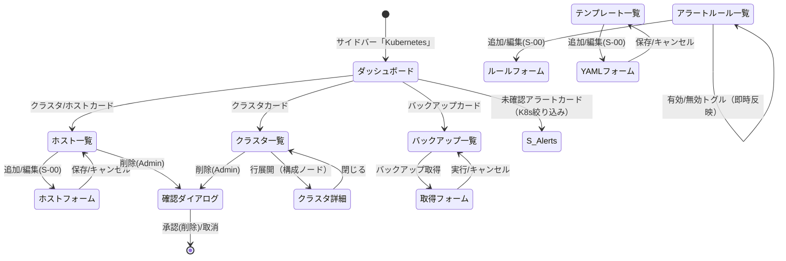

# 画面仕様：コンテナ／Kubernetes ドメイン（画面ID: S-K8S）

> 本仕様は **S-00（screen_common_crud.md）を前提**とし、K8s ドメイン**固有の差分のみ**を記述する。一覧/作成/更新/削除の標準操作・状態・部品・監査は S-00 に準拠し、各画面では固有カラム・固有項目・固有操作だけを定義する。
>
> **統合方針（厳守）**：完全統合モノリスへ収容。認証はローカル＋SSO で統一され、旧 Container サービスの**個別セッション認証（`rbac::current_user_ctx` によるサービス個別 session）は撤廃**。RBAC は横断統一（参照=Viewer／更新=Operator／破壊的=Admin）。単一組織前提のため組織スコープ選択は持たない。監査は横断共通（F-04）。**アラート通知先・バックアップ機構・テンプレート格納は横断共通機能（S-Alerts／S-Backup）を参照**し、本ドメインでは **K8s 固有設定（アラートルール定義・etcd スナップショット対象・マニフェストテンプレート）** に集中する。

## 画面一覧（ヘッダ表）

| 画面ID | 画面名 | 機能ID (F-16) | 受入基準 (AC-18) | 概要 |
|---|---|---|---|---|
| S-K8S-01 | K8s ダッシュボード | F-16 | AC-18 | クラスタ／ホスト／未確認アラート／バックアップのサマリを俯瞰する起点画面 |
| S-K8S-02 | ホスト（ノード）管理 | F-16 | AC-18 | コンテナホスト（SSH 接続先ノード）の一覧・登録・削除。標準CRUDは S-00 準拠 |
| S-K8S-03 | クラスタ管理 | F-16 | AC-18 | K8s クラスタの一覧・詳細（構成ノード）・削除。標準CRUDは S-00 準拠 |
| S-K8S-04 | アラートルール定義 | F-16 | AC-18 | **K8s 固有**の閾値アラートルールの CRUD と有効／無効の即時切替 |
| S-K8S-05 | クラスタバックアップ | F-16 | AC-18 | etcd スナップショット取得・一覧。機構は **S-Backup 参照**、K8s 固有対象指定のみ |
| S-K8S-06 | マニフェストテンプレート | F-16 | AC-18 | K8s リソース YAML テンプレートの CRUD。格納機構は横断参照、YAML 検証が固有 |

> クラスタ／ホストの**発生アラートの閲覧・確認応答**は横断 **S-Alerts** に集約する（本ドメインは生成側）。本仕様 S-K8S-04 はルール**定義**のみを扱う。

## 1. レイアウト（固有差分）

共通シェル・一覧テーブル・スライドオーバーフォームは S-00 に準拠。以下は固有の見出し／カラム／セクション構成のみ示す。

### S-K8S-01 ダッシュボード

```
┌──────────────────────────────────────────────┐
│ Kubernetes ダッシュボード      最終更新 hh:mm ⟳ │
├──────────────────────────────────────────────┤
│ ┌クラスタ┐ ┌ホスト┐ ┌未確認アラート┐ ┌バックアップ┐│
│ │  3     │ │  8   │ │   2 ●強調    │ │   12       ││
│ └────────┘ └──────┘ └──────────────┘ └──────────┘│
│  各カードクリックで対応する S-K8S-nn / S-Alerts へ  │
└──────────────────────────────────────────────┘
```

### S-K8S-02 ホスト一覧（固有カラム）

```
名称(hostname) | IP | ポート | ユーザー | 認証方式 | Role | クラスタ | 状態 | 操作
```
- 状態バッジ：`ready`/`online`→正常、`offline`→停止、`error`→異常。
- 作成フォーム固有項目：ホスト名／IP／SSH ポート（既定22）／SSH ユーザー／認証方式（password|key）／認証情報（credential）。**認証情報は保存後マスク表示・再表示不可**（横断シークレット管理に委譲）。

### S-K8S-03 クラスタ一覧（固有カラム）／詳細

```
名称 | Pod CIDR | Service CIDR | CNI | ノード数 | 状態 | 操作
```
- 行展開／詳細で **構成ノード一覧**（host_id・hostname・IP・role・status）を表示。クラスタは UI からの新規作成を持たず（ホスト昇格/プロビジョニングの結果）、**参照・削除のみ**。

### S-K8S-04 アラートルール（固有カラム）

```
ルール名 | 対象クラスタ | 種別 | 閾値 | 有効/無効(トグル) | 操作
```
- 種別：`cpu` / `memory` / `pod_restart` / `node_not_ready`。
- **有効/無効はインライン・トグル**（後述 E-K8S-01、即時反映）。通知先 Webhook は任意で、**恒久的な通知先管理は S-Alerts の通知設定を参照**（ここでは単発 URL の上書きのみ）。

### S-K8S-05 バックアップ（固有カラム）

```
対象クラスタ | ファイル名 | サイズ | 状態 | 取得ノード | 取得日時 | メッセージ
```
- 取得フォーム固有項目：対象クラスタ／取得元ノード hostname のみ。保存・世代管理・復元は **S-Backup**（横断バックアップ）に準拠。

### S-K8S-06 テンプレート（固有カラム）

```
名称 | 説明 | リソース種別 | 作成日時 | 操作
```
- リソース種別：`Deployment` / `Service` / `ConfigMap` / `Job`。本体は YAML テキストエリア。

## 2. 画面部品一覧（S-00 追加分のみ）

| 部品ID | 部品名 | 種別 | 初期表示 | 備考 |
|---|---|---|---|---|
| K-01 | サマリ stat-card ×4 | カード | S-K8S-01 常時 | クラスタ/ホスト/未確認アラート(強調)/バックアップ。クリックで遷移 |
| K-02 | ノード構成パネル | 展開パネル | S-K8S-03 詳細 | クラスタ詳細の構成ノード一覧（閲覧のみ） |
| K-03 | 有効/無効トグル | インラインスイッチ | S-K8S-04 行ごと | Operator以上で活性。ルールの enabled を即時切替 |
| K-04 | YAML エディタ | テキストエリア(12行) | S-K8S-06 作成/編集 | `template_yaml`。等幅・行番号。保存前に構文検証 |
| K-05 | 認証情報入力 | パスワード入力 | S-K8S-02 作成 | `credential`。保存後は非表示（マスク） |

削除確認（C-08）・トースト（C-09）・検索/フィルタ/ページング（C-02〜C-06）は S-00 のものを流用。

## 3. 状態(State)ごとの表示（固有差分）

S-00 の全状態（Empty/Loading/Success/Error/Validation/Forbidden/Submitting）に準拠。固有の追記のみ：

| 状態 | 発生条件 | 表示内容 |
|---|---|---|
| 空(Empty) | 各一覧0件 | S-K8S-02 `登録済みホストがありません。` ／ S-K8S-03 `クラスタがありません。` 等 |
| 権限不足(Forbidden) | Viewer が更新系要求 | 追加/削除/トグルを非活性（AC-04）。**削除（破壊的）は Admin のみ活性** |
| 処理中(Submitting) | バックアップ取得中 | 対象行の状態を `running` 表示。取得ボタンをスピナー化 |
| 検証エラー(Validation) | YAML 不正／閾値範囲外 | 該当フィールド直下に固有文言（5節）を赤字表示 |

## 4. イベント定義（固有操作）

S-00 の E-01〜E-13（追加/編集/保存/削除/ページング等）を継承。以下は **K8s 固有イベント**のみ。

| # | 部品 | イベント | 事前条件 | 動作・結果 |
|---|---|---|---|---|
| E-K8S-01 | 有効/無効トグル (K-03) | クリック | S-K8S-04・Operator以上 | `toggle_alert_rule(id, !enabled)` を実行し **即時反映**（楽観更新→確定）。成功でトースト `ルールを有効化/無効化しました。`→監査記録。失敗時は元状態へロールバックし `切替に失敗しました。` |
| E-K8S-02 | 削除（破壊的） | 承認 | ホスト/クラスタ/ルール/テンプレート・**Admin** | ConfirmDialog 承認後に削除。**クラスタ所属ホストや参照中テンプレートは E-10（参照あり）拒否**：`他の設定から参照されているため削除できません。` |
| E-K8S-03 | バックアップ取得 | クリック | S-K8S-05・Operator以上・対象クラスタ/ノード選択 | `create_backup` を実行。行を `running`→完了で `completed`。完了/失敗をトースト→監査記録（機構は S-Backup） |
| E-K8S-04 | YAML 保存 | クリック | S-K8S-06・入力妥当 | 構文検証 OK でテンプレート保存→一覧更新→トースト→監査記録。NG は E-06（検証）で保存不可 |
| E-K8S-05 | クラスタ詳細展開 | 行クリック | S-K8S-03 | 構成ノード一覧（K-02）を展開。閲覧のみ・破壊的操作なし |
| E-K8S-06 | サマリカード | クリック | S-K8S-01 | クラスタ/ホスト/バックアップは対応 S-K8S-nn へ、**未確認アラートは S-Alerts（K8s ドメイン絞り込み）へ遷移** |

> **クラスタ／ホストのアラート確認応答**は本ドメインに置かず **S-Alerts の E-01（確認応答）に集約**する。K8s が生成したアラートも横断アラート機構に流入し、AC-08 準拠で `open→acknowledged→resolved` 遷移・実行者/日時を監査記録する（AC-18 と整合）。

## 5. 入力検証ルール（固有項目）

S-00 の共通枠に加え、以下を確定する。

| 項目 | 必須 | 制約 | エラー文言 |
|---|---|---|---|
| ホスト名 (hostname) | 必須 | FQDN/ホスト名形式・一意 | `有効なホスト名を入力してください。` |
| IP アドレス | 必須 | IPv4/IPv6 形式 | `有効な IP アドレスを入力してください。` |
| SSH ポート | 必須 | 1〜65535 の整数（既定22） | `1〜65535 の数値を入力してください。` |
| 認証情報 (credential) | 必須 | 空不可（password 時＝パスワード、key 時＝秘密鍵） | `認証情報を入力してください。` |
| アラート閾値 (threshold) | 必須 | 0〜100（cpu/memory は %）／回数系は 1 以上 | `有効な閾値を入力してください。` |
| ルール種別 | 必須 | 定義値のいずれか | `ルール種別を選択してください。` |
| Webhook URL | 任意 | 入力時は http/https の URL | `有効な URL を入力してください。` |
| テンプレート YAML | 必須 | YAML として構文妥当・resource_kind と kind 整合 | `YAML の構文が不正です。` |
| リソース種別 | 必須 | Deployment/Service/ConfigMap/Job | `リソース種別を選択してください。` |

## 6. 画面遷移



## 7. 補足

- **アクセシビリティ**：有効/無効トグル（K-03）は `role=switch`＋aria-checked を付与し、状態は色＋テキスト（有効/無効）で色覚非依存。YAML エディタはラベル関連付け・Esc で閉じる。その他は S-00 準拠。
- **RBAC 詳細**：参照系（一覧/詳細/ダッシュボード）＝Viewer。作成・トグル・バックアップ取得＝Operator。**削除（ホスト/クラスタ/ルール/テンプレート）＝Admin**（破壊的操作の統一方針）。
- **横断参照の明確化**：発生アラートの閲覧・確認応答＝S-Alerts、バックアップの世代/保持/復元＝S-Backup、恒久的な通知先＝S-Alerts 通知設定。本ドメインは **K8s 固有の生成・定義・対象指定**に責務を限定する。
- **撤廃事項**：旧 Container サービスの個別セッション認証・サービス個別ログインは廃止。全サーバー処理は横断統一認証コンテキストと統一 RBAC で認可する。
- **監査**：全更新系イベント（E-K8S-01/02/03/04 および S-00 の保存/削除）は横断監査ログ（F-04）へ実行者・日時・対象を記録する（AC-18 整合）。
- **i18n**：全文言 ja/en キー管理。確定文言は日本語を正とし en 訳を対にする。
```
