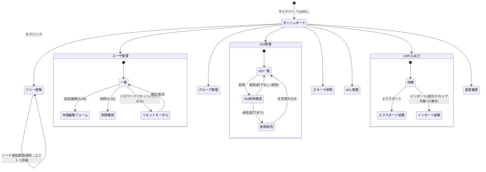

# 画面仕様：ディレクトリ(LDAP)管理（画面ID: S-LDAP-nn）

> 本仕様は **S-00（共通CRUD編集パターン／アプリシェル）を前提** とし、LDAP ドメイン固有の差分のみを記述する。一覧/作成/更新/削除の標準操作・状態遷移・共通文言・監査記録は **S-00 に準拠**。ここでは固有画面（ツリー閲覧・エントリ詳細・スキーマ・ACL・LDIF 入出力・変更履歴）と固有操作（LDIF 入出力／パスワードリセット／有効・無効切替／OU 削除拒否）に集中する。

## 0. 画面一覧（ヘッダ）

| 画面ID | 画面名 | 関連機能 / AC | 準拠 | 概要 |
|---|---|---|---|---|
| S-LDAP-01 | LDAP ダッシュボード | F-13 / AC-15 | 固有 | エントリ/ユーザ/グループ/OU 数・ベースDN 等の統計表示（参照のみ） |
| S-LDAP-02 | ディレクトリツリー閲覧 | F-13 / AC-15 | 固有 | DIT を遅延展開で閲覧し、選択エントリの属性詳細を表示（参照のみ） |
| S-LDAP-03 | ユーザ管理 | F-13 / AC-15 | S-00＋固有 | ユーザ CRUD ＋ 有効/無効切替・パスワードリセット |
| S-LDAP-04 | グループ管理 | F-13 / AC-15 | S-00＋固有 | グループ CRUD ＋ メンバー追加/削除 |
| S-LDAP-05 | OU 管理 | F-13 / AC-15 | S-00＋固有 | OU CRUD（配下エントリありは削除拒否） |
| S-LDAP-06 | スキーマ参照 | F-13 / AC-15 | 固有 | オブジェクトクラス（必須/任意属性）参照・検索（参照のみ） |
| S-LDAP-07 | ACL 管理 | F-13 / AC-15 | S-00＋固有 | アクセス制御ルール CRUD |
| S-LDAP-08 | LDIF 入出力 | F-13 / AC-15 | 固有 | ディレクトリの LDIF エクスポート／インポート |
| S-LDAP-09 | 変更履歴 | F-13 / AC-15 | 固有 | changelog をページングで閲覧（参照のみ） |

**画面数：9（S-LDAP-01〜S-LDAP-09）**

### RBAC（統一方針）

| ロール | 可能操作 |
|---|---|
| Viewer（参照） | 全画面の閲覧、ツリー展開、エントリ/スキーマ/変更履歴参照、LDIF エクスポート |
| Operator（更新） | 上記＋ユーザ/グループ/OU/ACL の CRUD、メンバー編集、有効/無効切替、LDIF インポート |
| Admin（破壊的） | 上記＋**パスワードリセット**（Admin のみ、AC-15）、OU 削除、大量削除を伴う LDIF インポート |

> **重要（分離原則）**：本ドメインが扱う「ユーザ/グループ」は *ディレクトリ管理データ* であり、Magnetite への *ログイン識別* とは分離する。ここで作成/無効化するユーザは Magnetite のログインアカウントではない。統一するのは RBAC・監査・UI 体裁のみ。

---

## 1. レイアウト（固有画面のみ）

一覧系（S-LDAP-03/04/05/07）のレイアウト・作成/編集スライドオーバーは **S-00 に準拠**。以下は固有画面のワイヤーフレーム。

### S-LDAP-02 ディレクトリツリー閲覧（固有UI）

```
┌────────────────────────────────────────────────────────────┐
│ ディレクトリツリー                          [🔄 再取得]      │ ← ページヘッダー
├──────────────────────┬─────────────────────────────────────┤
│ ツリーパネル          │ エントリ詳細パネル                   │
│ ▾ 📁 dc=example       │ DN : cn=Admin,ou=Users,dc=example    │
│   ▾ 📁 ou=Users       │ objectClass: person, top             │
│     📄 cn=Admin  ◀選択 │ ┌──────────┬────────────────────┐  │
│     📄 cn=user1       │ │ 属性       │ 値                  │  │
│   ▸ 📁 ou=Groups      │ │ cn         │ Admin               │  │
│   ▸ 📁 ou=OU-A        │ │ mail       │ admin@example       │  │
│ （▸=未展開/子あり）     │ │ member     │ ...(複数値は改行)   │  │
│                       │ └──────────┴────────────────────┘  │
│                       │ 作成: 2026-01-01 / 変更: 2026-07-01  │
└──────────────────────┴─────────────────────────────────────┘
   未選択時は右パネルに「エントリを選択してください。」
```

- **遅延展開（lazy）**：ルートは `get_ldap_tree_root`。ノードの ▸ クリックで `get_ldap_tree_children(dn)` を都度取得。`has_children=false` のノードは展開トグルを表示しない。
- **選択とハイライト**：ノードクリックで `selected_dn` を設定し `get_ldap_entry(dn)` を実行。右パネルに属性テーブルを表示。複数値属性は各値を改行表示。
- **DN の URL エンコード**：子ノード取得・エントリ取得時、DN は URL エンコードして送信。

### S-LDAP-06 スキーマ参照（固有UI・参照のみ）

```
┌────────────────────────────────────────────────────────────┐
│ スキーマ（オブジェクトクラス）      [🔍 クラス名で絞り込み__]│
├────────────────────────────────────────────────────────────┤
│ 名前        | 種別       | 上位   | 必須属性     | 任意属性   │
│ person      | structural | top    | cn, sn       | mail, ...  │
│ groupOfNames| structural | top    | cn, member   | ...        │
└────────────────────────────────────────────────────────────┘
   絞り込みはクライアント側フィルタ（名前の部分一致・小文字化）
```

### S-LDAP-08 LDIF 入出力（固有UI）

```
┌────────────────────────────────────────────────────────────┐
│ LDIF 入出力                                                  │
├────────────────────────────────────────────────────────────┤
│ ■ エクスポート（Viewer 以上）                                │
│   [⬇ LDIF エクスポート]                                      │
│   ┌──────────────────────────────────────────────┐          │
│   │ dn: cn=Admin,...   (readonly / 結果空なら非表示)│          │
│   └──────────────────────────────────────────────┘          │
├────────────────────────────────────────────────────────────┤
│ ■ インポート（Operator 以上）                                │
│   ┌──────────────────────────────────────────────┐          │
│   │ LDIF テキスト貼り付け                           │          │
│   └──────────────────────────────────────────────┘          │
│   [⬆ LDIF インポート]                                        │
│   ─ 結果 ─────────────────────────────────────────           │
│   成功 12 件 / スキップ 3 件                                  │
│   ⚠ 5 行目: 不正な属性 → スキップ                            │
│   ⚠ 21 行目: 既存 DN と重複 → スキップ                       │
└────────────────────────────────────────────────────────────┘
```

### S-LDAP-09 変更履歴（固有UI・参照のみ）

```
┌────────────────────────────────────────────────────────────┐
│ 変更履歴                                        [🔄 再取得]  │
├────────────────────────────────────────────────────────────┤
│ 日時          | 操作   | 対象 DN            | 実行者 | 詳細  │
│ 07-05 10:12   | modify | cn=user1,...       | oper1  | ...   │
├────────────────────────────────────────────────────────────┤
│ [◀ 戻る]   3 / M ページ（1ページ50件）   [次 ▶]             │
└────────────────────────────────────────────────────────────┘
```

---

## 2. 画面部品一覧（固有差分）

標準一覧の部品（追加/検索/テーブル/行操作/フォーム/ConfirmDialog/トースト）は **S-00 C-01〜C-09 に準拠**。以下は固有部品のみ。

| 部品ID | 画面 | 部品名 | 種別 | 初期表示 | 備考 |
|---|---|---|---|---|---|
| L-01 | 02 | ツリーパネル | ツリー | ルート取得後 | ▸/▾ で遅延展開、フォルダ/エントリ アイコン |
| L-02 | 02 | エントリ詳細パネル | 属性テーブル | 未選択時プレースホルダ | DN・objectClass・属性名/値（複数値は改行） |
| L-03 | 03 | 有効/無効トグル | ボタン(btn-xs) | Operator以上で活性 | ステータスバッジ（有効=success/無効=danger）と連動 |
| L-04 | 03 | パスワードリセット | ボタン(btn-xs)＋モーダル | **Admin のみ活性** | 新パスワード入力モーダル。Viewer/Operatorは非表示 |
| L-05 | 04 | メンバー管理パネル | detail-card | 「詳細」押下時 | メンバーDN一覧＋追加フォーム＋行削除 |
| L-06 | 06 | クラス絞り込み | 検索入力 | 常時 | クライアント側フィルタ |
| L-07 | 08 | LDIF エクスポート欄 | textarea(readonly) | 結果空なら非表示 | エクスポート結果テキスト |
| L-08 | 08 | LDIF インポート欄 | textarea | 常時 | 貼り付け入力。Operator以上で活性 |
| L-09 | 08 | インポート結果表示 | 結果リスト | インポート後 | 成功/スキップ件数＋**失敗行の行番号と理由** |
| L-10 | 09 | 変更履歴ページング | ナビ | 2ページ以上で活性 | offset 再計算で再取得（50件/頁） |

---

## 3. 状態(State)ごとの表示（固有差分）

一覧系（03/04/05/07）の Empty/Loading/Success/Error/Validation/Forbidden/Submitting は **S-00 セクション3 に準拠**。固有画面の状態を以下に補う。

| 画面 | 状態 | 発生条件 | 表示内容 |
|---|---|---|---|
| 02 ツリー | 空 | ルート0件 | `ディレクトリにエントリがありません。` |
| 02 ツリー | 子展開中 | 子ノード取得中 | 該当ノード配下にスピナー |
| 02 ツリー | 未選択 | エントリ未選択 | 右パネルに `エントリを選択してください。` |
| 02 ツリー | エラー | 取得失敗 | `ツリーの取得に失敗しました。` と [再試行] |
| 03 ユーザ | Forbidden | Operator がリセット要求 | パスワードリセットボタンを非表示（**Admin のみ**、AC-15） |
| 06 スキーマ | 空(絞込) | 一致0件 | `該当するオブジェクトクラスがありません。` |
| 08 LDIF | インポート結果 | 成功/失敗混在 | `成功 N 件 / スキップ M 件` と失敗行（行番号＋理由）を列挙 |
| 08 LDIF | インポート失敗(全体) | 解析不能 | `LDIF の取り込みに失敗しました。` （何もコミットせず） |
| 09 履歴 | 空 | 0件 | `変更履歴がありません。` |

---

## 4. イベント定義（固有操作）

標準 CRUD（作成/編集/削除/検索/ページング/再試行）のイベントは **S-00 E-01〜E-13 に準拠**（成功トースト `保存しました。`／`削除しました。`、全更新系は監査記録）。以下は LDAP 固有イベント。

| # | 画面/部品 | イベント | 事前条件 | 動作・結果 |
|---|---|---|---|---|
| LE-01 | 02 ツリーノード ▸ | 展開クリック | has_children=true | `get_ldap_tree_children(dn)` を取得し配下を描画（遅延展開） |
| LE-02 | 02 ツリーノード | 選択クリック | - | `selected_dn` 設定→`get_ldap_entry(dn)`→右パネルに属性表示 |
| LE-03 | 03 有効/無効 | クリック | Operator以上 | `toggle_ldap_user(dn, !enabled)` 実行→**即時反映**（バッジ更新）→一覧refetch→トースト `更新しました。`→監査記録（AC-15） |
| LE-04 | 03 パスワードリセット | クリック | **Admin のみ** | 新パスワード入力モーダルを開く。Operator以下は権限不足 `この操作を行う権限がありません。`（AC-04/AC-15） |
| LE-05 | 03 リセット確定 | モーダル保存 | Admin・新PW入力済 | `reset_ldap_password(dn, new_password)` 実行→トースト `パスワードをリセットしました。`→モーダル閉→監査記録 |
| LE-06 | 04 メンバー追加 | クリック | Operator以上・DN非空 | `add_ldap_member(group_dn, member_dn)` 実行→トースト `メンバーを追加しました。`→一覧refetch→監査記録 |
| LE-07 | 04 メンバー削除 | クリック | Operator以上 | `remove_ldap_member(group_dn, member_dn)` 実行→トースト `メンバーを削除しました。`→refetch→監査記録 |
| LE-08 | 05 OU 削除 | ConfirmDialog承認 | Admin・**配下エントリなし** | `delete_ldap_ou(dn)` 実行→`削除しました。`→監査記録 |
| LE-09 | 05 OU 削除（配下あり） | ConfirmDialog承認 | **配下エントリあり** | 削除拒否し `この OU には配下エントリがあります。先に移動または削除してください。` を表示（AC-15、S-00 E-10 の LDAP 具体化） |
| LE-10 | 08 LDIF エクスポート | クリック | Viewer以上 | `export_ldap_ldif()` 実行→結果欄に表示。失敗時トーストでエラー |
| LE-11 | 08 LDIF インポート | クリック | Operator以上・入力非空 | `import_ldap_ldif(text)` 実行→**成功/失敗を件数と行番号付きで表示、失敗行はスキップし処理継続**→`成功 N 件 / スキップ M 件`→入力欄クリア→監査記録（AC-15） |

> LDIF インポート結果の文言例：`成功 12 件 / スキップ 3 件`、行別 `<n> 行目: <理由> → スキップ`（理由＝不正属性/DN重複/親不在 等）。処理は失敗行で中断せず全行走査する。

---

## 5. 入力検証ルール（固有項目）

共通枠は **S-00 セクション5 に準拠**。LDAP 固有の項目・文言を以下に定義。

| 画面 | 項目 | 必須 | 制約 | エラー文言 |
|---|---|---|---|---|
| 03 | CN | 必須 | 1〜64文字 | `CN を正しく入力してください。` |
| 03 | sAMAccountName | 必須 | 一意・英数と一部記号 | `同じアカウント名が既に存在します。` |
| 03 | パスワード（作成/リセット） | 必須 | ポリシー準拠（長さ・文字種） | `パスワードがポリシーを満たしていません。` |
| 04 | メンバー DN | 必須 | DN 形式（`attr=value,...`） | `DN の形式が正しくありません。` |
| 05 | OU 名 | 必須 | 1〜64文字 | `OU 名を正しく入力してください。` |
| 05 | 親 DN | 必須 | 既存 DN | `親 DN が存在しません。` |
| 07 | 対象DN/主体 | 必須 | DN 形式 | `DN の形式が正しくありません。` |
| 07 | 効果(effect) | 必須 | allow / deny | `いずれかを選択してください。` |
| 08 | LDIF テキスト | 必須 | 非空 | `LDIF を入力してください。` |

---

## 6. 画面遷移



---

## 7. 補足

- **分離原則の徹底**：LDAP ユーザ/グループはディレクトリ管理データであり、Magnetite ログイン識別（認証統一：ローカル＋SSO）とは別系統。サービス個別認証(session)は撤廃済みで、本画面群も統一 RBAC（Viewer/Operator/Admin）とセッションに従う。
- **監査**：LE-03/05/06/07/08/09/11 を含む全更新系は横断監査ログ（F-04）へ記録（S-00 セクション4 準拠）。
- **横断共通機能**：監査/アラート/バックアップ/テンプレート/ログは参照のみ。本ドメイン画面からは直接編集しない。
- **ツリー閲覧のアクセシビリティ**：ツリーは `role=tree` / ノードは `role=treeitem`、`aria-expanded` を付与。キーボード（↑↓で移動、→/←で展開折り畳み、Enter で選択）に対応。
- **LDIF の安全性**：インポートは失敗行スキップ継続方式のため部分適用となる。結果の成功/スキップ内訳（行番号・理由）を必ず提示し、監査に記録する。大量エントリを削除し得る LDIF の適用は Admin 権限を要する。
- **i18n**：確定文言は日本語を正とし en 訳を対に持つ（S-00 準拠）。
