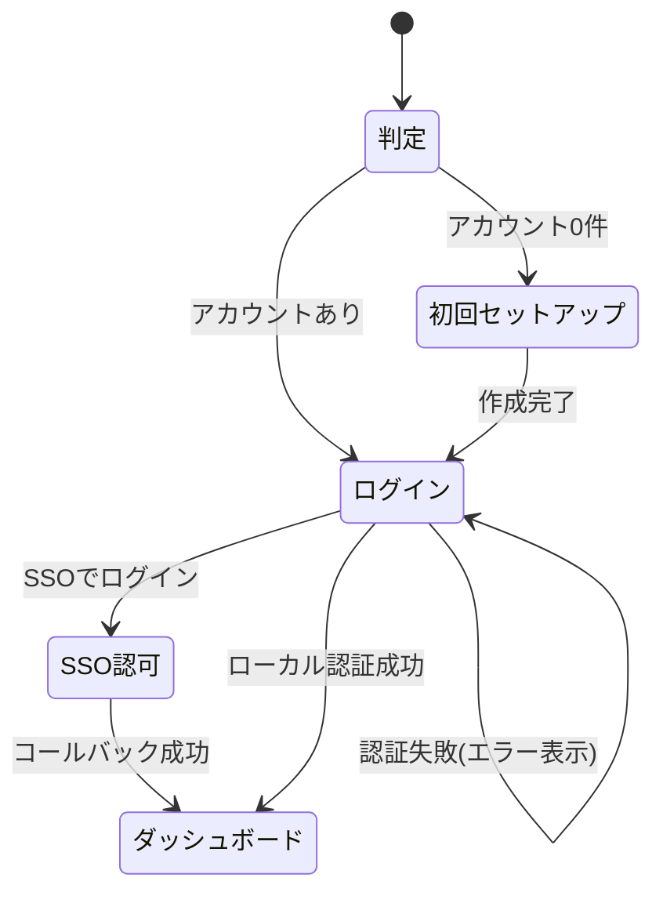

# 画面仕様：ログイン／初回セットアップ（画面ID: S-Login）

| 項目 | 内容 |
|---|---|
| 画面ID | S-Login |
| 画面名 | ログイン ／ 初回セットアップ |
| 関連ユースケース | US-01, US-02, US-03 / UC-01 |
| 関連AC | AC-01, AC-02, AC-03 |
| 概要 | ローカル or SSO でのログイン、および初回起動時の初期管理者作成を行う（アプリシェル外の非認証画面）。 |

## 1. レイアウト

```
── 通常ログイン ──                    ── 初回セットアップ（アカウント0件時） ──
┌───────────────────────┐            ┌───────────────────────────┐
│      Magnetite        │            │  初回セットアップ            │
│  ┌─────────────────┐  │            │  管理者アカウントを作成します │
│  │ ユーザ名 [_____] │  │            │  ユーザ名 [______________]  │
│  │ パスワード[_____]│  │            │  パスワード[______________] │
│  │      [ログイン]  │  │            │  確認     [______________]  │
│  └─────────────────┘  │            │            [作成して開始]    │
│  ── または ──         │            └───────────────────────────┘
│  [🔑 SSO でログイン]   │
└───────────────────────┘
```

- SSO 未設定時は「SSO でログイン」を非表示にし、ローカルログインのみ表示。
- 初回セットアップはローカルアカウントが 0 件のときのみ到達可能。作成後は通常ログインへ。

## 2. 画面部品一覧

| 部品ID | 部品名 | 種別 | 初期表示 | 備考 |
|---|---|---|---|---|
| C-01 | ユーザ名 | テキスト入力 | 常時 | - |
| C-02 | パスワード | パスワード入力 | 常時 | マスク表示 |
| C-03 | ログインボタン | ボタン | 常時 | - |
| C-04 | SSOログインボタン | ボタン | SSO設定時のみ | SSO認可へリダイレクト |
| C-05 | 確認パスワード | パスワード入力 | 初回設定時のみ | 一致検証 |
| C-06 | エラーバナー | 通知 | 認証失敗時 | 画面上部 |

## 3. 状態(State)ごとの表示

| 状態 | 発生条件 | 表示内容 |
|---|---|---|
| 通常(Success) | アカウント存在・未認証 | ログインフォーム（＋SSO） |
| 初回(Setup) | ローカルアカウント0件 | 初期セットアップフォーム |
| 認証中(Loading) | ログイン送信中 | ボタンをスピナー化、二重送信防止 |
| 認証エラー(Error) | 資格情報不正 | `ユーザ名またはパスワードが正しくありません。`（AC-02） |
| SSOエラー(Error) | state不一致/交換失敗 | `SSO ログインに失敗しました。もう一度お試しください。`（AC-01） |
| 検証エラー(Validation) | 初回設定の入力不正 | 該当項目に文言表示（下記5） |

## 4. イベント定義

| # | 部品 | イベント | 事前条件 | 動作・結果 |
|---|---|---|---|---|
| E-01 | ログインボタン | クリック | 入力あり | 資格情報検証→成功でセッション確立しダッシュボードへ／失敗でE-Error |
| E-02 | SSOログインボタン | クリック | SSO設定済 | PKCE/state生成しSSO認可へリダイレクト（UC-01） |
| E-03 | 作成して開始 | クリック | 初回・入力妥当 | 初期Adminを作成しログイン画面へ（AC-03） |
| E-04 | 作成して開始 | クリック | パスワード不一致 | `パスワードが一致しません。` を表示 |
| E-05 | 作成して開始 | クリック | ポリシー未達 | `パスワードは8文字以上で、英字と数字を含めてください。` |

## 5. 入力検証ルール

| 項目 | 必須 | 制約 | エラー文言 |
|---|---|---|---|
| ユーザ名 | 必須 | 1〜64文字 | `ユーザ名を入力してください。` |
| パスワード（ログイン） | 必須 | - | `パスワードを入力してください。` |
| パスワード（初回） | 必須 | 8文字以上・英数字含む | `パスワードは8文字以上で、英字と数字を含めてください。` |
| 確認パスワード | 必須 | パスワードと一致 | `パスワードが一致しません。` |

## 6. 画面遷移



## 7. 補足

- ブルートフォース対策として連続失敗時の遅延/ロックは実装フェーズで方針化（残課題）。
- SSO のロール判定は OIDC の groups/roles クレームから（Viewer/Operator/Admin）。写像規則は **08_authz §4.2**（`AppConfig.sso` の設定）で定義。
- a11y：初回フォーカスはユーザ名。Enter でログイン送信。
