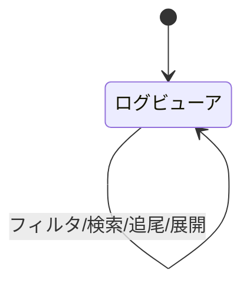

# 画面仕様：統合ログビューア（画面ID: S-Logs）

| 項目 | 内容 |
|---|---|
| 画面ID | S-Logs |
| 画面名 | 統合ログビューア |
| 関連ユースケース | US-11 / F-08 |
| 関連AC | AC-11 |
| 概要 | 各ドメインの動作ログ／クエリログ／アクセスログを統一ビューアで確認する（閲覧専用）。 |

## 1. レイアウト

```
┌──────────────────────────────────────────────┐
│ ログ  [ドメイン▾][ログ種別▾][レベル▾] [追尾⏺] [🔍___]│
├──────────────────────────────────────────────┤
│ 10:12:03 INFO  dns  zone reloaded             │
│ 10:12:01 WARN  dns  slow query 320ms          │
│ 10:11:58 ERROR proxy upstream timeout         │
│  … 逆時系列・自動追尾（トグル）…               │
└──────────────────────────────────────────────┘
```

## 2. 画面部品一覧

| 部品ID | 部品名 | 種別 | 初期表示 | 備考 |
|---|---|---|---|---|
| C-01 | ドメインフィルタ | ドロップダウン | 直近選択 | 8ドメイン＋横断（プロセス無しのため「システム」ログ含む） |
| C-02 | ログ種別フィルタ | ドロップダウン | 動作ログ | 動作/クエリ/アクセス（ドメインにより選択肢可変） |
| C-03 | レベルフィルタ | ドロップダウン | 全 | DEBUG/INFO/WARN/ERROR |
| C-04 | 追尾トグル | トグル | OFF | ONで新着を自動追尾（末尾固定） |
| C-05 | 検索ボックス | テキスト | 空 | メッセージ部分一致・ハイライト |
| C-06 | ログ表示領域 | 仮想リスト | データ依存 | 逆時系列。行クリックで詳細展開 |

## 3. 状態(State)ごとの表示

| 状態 | 発生条件 | 表示内容 |
|---|---|---|
| 空(Empty) | ログ0件 | `表示できるログがありません。`（AC-11） |
| 読み込み中(Loading) | 取得中 | スケルトン |
| 正常(Success) | データあり | ログ行を表示 |
| 追尾中(Streaming) | 追尾ON | 新着を末尾に追加し自動スクロール |
| エラー(Error) | 取得失敗 | `ログの取得に失敗しました。` と [再試行] |

## 4. イベント定義

| # | 部品 | イベント | 事前条件 | 動作・結果 |
|---|---|---|---|---|
| E-01 | ドメイン/種別/レベル | 変更 | - | 条件でログを再取得 |
| E-02 | 追尾トグル | ON/OFF | - | ON=新着追尾開始／OFF=停止（スクロール自由） |
| E-03 | 検索 | 入力 | - | 表示中ログをフィルタ＆一致箇所ハイライト |
| E-04 | ログ行 | クリック | - | 全文・付随メタデータ（発生元/タグ）を展開 |
| E-05 | 手動スクロール | 上方向 | 追尾ON | 追尾を一時停止（新着があれば通知バッジ） |

## 5. 入力検証ルール

なし（閲覧専用）。

## 6. 画面遷移



## 7. 補足

- モノリス化により旧「プロセスのstdout/stderr」は各**ドメインモジュールの内部ログ**へ再定義（プロセスマネージャ廃止に伴う扱いは 09 で規定）。
- 監査ログ（S-Audit）とは別物。こちらは動作/運用ログ、監査は操作履歴。
- ログ保持（リングバッファ相当）・容量は 05_non_functional。Viewer 以上で閲覧可。
