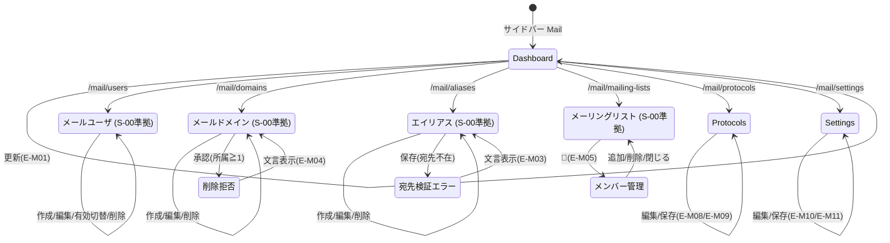

# 画面仕様：Mail 管理（画面ID: S-MAIL-nn）

> 本仕様は **Mail ドメイン固有画面の差分のみ** を記述する。一覧・作成・更新・削除の標準操作（アプリシェル / データテーブル / スライドオーバー / ConfirmDialog / トースト / 状態表示 / ページング / 検索 / 監査記録 / RBAC 非活性）は **S-00（screen_common_crud.md）に準拠** する。以下では S-00 と異なる固有カラム・固有入力項目・固有検証・固有画面（参照専用の設定画面等）のみを定義する。

| 項目 | 内容 |
|---|---|
| ドメイン | Mail 管理 |
| 関連機能 | F-14 |
| 関連AC | AC-16 |
| 関連ユースケース | US-16 / UC-02 |
| 概要 | メールユーザ・ドメイン・エイリアス・メーリングリストの CRUD と、プロトコル/サーバ設定の参照・編集を提供する。 |
| 前提 | 完全統合モノリス。認証は統一（ローカル＋SSO）で **サービス個別認証(JWT)は撤廃**。RBAC 統一（参照=Viewer / 更新=Operator / 破壊的=Admin）。単一組織前提。 |

## 0. 画面一覧（ヘッダ表）

| 画面ID | 画面名 | ルート | 分類 | 関連 | 概要 |
|---|---|---|---|---|---|
| S-MAIL-01 | メールダッシュボード | /mail | 参照 | F-14 / AC-16 | ユーザ数・ドメイン数・リスト数・総メール数・使用容量の統計サマリを表示（参照専用）。 |
| S-MAIL-02 | メールユーザ一覧/編集 | /mail/users | CRUD（S-00準拠） | F-14 / AC-16 | メールユーザの一覧・作成・更新・有効/無効切替・削除。固有カラム/検証あり。 |
| S-MAIL-03 | メールドメイン一覧/編集 | /mail/domains | CRUD（S-00準拠） | F-14 / AC-16 | メールドメインの一覧・作成・更新・削除。参照あり削除拒否（固有文言）。 |
| S-MAIL-04 | エイリアス一覧/編集 | /mail/aliases | CRUD（S-00準拠） | F-14 / AC-16 | 転送エイリアスの一覧・作成・更新・削除。宛先存在検証（固有）。 |
| S-MAIL-05 | メーリングリスト一覧/編集 | /mail/mailing-lists | CRUD（S-00準拠） | F-14 / AC-16 | リストの一覧・作成・更新・削除と、メンバー追加/削除（固有サブ操作）。 |
| S-MAIL-06 | プロトコル設定 | /mail/protocols | 参照/設定 | F-14 / AC-16 | SMTP/Submission/SMTPS/IMAP/IMAPS/POP3/POP3S の有効状態とポートを表示・編集。 |
| S-MAIL-07 | メールサーバ設定 | /mail/settings | 設定（単一フォーム） | F-14 / AC-16 | ホスト名・最大メッセージサイズ・ACME 設定の参照と保存。 |

**Mail 固有画面数：7（S-MAIL-01〜07）**

## 1. レイアウト（固有差分のみ）

一覧系（S-MAIL-02〜05）の外枠・作成/編集スライドオーバー・削除 ConfirmDialog は S-00「1. レイアウト」に従う。各画面の**固有カラム**は以下。

### S-MAIL-02 メールユーザ（固有カラム）

```
名称=ユーザ名@ドメイン | 表示名 | ロール | クォータ(使用/割当) | 状態 | 操作[✎][有効切替][🗑]
```

### S-MAIL-03 メールドメイン（固有カラム）

```
ドメイン名 | 状態 | 最大ユーザ数 | 既定クォータ | 所属アカウント数 | 操作[✎][🗑]
```

### S-MAIL-04 エイリアス（固有カラム）

```
転送元アドレス | 転送先(カンマ区切り) | ドメイン | 状態 | 操作[✎][🗑]
```

### S-MAIL-05 メーリングリスト（固有カラム＋メンバー小画面）

```
リストアドレス | リスト名 | ドメイン | メンバー数 | 返信ポリシー | 状態 | 操作[✎][👥メンバー][🗑]
```

- **メンバー管理**（[👥]）：行から開くスライドオーバー内でメンバー一覧（メール/名前/受信/投稿可否）を表示し、追加フォームと行削除を提供する（画面遷移せず一覧の文脈を保持）。

### S-MAIL-01 ダッシュボード（参照専用）

```
┌────────────────────────────────────────────────┐
│ Mail ダッシュボード                    [🔄 更新] │
├────────────────────────────────────────────────┤
│ [ユーザ数] [ドメイン数] [リスト数] [総メール数] │
│ [使用容量(GB整形)]                              │
│ （任意）日別メール件数の推移                     │
└────────────────────────────────────────────────┘
```

### S-MAIL-06 プロトコル設定

```
┌────────────────────────────────────────────────┐
│ プロトコル設定                          [保存]   │
├────────────────────────────────────────────────┤
│ プロトコル        | 有効 | ポート                │
│ SMTP              | [x]  | [25]                  │
│ SMTP Submission   | [x]  | [587]                 │
│ SMTPS             | [x]  | [465]                 │
│ IMAP              | [x]  | [143]                 │
│ IMAPS             | [x]  | [993]                 │
│ POP3              | [ ]  | [110]                 │
│ POP3S             | [x]  | [995]                 │
└────────────────────────────────────────────────┘
```

### S-MAIL-07 サーバ設定（単一フォーム）

```
┌────────────────────────────────────────────────┐
│ サーバ設定                              [保存]   │
├────────────────────────────────────────────────┤
│ ホスト名          [mail.example.com]            │
│ 最大メッセージサイズ [26214400] バイト           │
│ ACME 有効         [x]                           │
│ ACME 連絡先メール  [admin@example.com]           │
│ ACME 対象ドメイン  [example.com, ...]（複数）    │
└────────────────────────────────────────────────┘
```

## 2. 画面部品一覧（固有部品のみ）

S-00 の共通部品（C-01〜C-09）に加え、Mail 固有部品を定義する。

| 部品ID | 画面 | 部品名 | 種別 | 初期表示 | 備考 |
|---|---|---|---|---|---|
| M-01 | S-MAIL-02 | 有効/無効切替ボタン | トグルボタン | 行ごと・Operator以上で活性 | `enabled` を反転。Viewer は非活性 |
| M-02 | S-MAIL-02 | クォータ表示セル | テキスト | 常時 | 使用量/割当を GB/MB 整形表示 |
| M-03 | S-MAIL-02 | クォータ入力 | 数値入力(MB) | 作成/編集フォーム | 空欄時はドメイン既定を適用 |
| M-04 | S-MAIL-03 | 所属アカウント数セル | テキスト | 常時 | 削除可否判定の根拠。0件で削除可 |
| M-05 | S-MAIL-04 | 転送先アドレス入力 | テキスト（カンマ区切り） | 作成/編集フォーム | トリム後 Vec 化。1件以上必須 |
| M-06 | S-MAIL-05 | メンバー管理スライドオーバー | スライドオーバー | [👥] クリック時 | メンバー一覧＋追加/削除 |
| M-07 | S-MAIL-05 | メンバー追加フォーム | フォーム | メンバー小画面内 | email 必須・受信/投稿可否指定 |
| M-08 | S-MAIL-06 | プロトコル行（有効/ポート） | チェック＋数値入力 | 常時（Operator以上で編集可） | 7 プロトコル固定行 |
| M-09 | S-MAIL-06/07 | 保存ボタン | ボタン | Operator以上で活性 | 一括 PUT。二重送信防止（S-00 Submitting） |
| M-10 | S-MAIL-07 | ACME 対象ドメイン入力 | テキスト（カンマ区切り） | ACME 有効時 | 空可。ACME 無効時は非活性 |

## 3. 状態(State)ごとの表示（固有差分）

一覧系（S-MAIL-02〜05）の Empty/Loading/Success/Error/Forbidden/Submitting は S-00「3.」に準拠。固有差分は以下。

| 画面 | 状態 | 発生条件 | 表示内容 |
|---|---|---|---|
| S-MAIL-01/06/07 | 参照専用/設定 Loading | 取得中 | スケルトン（テーブル/カード/フォーム） |
| S-MAIL-01/06/07 | Error | 取得失敗 | `データの取得に失敗しました。` と [再試行] |
| S-MAIL-03 | Validation（削除拒否） | 所属アカウント≧1で削除承認 | `このドメインには N 件のアカウントがあります。`（AC-16、後述 E-M04） |
| S-MAIL-04 | Validation（宛先不在） | 転送先に存在しないアカウント | 該当フィールド直下に `宛先のアカウントが存在しません。`（AC-16） |
| S-MAIL-06 | Validation | ポート範囲外/重複 | 該当行に `1〜65535 の数値を入力してください。` / `ポートが他プロトコルと重複しています。` |
| S-MAIL-07 | Validation | 必須/範囲不正 | 該当フィールド直下に確定文言（5. 参照） |

## 4. イベント定義（固有イベントのみ）

共通の追加/編集/保存/削除/検索/ページング/再試行は S-00「4.（E-01〜E-13）」に準拠。以下は Mail 固有イベント。

| # | 画面 | 部品 | イベント | 事前条件 | 動作・結果 |
|---|---|---|---|---|---|
| E-M01 | S-MAIL-01 | 更新ボタン | クリック | - | 統計を再取得しカードを再描画 |
| E-M02 | S-MAIL-02 | 有効/無効切替(M-01) | クリック | Operator以上 | `enabled` 反転を更新→一覧更新→トースト `保存しました。`→監査記録 |
| E-M03 | S-MAIL-04 | 保存ボタン | クリック | 転送先に不在アカウント | 保存せず該当フィールドに `宛先のアカウントが存在しません。` を表示（AC-16） |
| E-M04 | S-MAIL-03 | ConfirmDialog 承認 | クリック | 所属アカウント≧1 | 削除を拒否し `このドメインには N 件のアカウントがあります。` を表示（AC-16／S-00 E-10 の Mail 具体化）。0件時のみ削除実行 |
| E-M05 | S-MAIL-05 | メンバー管理(M-06) | [👥]クリック | - | メンバー管理スライドオーバーを開く（メンバー一覧取得） |
| E-M06 | S-MAIL-05 | メンバー追加(M-07) | 保存クリック | email 妥当 | メンバー追加→メンバー一覧更新→トースト `保存しました。`→監査記録 |
| E-M07 | S-MAIL-05 | メンバー行削除 | クリック | Operator以上 | ConfirmDialog 承認後にメンバー削除→一覧更新→監査記録 |
| E-M08 | S-MAIL-06 | 保存ボタン(M-09) | クリック | 全行が妥当 | 7 プロトコル設定を一括保存→トースト `保存しました。`→監査記録 |
| E-M09 | S-MAIL-06 | ポート入力(M-08) | 入力 | 範囲外/重複 | 該当行に検証文言を表示し保存不可（5. 参照） |
| E-M10 | S-MAIL-07 | 保存ボタン(M-09) | クリック | 入力妥当 | サーバ設定を保存→トースト `保存しました。`→監査記録。失敗時エラートースト |
| E-M11 | S-MAIL-07 | ACME 有効チェック | 変更 | - | 無効化時は ACME 連絡先/対象ドメイン入力を非活性化 |

> 全更新系イベント（E-M02/E-M04/E-M06〜E-M10）は横断監査ログ（F-04）へ記録する。破壊的操作（ドメイン/ユーザ/エイリアス/リスト削除）は Admin を要する。

## 5. 入力検証ルール（Mail 固有）

S-00「5.」の共通枠を Mail 向けに具体化する。確定文言は日本語を正とする。

| 画面 | 項目 | 必須 | 制約 | エラー文言（確定） |
|---|---|---|---|---|
| S-MAIL-02 | ユーザ名（ローカルパート） | 必須 | RFC 準拠のローカルパート文字種 | `名称を正しく入力してください。` |
| S-MAIL-02 | 所属ドメイン | 必須 | 既存ドメインのいずれか | `いずれかを選択してください。` |
| S-MAIL-02 | 初期パスワード | 必須（作成時） | ポリシー準拠の長さ | `パスワードを正しく入力してください。` |
| S-MAIL-02 | クォータ(MB) | 任意 | 0 以上の整数 | `0 以上の数値を入力してください。` |
| S-MAIL-02 | メールアドレス一意 | 必須 | 同一ドメイン内で重複不可 | `同じ名称が既に存在します。` |
| S-MAIL-03 | ドメイン名 | 必須 | FQDN 形式・重複不可 | `名称を正しく入力してください。` / `同じ名称が既に存在します。` |
| S-MAIL-03 | 最大ユーザ数 | 任意 | 1 以上の整数 | `1 以上の数値を入力してください。` |
| S-MAIL-03 | 削除（参照あり） | - | 所属アカウント 0 件必須 | `このドメインには N 件のアカウントがあります。` |
| S-MAIL-04 | 転送元アドレス | 必須 | メールアドレス形式・重複不可 | `名称を正しく入力してください。` |
| S-MAIL-04 | 転送先アドレス | 必須 | 1 件以上・各要素がメール形式 | `宛先を 1 件以上入力してください。` |
| S-MAIL-04 | 転送先の実在 | 必須 | 存在するメールユーザを指すこと | `宛先のアカウントが存在しません。` |
| S-MAIL-05 | リストアドレス | 必須 | メールアドレス形式・重複不可 | `名称を正しく入力してください。` |
| S-MAIL-05 | リスト名 | 必須 | 1〜N 文字 | `名称を正しく入力してください。` |
| S-MAIL-05 | メンバー email | 必須 | メールアドレス形式 | `宛先を正しく入力してください。` |
| S-MAIL-06 | ポート番号 | 必須 | 1〜65535 の整数・プロトコル間で重複不可 | `1〜65535 の数値を入力してください。` / `ポートが他プロトコルと重複しています。` |
| S-MAIL-07 | ホスト名 | 必須 | FQDN 形式 | `ホスト名を正しく入力してください。` |
| S-MAIL-07 | 最大メッセージサイズ | 必須 | 1 以上の整数（バイト） | `1 以上の数値を入力してください。` |
| S-MAIL-07 | ACME 連絡先メール | 条件必須（ACME有効時） | メールアドレス形式 | `メールアドレスを正しく入力してください。` |

## 6. 画面遷移



## 7. 補足

- **標準CRUD準拠**：S-MAIL-02〜05 の一覧・作成・更新・削除の骨格（アプリシェル / 検索 / フィルタ / ソート / ページング / スライドオーバー / ConfirmDialog / トースト / 状態表示 / RBAC 非活性 / キーボードショートカット / 監査記録）はすべて **S-00 に準拠** し、本書では固有差分のみを規定した。
- **メールユーザとログイン識別の分離**：Mail が扱う「メールユーザ」は**ドメイン固有データ**であり、ポータルへのログイン識別（統一認証：ローカル＋SSO）とは分離される。メールユーザの作成・パスワード設定はログインアカウントに影響しない。
- **認証統一（JWT撤廃）**：Mail サービスへのサービス個別 JWT 認証は撤廃。全操作は統一認証セッションと RBAC（Viewer/Operator/Admin）で制御する。
- **横断共通機能は参照のみ**：監査・アラート・バックアップ・テンプレート・ログは横断共通機能であり、Mail 画面からは参照のみ（本書では画面を持たない）。更新系操作の記録は横断監査ログ（F-04）で閲覧する。
- **参照専用画面**：S-MAIL-01 は統計表示のみで編集操作を持たない。S-MAIL-06/07 は設定編集を持つが、更新は Operator 以上、破壊的操作は伴わない。
- **i18n / アクセシビリティ / レスポンシブ**：S-00「7.」に準拠（確定文言は日本語を正、en 訳を対にする）。
