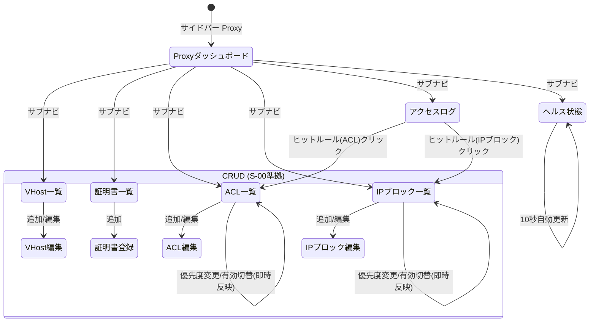

# 画面仕様：Proxy ドメイン（画面ID: S-PROXY）

> 本仕様は共通CRUDパターン（[S-00](screen_common_crud.md)）を前提とし、**Proxy 固有の画面・カラム・操作・表示差分のみ**を記述する。一覧/作成/更新/削除の標準挙動（レイアウト、部品 C-01〜C-09、状態表示、E-01〜E-13、監査記録）は **S-00 に準拠**する。

## 統合方針（確定事項の反映）

- **完全統合モノリス**。認証はポータル統一（ローカル＋SSO）。**サービス個別認証（旧 `get_service_token("proxy")` / APIキー）は撤廃**し、統一セッション＋統一RBACで全操作を認可する。
- **RBAC統一**：参照=Viewer / 更新（作成・更新・優先度変更・有効切替）=Operator / 破壊的（削除）=Admin。単一組織前提。
- **横断共通機能へ寄せる（本ドメインからは参照のみ）**：監査ログ（F-04）、アラート／通知（[S-Alerts](screen_alerts.md)）、バックアップ、テンプレート、ログ。
- **Webhook は撤廃し横断アラート通知（S-Alerts）へ集約**する。Proxy 固有イベント（`request.error` / `backend.down` / `cert.expiring` 等）は S-Alerts の通知条件（ドメイン=Proxy）として選択する。本ドメインに固有 Webhook 画面は設けない。

## ヘッダ表（Proxy 固有画面一覧）

| 画面ID | 画面名 | ルート | 関連機能 / AC | 概要（S-00 差分の要点） |
|---|---|---|---|---|
| S-PROXY-01 | プロキシダッシュボード | /proxy | F-15 | 統計サマリー（接続数/総req/転送量/VHost数/証明書数）をカード表示（参照専用） |
| S-PROXY-02 | 仮想ホスト（VHost） | /proxy/vhosts | F-15 | ホスト名/ポート/TLS/モード/LB戦略/状態の CRUD。TLS・force_https・LB戦略が固有項目 |
| S-PROXY-03 | 証明書 | /proxy/certificates | F-15 | PEM登録による証明書管理。**有効期限バッジ**（まもなく期限切れ/期限切れ）が固有表示 |
| S-PROXY-04 | ACL ルール | /proxy/acl-rules | F-15 / AC-17 | CIDR単位の Allow/Deny。**優先度変更（即時反映）**が固有操作 |
| S-PROXY-05 | IP ブロックリスト | /proxy/ip-blocklist | F-15 / AC-17 | CIDR単位の遮断。失効日時・**優先度変更（即時反映）**が固有 |
| S-PROXY-06 | アクセスログ | /proxy/access-logs | F-15 / AC-17 | ページング閲覧（参照専用）。**ヒットしたルール（ACL/ブロック）表示**が固有 |
| S-PROXY-07 | ヘルス状態 | /proxy/health | F-15 | 稼働状態/稼働時間/バージョンを自動更新表示（参照専用） |

- **標準CRUD準拠**：S-PROXY-02〜05 の一覧・作成・編集・削除の枠組みは S-00 に準拠。以下の各節は**固有差分のみ**を記す。
- **参照専用画面**：S-PROXY-01 / 06 / 07 は作成・更新・削除を持たない（S-00 の「一覧」外枠のみ継承、追加ボタン C-01 非表示）。

## 1. レイアウト（固有差分）

サイドバー「ドメイン」グループに **Proxy** を配置。選択時、Proxy 配下のサブナビ（ダッシュボード/VHost/証明書/ACL/IPブロック/アクセスログ/ヘルス）を提示する（S-00 アプリシェル内）。

**S-PROXY-03 証明書一覧**（固有カラム＝期限バッジ）:

```
┌────────────────────────────────────────────────────────┐
│ 証明書                          [🔍 検索__] [＋ 登録]     │
├────────────────────────────────────────────────────────┤
│ 証明書名 | 有効開始 | 有効終了   | 期限        | 操作      │
│ star-ex  | 2026/01 | 2026/07/20 | 🟡まもなく期限切れ|[✎][🗑]│
│ old-ex   | 2025/01 | 2025/07/01 | 🔴期限切れ   |[✎][🗑]  │
│ web-ex   | 2026/01 | 2027/01/10 | 🟢有効      |[✎][🗑]   │
└────────────────────────────────────────────────────────┘
```

**S-PROXY-04 ACL / S-PROXY-05 IPブロック一覧**（固有操作＝優先度の即時変更）:

```
┌──────────────────────────────────────────────────────────┐
│ ACL ルール       [スコープ▾] [アクション▾]      [＋ 作成]  │
├──────────────────────────────────────────────────────────┤
│ ≡優先度 | CIDR       | アクション | スコープ | 状態 | 操作  │
│ [▲▼] 10 | 10.0.0.0/8 | 🔴Deny    | Global  |[有効]|[✎][🗑]│
│ [▲▼] 20 | 192.168/16 | 🟢Allow   | a.ex.com|[有効]|[✎][🗑]│
└──────────────────────────────────────────────────────────┘
   ↑ 行の [▲▼]／ドラッグで優先度を並べ替え → 即時反映（保存不要）
```

**S-PROXY-06 アクセスログ**（固有カラム＝ヒットルール）:

```
┌───────────────────────────────────────────────────────────────┐
│ アクセスログ  [期間▾][ホスト▾][ｽﾃｰﾀｽ▾][判定▾]        [更新]   │
├───────────────────────────────────────────────────────────────┤
│ 日時 |ｸﾗｲｱﾝﾄIP| METHOD| ホスト | パス |ｺｰﾄﾞ| 判定/ヒットルール   │
│ 10:02|10.1.2.3| GET   | a.ex   | /api |200 | 許可              │
│ 10:01|66.0.0.9| GET   | a.ex   | /adm |403 | 🔴遮断: ACL#10 Deny │
│ 10:00|66.0.0.9| GET   | a.ex   | /    |403 | 🔴遮断: IPブロック  │
└───────────────────────────────────────────────────────────────┘
│ [◀ 前へ]        1 / 5 ページ        [次へ ▶]                    │
```

## 2. 画面部品一覧（S-00 C-01〜C-09 に加える固有部品）

| 部品ID | 部品名 | 種別 | 初期表示 | 備考 |
|---|---|---|---|---|
| PX-01 | 統計カード群 | stat-card | 常時（01/07） | 接続数/総req/転送量/VHost数/証明書数・稼働状態等。参照専用 |
| PX-02 | 手動更新ボタン | ボタン | 参照系画面 | ダッシュ/ログ/ヘルスを再取得（Viewerも活性） |
| PX-03 | ヘルス自動更新 | タイマー | 07のみ | 10秒間隔でヘルス再取得（ブラウザのみ） |
| PX-04 | 期限バッジ | バッジ | 証明書行 | `有効`(緑)/`まもなく期限切れ`(黄)/`期限切れ`(赤)。not_after から算出 |
| PX-05 | 優先度ハンドル | 行操作(▲▼/ドラッグ) | ACL/IPブロック行・Operator以上 | 優先度の並べ替え。**即時反映**（E-P02） |
| PX-06 | 有効/無効トグル | スイッチ | ACL/IPブロック/VHost行・Operator以上 | enabled を即時切替（E-P03） |
| PX-07 | 判定/ヒットルール列 | テキスト＋バッジ | アクセスログ行 | `許可`/`遮断: ACL#<優先度> <action>`/`遮断: IPブロック`（AC-17整合） |
| PX-08 | 判定フィルタ | ドロップダウン | ログ画面 | 全/許可/遮断で絞り込み |
| PX-09 | PEM入力（証明書/秘密鍵/チェーン） | テキストエリア | 証明書作成フォーム | S-00 フォーム内の固有項目。チェーンは任意 |

## 3. 状態(State)ごとの表示（S-00 の全状態を継承、固有追記のみ）

| 状態 | 発生条件 | 表示内容（固有差分） |
|---|---|---|
| 空(Empty) | データ0件 | S-00 準拠。アクセスログ/ヘルスは `表示するデータがありません。` |
| 正常(Success) | データあり | 証明書は PX-04 期限バッジを付与。ログは PX-07 判定を付与 |
| 期限警告 | not_after が閾値内/経過 | 証明書行に `まもなく期限切れ`（既定30日以内）/`期限切れ`。S-Alerts の `cert.expiring` と連動 |
| 権限不足(Forbidden) | Viewer が更新系要求 | 優先度ハンドル/トグル/追加/削除を非活性。削除は Admin 未満で非活性（`この操作を行う権限がありません。` AC-04） |
| 反映中(Reordering) | 優先度変更の送信中 | 対象行を淡色化しハンドルを一時ロック。失敗時は元順序へロールバックしトースト |

## 4. イベント定義（固有イベントのみ。標準 CRUD は S-00 E-01〜E-13）

| # | 部品 | イベント | 事前条件 | 動作・結果 |
|---|---|---|---|---|
| E-P01 | 期限バッジ(PX-04) | 表示 | 証明書一覧描画時 | not_after と現在時刻を比較し `有効`/`まもなく期限切れ`(≤30日)/`期限切れ`(<0) を色分け表示 |
| E-P02 | 優先度ハンドル(PX-05) | ▲▼／ドラッグ | Operator以上 | 対象の priority を更新し**即時反映**（並べ替え確定＝保存）。一覧再取得→トースト `優先度を変更しました。`→監査記録。失敗時ロールバック |
| E-P03 | 有効トグル(PX-06) | 切替 | Operator以上 | enabled を即時更新→トースト→監査記録。ACL/IPブロックは遮断判定へ即反映 |
| E-P04 | 判定フィルタ(PX-08) | 変更 | - | 許可/遮断でアクセスログを再取得（ページ1へ） |
| E-P05 | ヒットルール(PX-07) | 表示/クリック | 遮断ログ行 | ヒットした ACL/IPブロックを `遮断: ACL#<優先度> <action>` 等で表示（AC-17）。クリックで該当ルール画面へ遷移し当該行をハイライト |
| E-P06 | 手動更新(PX-02) | クリック | 参照系画面 | 当該リソースを再取得（Viewerも可） |
| E-P07 | ヘルス自動更新(PX-03) | 10秒タイマー | 07表示中・ブラウザ | health を再取得。ステータス非healthy時は赤バッジ＋S-Alerts連動 |
| E-P08 | 証明書 登録 | 保存 | Operator以上・PEM入力 | S-00 E-07 準拠＋PEM検証（5節）。チェーン空欄は None として送信 |
| E-P09 | VHost 削除 | 承認 | Admin・参照あり | 当該 VHost を参照する ACL/証明書があれば S-00 E-10 に従い拒否 `他の設定から参照されているため削除できません。` |

> ショートカット・監査は S-00 に準拠。優先度変更（E-P02）・有効切替（E-P03）も更新系として横断監査ログ（F-04）へ記録する。

## 5. 入力検証ルール（S-00 の枠に対する Proxy 固有項目）

| 項目 | 画面 | 必須 | 制約 | エラー文言 |
|---|---|---|---|---|
| ホスト名 | VHost | 必須 | FQDN 形式・一意 | `有効なホスト名を入力してください。` |
| リッスンポート | VHost | 必須 | 1〜65535 の整数 | `1〜65535 の数値を入力してください。` |
| LB戦略 / プロキシモード | VHost | 必須 | 定義 enum（RoundRobin 等 / Http 等） | `いずれかを選択してください。` |
| 証明書名 | 証明書 | 必須 | 1〜100文字・一意 | `証明書名を入力してください。` |
| 証明書 PEM / 秘密鍵 PEM | 証明書 | 必須 | PEM 形式・鍵と証明書が一致 | `有効な PEM を入力してください。` |
| チェーン PEM | 証明書 | 任意 | PEM 形式（空欄可） | `有効な PEM を入力してください。` |
| CIDR | ACL/IPブロック | 必須 | 有効な CIDR 表記 | `有効な CIDR を入力してください。` |
| アクション | ACL | 必須 | Allow / Deny | `いずれかを選択してください。` |
| スコープ / ホスト名 | ACL | 条件付 | Vhost スコープ時ホスト名必須 | `対象ホスト名を入力してください。` |
| 優先度 | ACL/IPブロック | 任意 | 整数（既定0） | `整数を入力してください。` |
| 失効日時 | IPブロック | 任意 | 未来日時（空欄=無期限） | `未来の日時を入力してください。` |

## 6. 画面遷移



## 7. 補足

- **認証の一元化**：旧 Proxy サービスの JWT/サービストークンは撤廃。全サーバー関数は統一セッション（Viewer/Operator/Admin）で認可し、Proxy 固有の APIキー入力欄は設けない。
- **AC-17 整合**：アクセスログの判定列（PX-07）は「どのルールでその結果になったか」を必ず示す。ACL は優先度順評価であり、ヒットルールは `ACL#<優先度>` 形式でルール優先度と対応させる。
- **優先度＝即時反映**：ACL/IP ブロックの優先度・有効状態の変更は保存ボタンを介さず即時適用する（遮断/許可判定に直結するため）。誤操作対策として反映中ロックとロールバック（3節・E-P02）を備える。
- **アラート連携**：証明書期限（`cert.expiring`）、バックエンド停止（`backend.down`）、リクエストエラー率（`request.error`）は S-Alerts の通知条件（ドメイン=Proxy）で管理する。本ドメインは通知先を持たない。
- **i18n / アクセシビリティ / レスポンシブ**：S-00 に準拠。優先度ハンドル（PX-05）はドラッグに加えキーボード（`Alt+↑/↓`）でも並べ替え可能とし、aria-label を付与する。
