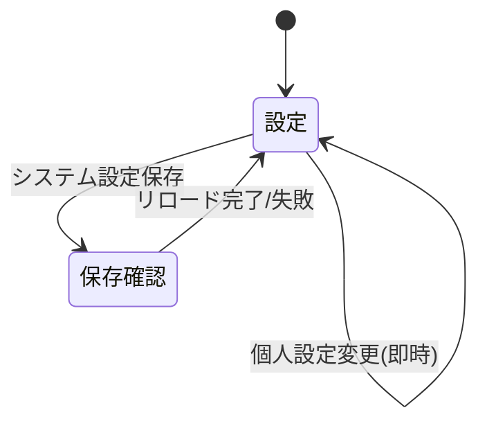

# 画面仕様：アプリ設定（画面ID: S-Settings）

| 項目 | 内容 |
|---|---|
| 画面ID | S-Settings |
| 画面名 | アプリ設定 |
| 関連ユースケース | US-12 / F-09 |
| 関連AC | AC-12 |
| 概要 | 言語・テーマ（個人設定）と、接続/ポリシー/更新間隔等のシステム設定（Admin）を管理する。 |

## 1. レイアウト

```
┌──────────────────────────────────────────────┐
│ 設定                                          │
│ ┌ 個人設定 ─────────────┐                     │
│ │ 言語   [ 日本語 ▾ ]    │                     │
│ │ テーマ [ ● dark ○ light ]                   │
│ └───────────────────────┘                     │
│ ┌ システム設定（Admin）─────────────────────┐ │
│ │ SSO接続   [issuer/client/...]  [接続テスト]│ │
│ │ 各ドメイン接続/有効化  [トグル一覧]         │ │
│ │ ダッシュボード更新間隔 [ 30 ] 秒            │ │
│ │ 監査/ログ保持          [ 90 ] 日           │ │
│ │                         [保存してリロード] │ │
│ └───────────────────────────────────────────┘ │
└──────────────────────────────────────────────┘
```

## 2. 画面部品一覧

| 部品ID | 部品名 | 種別 | 初期表示 | 備考 |
|---|---|---|---|---|
| C-01 | 言語選択 | ドロップダウン | 現在値 | ja/en。即時反映 |
| C-02 | テーマ選択 | ラジオ/トグル | 現在値 | dark/light。即時反映 |
| C-03 | SSO接続設定 | フォーム群 | Adminのみ | issuer/client_id/secret/redirect |
| C-04 | 接続テスト | ボタン | Adminのみ | SSO/各接続の疎通確認 |
| C-05 | ドメイン有効化 | トグル一覧 | Adminのみ | 各ドメインの表示/機能ON-OFF |
| C-06 | 数値設定 | 数値入力 | Adminのみ | 更新間隔・保持日数等 |
| C-07 | 保存してリロード | ボタン | Adminのみ | 設定ホットリロード |

## 3. 状態(State)ごとの表示

| 状態 | 発生条件 | 表示内容 |
|---|---|---|
| 正常(Success) | 表示時 | 現在設定を反映 |
| 読み込み中(Loading) | 取得中 | スケルトン |
| 保存中(Submitting) | 保存要求中 | ボタンをスピナー化 |
| 検証エラー(Validation) | 入力不正 | 該当項目に文言表示（下記5） |
| エラー(Error) | 保存/リロード失敗 | `設定の保存に失敗しました。` と詳細 |
| 権限(View) | Admin以外 | 個人設定のみ表示、システム設定は非表示/非活性（AC-04） |

## 4. イベント定義

| # | 部品 | イベント | 事前条件 | 動作・結果 |
|---|---|---|---|---|
| E-01 | 言語選択 | 変更 | - | 表示を即時に切替、選択を保存（次回も保持） |
| E-02 | テーマ選択 | 変更 | - | 表示を即時に切替、選択を保存 |
| E-03 | 接続テスト | クリック | Admin | 疎通結果を `接続に成功しました。`／`接続できません（詳細）。` で表示 |
| E-04 | ドメイン有効化 | トグル | Admin | ONで当該ドメインをサイドバー/機能に表示、OFFで非表示 |
| E-05 | 保存してリロード | クリック | Admin・入力妥当 | 設定を保存し**ホットリロード**、`設定を反映しました。`→監査記録 |
| E-06 | 保存 | クリック | 検証違反 | 該当項目に文言表示し保存しない |

## 5. 入力検証ルール

| 項目 | 必須 | 制約 | エラー文言 |
|---|---|---|---|
| issuer URL | SSO有効時必須 | http/https URL | `有効な issuer URL を入力してください。` |
| client_id | SSO有効時必須 | 1文字以上 | `client_id を入力してください。` |
| redirect URI | SSO有効時必須 | URL・自ホスト整合 | `有効な redirect URI を入力してください。` |
| 更新間隔(秒) | 必須 | 5〜3600 の整数 | `5〜3600 秒の範囲で入力してください。` |
| 保持日数 | 必須 | 1〜3650 の整数 | `1〜3650 日の範囲で入力してください。` |

## 6. 画面遷移



## 7. 補足

- 「ドメイン有効化」により、単一組織で使わないドメインは非表示にでき、スコープを絞れる（対象ユーザー方針に沿う）。
- 設定の実体（PortalConfig 相当）とホットリロードの意味論は 09_runtime_spec に規定。
- SSO の secret 等の機微情報はマスク表示。監査には値を残さない。
