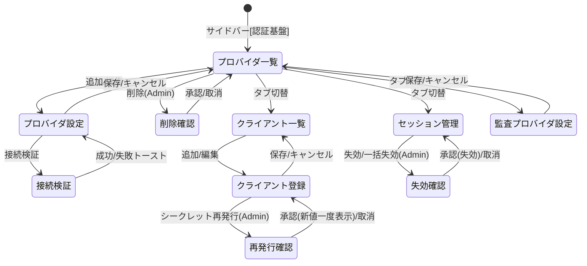

# 画面仕様：SSO／認証プロバイダ管理ドメイン（画面ID: S-SSO）

> 本仕様は統合再設計後の**統一認証基盤の *管理面*** を扱う。標準の一覧/作成/更新/削除の挙動・部品・状態・遷移は **[S-00 共通CRUD編集パターン](screen_common_crud.md) に準拠**し、本書は **SSO固有の差分（固有カラム・固有項目・固有操作）のみ**を記述する。
>
> **役割分担（重複回避）**：本ドメインは認証*基盤*の設定・管理（連携プロバイダ／OIDCクライアント／アクティブセッション／監査プロバイダ設定）に集中する。エンドユーザのログイン画面は **S-Login**、ドメインユーザ（メンバー）の管理は **S-Account**、横断的な認証イベント閲覧は **S-Audit** が担う。→ 詳細は「7. 補足」。

## ヘッダ表

| 画面ID | 画面名 | 関連機能 / AC | 概要 |
|---|---|---|---|
| S-SSO-01 | 連携プロバイダ一覧 | F-17 / AC-19 | 外部IdP（Google / GitHub / Azure / OIDCカスタム）連携設定の一覧。標準CRUDのハブ。 |
| S-SSO-02 | 連携プロバイダ設定（作成/編集） | F-17 / AC-19 | 外部IdP連携の登録・編集。種別ごとの必須項目検証と接続検証を持つ。 |
| S-SSO-03 | OIDCクライアント登録一覧 | F-17 / AC-19 | 本基盤をIdPとして利用する内部/外部クライアント（RP）の一覧。 |
| S-SSO-04 | OIDCクライアント登録（作成/編集） | F-17 / AC-19 | リダイレクトURI・グラント種別・スコープの登録。シークレット再発行を持つ。 |
| S-SSO-05 | アクティブセッション管理 | F-17 / AC-05 / AC-19 | 統一認証基盤の有効セッション一覧と失効（単一/一括）。 |
| S-SSO-06 | 監査連携先設定 | F-17 / AC-19 | 認証/監査イベントの外部連携（SIEM/Webhook）の設定。**横断共有構造 `NotificationTarget`（kind=`audit_sink`、07 §3.4）を編集するビュー**で、SSO固有の保存先は持たない（方針④の全統合に整合。Proxy/K8sが固有Webhookを廃した方針と一致）。閲覧はS-Auditへ委譲。 |

- **画面数：6画面**（S-SSO-01〜06）。
- 縮退により **移行元の「テナント管理」画面・各画面の「テナント選択セレクト」は廃止**（単一暗黙テナント）。移行元の「ユーザー管理」「監査ログ閲覧」は本ドメイン対象外（S-Account / S-Audit へ委譲）。

---

## 1. レイアウト（固有差分）

アプリシェル・ページヘッダー・一覧テーブル・スライドオーバーフォーム・ConfirmDialogは **S-00 と同一**。以下は固有領域のみ示す。

### S-SSO-02 連携プロバイダ設定フォーム（固有）

```
┌── 連携プロバイダ設定 ─────────────────────────┐
│ 表示名     [__________________]                │
│ 種別       [▾ Google/GitHub/Azure/OIDCカスタム]│
│ クライアントID     [__________________]         │
│ クライアントシークレット [•••••••] [再入力]     │
│ ─ OIDCカスタム時のみ表示 ────────────────────  │
│ 認可URL     [__________________]                │
│ トークンURL [__________________]                │
│ ユーザ情報URL[__________________]               │
│ ───────────────────────────────────────────── │
│ [ ] 有効   [ ] 自動プロビジョニング             │
│                    [接続検証] [キャンセル] [保存]│
└───────────────────────────────────────────────┘
```

### S-SSO-04 OIDCクライアント登録フォーム（固有）

```
┌── OIDCクライアント登録 ───────────────────────┐
│ クライアント名 [__________________]             │
│ クライアントID [自動採番/表示]                  │
│ リダイレクトURI[__________________] [＋行追加]  │
│ グラント種別  [☑ authorization_code ☐ ...]     │
│ スコープ      [openid profile email ...]        │
│ [ ] 有効                                        │
│  ── シークレット ──                             │
│  [表示: •••••••]  [シークレット再発行]           │
│                          [キャンセル] [保存]    │
└───────────────────────────────────────────────┘
```

### S-SSO-05 アクティブセッション管理（固有：一覧＋一括失効）

```
┌──────────────────────────────────────────────┐
│ アクティブセッション        [🔍  user/IP] [一括失効▾]│
├──────────────────────────────────────────────┤
│ □ | ユーザ | IP | 端末(UA) | 発行 | 期限 | 操作 │
│ □ | alice | .. | Chrome.. | .. | .. | [失効]   │
├──────────────────────────────────────────────┤
│ 選択: 2件   [選択を失効]                        │
└──────────────────────────────────────────────┘
```
> セッション管理は**参照＋失効のみ**（作成・編集なし）。「追加」ボタンは非表示。

---

## 2. 画面部品一覧（固有差分のみ／S-00の C-01〜C-09 を継承）

| 部品ID | 部品名 | 種別 | 初期表示 | 備考 |
|---|---|---|---|---|
| C-S01 | 種別セレクト | ドロップダウン | 常時 | Google/GitHub/Azure/OIDCカスタム。カスタム選択時のみURL群を表示 |
| C-S02 | 接続検証ボタン | ボタン | Operator以上で活性 | 保存前に外部IdPへの到達性・設定妥当性を検証（E-S01） |
| C-S03 | シークレット再入力/再発行 | ボタン | 編集時 | 値は伏字表示。再発行は破壊的操作としてConfirmDialog経由（E-S05） |
| C-S04 | リダイレクトURIリスト | 動的入力行 | 作成/編集 | 最低1件必須。行追加/削除可 |
| C-S05 | グラント種別チェック | チェック群 | 作成/編集 | 最低1つ必須 |
| C-S06 | 行選択チェック＋一括失効 | チェック＋ボタン | セッション画面 | 複数選択→まとめて失効（Admin） |
| C-S07 | 失効ボタン（行） | アイコンボタン | セッション行ごと | 単一セッション失効。ConfirmDialog経由 |
| C-S08 | 監査連携先入力 | フォーム | 監査設定画面 | 横断 `NotificationTarget`(kind=`audit_sink`) を編集：endpoint＋event_filter＋signing_secret（07 §3.4）。SSO固有の保存先は持たない |

> **ロール対応（統一RBAC）**：参照=Viewer、作成/編集=Operator、**破壊的・設定（プロバイダ削除・シークレット再発行・セッション失効・監査連携変更）=Admin**。C-01（追加）等の活性条件はS-00に準拠しつつ、破壊的操作はAdmin限定に引き上げる。

---

## 3. 状態(State)ごとの表示（固有差分のみ／他はS-00に準拠）

| 状態 | 発生条件 | 表示内容 |
|---|---|---|
| 空(Empty) | 連携プロバイダ0件 | `連携プロバイダが登録されていません。` ＋（Operator以上に）追加ボタン |
| 空(Empty)：セッション | 有効セッション0件 | `アクティブなセッションはありません。` |
| 検証エラー(Validation) | 必須欠落／URL不正 | 「5. 入力検証」の確定文言を該当項目直下に赤字表示し保存不可 |
| 接続検証中 | 接続検証ボタン押下後 | ボタンをスピナー化。結果は成功/失敗トーストで返す（E-S01） |
| 接続検証失敗 | 外部IdP到達不可／設定不整合 | `接続検証に失敗しました。設定を確認してください。`（詳細理由を併記） |
| 失効処理中 | セッション失効実行中 | 対象行/一括ボタンをスピナー化し二重実行を防止 |

---

## 4. イベント定義（SSO固有操作のみ／標準CRUDのE-01〜E-13はS-00に準拠）

| # | 部品 | イベント | 事前条件 | 動作・結果 |
|---|---|---|---|---|
| E-S01 | 接続検証ボタン | クリック | Operator以上・必須項目充足 | 外部IdPへ到達性/設定妥当性を検証。成功→`接続検証に成功しました。`／失敗→`接続検証に失敗しました。設定を確認してください。` |
| E-S02 | 保存ボタン（プロバイダ） | クリック | 必須項目未充足 | 欠落項目直下に確定文言を表示し保存しない（「5. 入力検証」参照）。監査記録なし |
| E-S03 | 種別セレクト | 変更（→OIDCカスタム） | - | 認可URL/トークンURL/ユーザ情報URLの入力欄を表示し必須化。他種別では非表示・不要 |
| E-S04 | 保存ボタン（クライアント） | クリック | リダイレクトURI 0件 or グラント種別 0件 | `リダイレクトURIを1件以上入力してください。` / `グラント種別を1つ以上選択してください。` を表示し保存しない |
| E-S05 | シークレット再発行 | クリック | Admin | ConfirmDialog `クライアントシークレットを再発行します。既存の値は無効になります。よろしいですか？` → 承認で新値発行＆一度だけ表示→トースト`再発行しました。`→監査記録 |
| E-S06 | 失効ボタン（行） | クリック | Admin | ConfirmDialog `このセッションを失効します。対象ユーザは再ログインが必要になります。よろしいですか？` → 承認で失効→一覧更新→トースト`失効しました。`→監査記録（AC-05準拠） |
| E-S07 | 選択を失効（一括） | クリック | Admin・1件以上選択 | ConfirmDialog `選択した N 件のセッションを失効します。よろしいですか？` → 承認で一括失効→一覧更新→トースト`N 件を失効しました。`→監査記録 |
| E-S08 | プロバイダ/クライアント削除 | 承認 | Admin・参照あり | S-00 E-10準拠：進行中の連携/依存クライアントがある場合 `他の設定から参照されているため削除できません。` で拒否 |
| E-S09 | 監査連携先 保存 | クリック | Admin・URL不正 or イベント未選択 | `通知先URLを正しく入力してください。` / `購読イベントを1つ以上選択してください。` を表示し保存しない |

> 更新系イベント（E-S05〜E-S07・E-S09、及び継承のE-07/E-09）は横断監査ログ（F-04）へ記録する。セッション失効の監査要件は **AC-05** に、破壊的操作のロール要件は **AC-19** に整合する。

---

## 5. 入力検証（SSO固有項目の確定文言）

| 項目 | 必須 | 制約 | エラー文言（確定） |
|---|---|---|---|
| 表示名（プロバイダ/クライアント） | 必須 | 1〜100文字 | `名称を正しく入力してください。` |
| 種別 | 必須 | 定義値のいずれか | `いずれかを選択してください。` |
| クライアントID | 必須 | 空不可 | `クライアントIDを入力してください。` |
| クライアントシークレット | 作成時必須 | 空不可（編集時は無入力で据置） | `クライアントシークレットを入力してください。` |
| 認可URL/トークンURL/ユーザ情報URL | 種別=OIDCカスタム時のみ必須 | 妥当なURL（https） | `URLを正しく入力してください（https）。` |
| リダイレクトURI | 必須（1件以上） | 各行が妥当なURI | `リダイレクトURIを1件以上入力してください。` |
| グラント種別 | 必須（1つ以上） | 定義値 | `グラント種別を1つ以上選択してください。` |
| 監査連携先URL | 必須 | 妥当なURL | `通知先URLを正しく入力してください。` |
| 購読イベント | 必須（1つ以上） | 定義イベント | `購読イベントを1つ以上選択してください。` |

---

## 6. 画面遷移（固有）



---

## 7. 補足

- **テナント縮退**：統合後は **単一組織前提＝マルチテナント外**。移行元SSOの「テナント」概念は**単一の暗黙テナントに縮退**する。よって（1）テナントCRUD画面、（2）各画面先頭の「テナント選択セレクト」、（3）テナント統計サマリは**すべて廃止**。プロバイダ/クライアント/セッション/監査設定はすべてこの単一テナントに従属する（UIからテナントを意識させない）。
- **役割分担（重複回避）**：
  - **S-Login**：エンドユーザの認証（ローカル＋SSO）を行うログイン画面。本ドメインは*設定を提供する側*で、ログイン体験そのものは扱わない。
  - **S-Account**：ドメインユーザ（メンバー）の作成・ロール割当・状態管理。移行元「ユーザー管理」は統一RBACのもとS-Accountへ集約し、本ドメイン対象外。
  - **S-Audit**：認証イベントを含む横断監査ログの閲覧。移行元「監査ログ閲覧」画面は廃止し、本ドメインは**監査連携先の設定（S-SSO-06）**のみを持つ（閲覧はS-Auditへ委譲）。S-SSO-06 は横断 `NotificationTarget`(kind=`audit_sink`、07 §3.4) を編集するビューであり、固有の保存先は作らない（Proxy/K8s が固有 Webhook を廃した全統合方針と一致）。
  - 本ドメイン（S-SSO）：外部IdP連携／OIDCクライアント登録／アクティブセッション管理／監査連携先設定＝**認証基盤の設定・管理面**に集中。
- **RBAC**：参照=Viewer、作成/編集=Operator、破壊的・設定（削除・シークレット再発行・セッション失効・監査連携変更）=Admin（AC-19整合）。セッション失効の監査はAC-05に準拠。
- **秘匿値**：クライアントシークレット等は保存後は伏字表示し、平文再取得は不可。再発行時のみ一度だけ平文表示する。
- **標準準拠**：一覧の検索/フィルタ/ページング/ソート、作成・編集フォームの開閉、削除確認、トースト、状態表示（Loading/Error/Forbidden等）、アクセシビリティ・i18n・レスポンシブは **S-00 に準拠**する。
