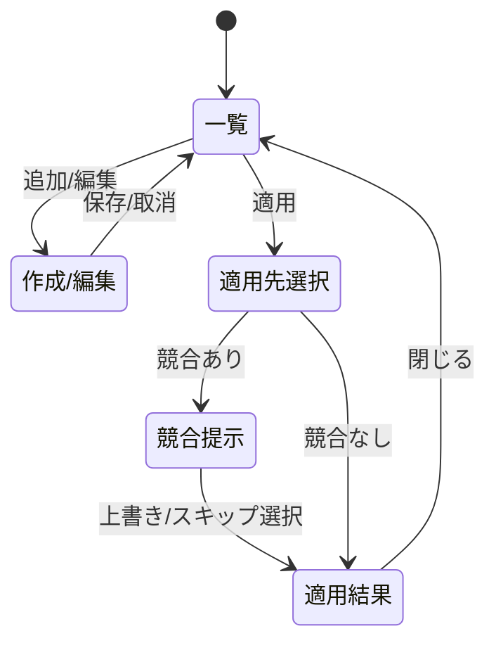

# 画面仕様：横断テンプレート管理（画面ID: S-Template）

| 項目 | 内容 |
|---|---|
| 画面ID | S-Template |
| 画面名 | 横断テンプレート管理 |
| 関連ユースケース | US-10 / F-07 |
| 関連AC | AC-10 / AC-CRUD |
| 概要 | 定型設定の雛形（`Template`）をドメイン横断で登録・編集し、対象へ一括適用する横断機能。各ドメイン画面は「テンプレートは本画面を参照」とする、その参照先の実体。 |

> **穴埋め（2026-07-05 レビュー追補）**：各ドメイン画面が「テンプレートは横断共通機能を参照」とする先の実体がなかったため新設。テンプレート適用の実行意味論は 08_ops_logic §2、データは 07 §3.5 `Template`。

## 1. レイアウト

```
┌──────────────────────────────────────────────┐
│ テンプレート   [ドメイン▾]        [＋ 作成]      │
├──────────────────────────────────────────────┤
│ 名称        | ドメイン | 説明        | 操作       │
│ std-web-zone| DNS      | 標準Webゾーン|[適用][✎][🗑]│
│ base-cluster| K8s      | 基本クラスタ |[適用][✎][🗑]│
└──────────────────────────────────────────────┘
   [適用] → 適用先選択 → 競合提示 → 結果
```

作成/編集は S-00 のスライドオーバー（`body` は等幅の JSON/YAML エディタ、ドメイン別スキーマ）。

## 2. 画面部品一覧

| 部品ID | 部品名 | 種別 | 初期表示 | 備考 |
|---|---|---|---|---|
| C-01 | ドメインフィルタ | ドロップダウン | 全 | テンプレート対応ドメインで絞り込み |
| C-02 | 作成ボタン | ボタン | Operator以上 | S-00 準拠 |
| C-03 | テンプレート一覧 | テーブル | データ依存 | 名称/ドメイン/説明 |
| C-04 | 適用ボタン | 行アクション | Operator以上 | 適用先選択→競合提示（08_ops_logic §2） |
| C-05 | 編集/削除 | 行アクション | Operator以上 | S-00 準拠 |
| C-06 | body エディタ | JSON/YAMLエディタ | 作成/編集時 | ドメイン別スキーマ（07 §3.5 / 各 07_data_<domain>） |
| C-07 | 適用結果パネル | 結果表示 | 適用後 | 成功/スキップ/失敗の件数 |

## 3. 状態(State)ごとの表示

| 状態 | 発生条件 | 表示内容 |
|---|---|---|
| 空(Empty) | 0件 | `テンプレートがありません。` と作成ボタン |
| 読み込み中(Loading) | 取得中 | スケルトン |
| 正常(Success) | データあり | 一覧表示 |
| 適用中(Progress) | 一括適用中 | 進捗・二重実行防止 |
| 検証エラー(Validation) | body 不正 | `テンプレートの内容が不正です（<詳細>）。` を表示し保存しない |
| エラー(Error) | 取得/適用失敗 | `処理に失敗しました。` と [再試行] |
| 権限不足 | Viewer | 作成/適用/編集/削除は非活性（AC-04） |

## 4. イベント定義

| # | 部品 | イベント | 事前条件 | 動作・結果 |
|---|---|---|---|---|
| E-01 | 作成 | クリック | Operator以上 | body エディタ（ドメイン選択）を開く |
| E-02 | 保存 | クリック | body 妥当 | 保存→一覧更新→トースト→監査記録 |
| E-03 | 適用 | クリック | Operator以上 | 適用先を選択→競合検出（08_ops_logic §2.2） |
| E-04 | 適用（競合あり） | 続行 | 既存と競合 | `N 件が既存設定と競合します。`（AC-10）→ 上書き/スキップ選択 |
| E-05 | 適用 実行 | 承認 | - | 適用→`成功/スキップ/失敗`の件数表示→監査記録 |
| E-06 | 編集/削除 | クリック | Operator以上 | S-00 準拠（削除は確認ダイアログ） |

## 5. 入力検証ルール

| 項目 | 必須 | 制約 | エラー文言 |
|---|---|---|---|
| 名称 | 必須 | domain内一意・1〜50文字 | `名称を入力してください。`／`同じ名称が既に存在します。` |
| ドメイン | 必須 | テンプレート対応ドメイン | `適用先ドメインを選択してください。` |
| body | 必須 | ドメイン別スキーマに適合 | `テンプレートの内容が不正です（<詳細>）。` |

## 6. 画面遷移



## 7. 補足

- テンプレート対応ドメインは 07 §3.5／各 07_data_<domain> で `body` スキーマを定義（例：DNS レコード群 S-DNS-07、K8s 構成 S-K8S-06）。対応ドメインのみフィルタ/作成に現れる。
- 各ドメインの固有テンプレ画面（例 S-DNS-07 のテンプレタブ）は「そのドメインに絞った本画面のビュー」として整合させる（機能重複ではなく、横断＝本画面／ドメイン起点＝各ドメイン画面のフィルタ済みビュー）。
- 適用の競合検出・結果集計・原子性は 08_ops_logic §2。権限は Operator（08_authz Write）。
