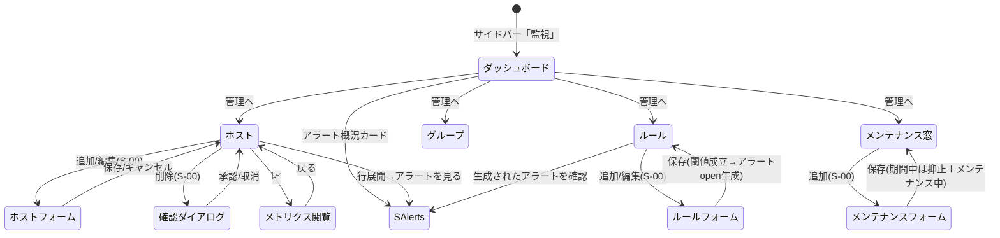

# 画面仕様：監視(Watch) ドメイン（画面ID: S-WATCH）

| 項目 | 内容 |
|---|---|
| 画面群ID | S-WATCH-01 〜 S-WATCH-06 |
| ドメイン名 | 監視(Watch) |
| 関連ユースケース | US-20 |
| 関連機能 / AC | F-18 / AC-CRUD, AC-20 |
| 継承 | 標準CRUD＝**S-00 に準拠**、横断アラート＝**S-Alerts**、監査＝**S-Audit** |
| 概要 | 監視ホスト・監視ルール・グループ・メンテナンス窓を管理し、メトリクス時系列を閲覧する。**アラートを生成する側**の固有機能に集中する。 |

> 本仕様は S-00（共通CRUD＋アプリシェル）を前提とし、**監視固有の差分（固有カラム・固有項目・固有操作）のみ**を記述する。一覧/作成/更新/削除の共通挙動・状態表示・共通イベント・トースト・監査記録は S-00 を参照。
>
> **統合方針の反映**：完全統合モノリスにより、サービス個別認証(JWT)・`get_service_token("watch")` は撤廃。認証は統一セッション、認可は RBAC 統一（参照=Viewer／作成・更新・削除=Operator／破壊的な一括操作=Admin）。単一組織前提。

## ヘッダ（画面一覧）

| 画面ID | 画面名 | パス | F / AC | 継承 | 概要（固有差分） |
|---|---|---|---|---|---|
| S-WATCH-01 | 監視ダッシュボード | `/watch` | F-18 / AC-20 | 固有（参照） | ホスト稼働数・アラート概況・監視タスク状態の集計表示。各管理画面／S-Alerts への起点。 |
| S-WATCH-02 | 監視ホスト | `/watch/hosts` | F-18 / AC-CRUD, AC-20 | S-00＋固有 | 監視対象ホストの一覧/CRUD。状態バッジ・`メンテナンス中`バッジ・行詳細（メトリクス/ホスト別アラートはS-Alerts）。 |
| S-WATCH-03 | 監視ルール | `/watch/rules` | F-18 / AC-CRUD, AC-20 | S-00＋固有 | メトリクス別の警告/危険閾値・重大度を定義。**条件成立でアラートを open 生成**。 |
| S-WATCH-04 | ホストグループ | `/watch/groups` | F-18 / AC-CRUD | S-00 | 複数ホストを論理グループ化。標準CRUD。 |
| S-WATCH-05 | メンテナンス窓 | `/watch/maintenance` | F-18 / AC-CRUD, AC-20 | S-00＋固有 | 計画停止期間を登録。**期間中は対象ホストのアラートを抑止**し `メンテナンス中` を付与。 |
| S-WATCH-06 | メトリクス閲覧 | `/watch/hosts/{id}/metrics` | F-18 / AC-20 | 固有（参照） | ホスト単位の CPU/メモリ/ディスク/ネットワークの時系列表示（AC-20 整合）。 |

> **本ドメインに含めない画面**：アラート一覧・確認・解決は **S-Alerts** に集約（ドメインフィルタ=監視）。操作監査ログは **S-Audit**（ドメイン=監視）。旧 `WatchHealthPage` は S-WATCH-01 のヘルス／監視タスク節へ統合、旧 `WatchAlertsPage`・`WatchAuditLogsPage` は撤廃（横断へ移管）。

---

## S-WATCH-01：監視ダッシュボード（`/watch`）

参照専用。CRUD なし。

### 1. レイアウト

```
┌──────────────────────────────────────────────────────────┐
│ 監視 ダッシュボード                              [更新]    │
├──────────────────────────────────────────────────────────┤
│ [status] [version] [Uptime]      ← サービス稼働（ヘルス）  │
│ [ホスト総数][オンライン][オフライン][警告]  ← ホスト集計   │
│ [未対応アラート][危険アラート]    → クリックで S-Alerts へ │
├──────────────────────────────────────────────────────────┤
│ 監視タスク: 名前 | 状態 | 最終実行          (data-table)   │
│ 構成要素(Database等): 名前 | 状態 | レイテンシ (data-table)│
└──────────────────────────────────────────────────────────┘
```

### 2. 画面部品（固有差分）

| 部品ID | 部品名 | 種別 | 初期表示 | 備考 |
|---|---|---|---|---|
| W1-01 | サービス稼働カード群 | stat-card | 常時 | status / version / uptime_seconds（`s`付き） |
| W1-02 | ホスト集計カード群 | stat-card | 常時 | hosts_total / online / offline / warning |
| W1-03 | アラート概況カード | stat-card（リンク） | 常時 | alerts_open / alerts_critical。クリックで **S-Alerts（ドメイン=監視）** へ遷移 |
| W1-04 | 監視タスク表 | data-table | データ依存 | 名前/状態/最終実行 |
| W1-05 | 構成要素表 | data-table | 構成要素ありのみ | 名前/状態/レイテンシ（ms） |

### 3. 状態（固有差分）

| 状態 | 発生条件 | 表示 |
|---|---|---|
| 正常 | 取得成功 | カード＋タスク/構成要素表を表示 |
| 縮退 | ヘルス degraded/down | 該当カードを警告色。監視タスク `stopped` は行を警告色 |
| 空 | 監視タスク0件 | `監視タスクがありません。` |
| エラー | 取得失敗 | `監視情報の取得に失敗しました。` と [再試行]（S-00 準拠） |

### 4. イベント（固有差分）

| # | 部品 | イベント | 事前条件 | 動作・結果 |
|---|---|---|---|---|
| E-01 | 更新ボタン | クリック | - | ヘルス・集計・タスクを再取得 |
| E-02 | アラート概況カード | クリック | - | S-Alerts（状態=open／ドメイン=監視）へ遷移 |

---

## S-WATCH-02：監視ホスト（`/watch/hosts`）

一覧/作成/更新/削除は **S-00 に準拠**。以下は固有差分のみ。

### 1. レイアウト（固有カラム）

```
┌──────────────────────────────────────────────────────────┐
│ 監視ホスト                    [🔍検索] [状態▾][グループ▾][＋追加]│
├──────────────────────────────────────────────────────────┤
│ □ 名前 | IP | ホスト名 | 状態 | 種別 | SNMP | Agent | Tags | 操作 │
│ □ web1 |.10 | web1.ex  |●online|server| 有  | 1.0.2 | prod |[✎][🗑][📈]│
│ □ db1  |.20 | db1.ex   |🛠メンテ中|server| 無  | 1.0.2 | prod |[✎][🗑][📈]│
└──────────────────────────────────────────────────────────┘
```

### 2. 画面部品（固有差分）

| 部品ID | 部品名 | 種別 | 初期表示 | 備考 |
|---|---|---|---|---|
| W2-01 | 状態フィルタ | ドロップダウン | 全 | online / offline / warning |
| W2-02 | グループフィルタ | ドロップダウン | 全 | 所属グループで絞り込み |
| W2-03 | 状態バッジ | status-badge | 行ごと | `online`/`offline`/`warning` で配色 |
| W2-04 | メンテナンス中バッジ | badge | 該当時 | 有効なメンテナンス窓の対象ホストに `メンテナンス中`（AC-20） |
| W2-05 | メトリクス表示ボタン | 行アクション（📈） | 行ごと | S-WATCH-06 へ遷移 |
| W2-06 | ホスト詳細（行展開） | 展開 | 任意 | last_seen / os_type / description / タグ。ホスト別アラートは **S-Alerts へのリンク** |

### 3. 入力検証（固有）

| 項目 | 必須 | 制約 | エラー文言 |
|---|---|---|---|
| 名前 | 必須 | 1〜100文字・一意 | `名称を正しく入力してください。` |
| IP アドレス | 必須 | IPv4/IPv6 形式 | `有効な IP アドレスを入力してください。` |
| ホスト名(FQDN) | 任意 | ホスト名形式 | `有効なホスト名を入力してください。` |
| SNMP 有効 | 任意 | 真偽 | - |
| タグ | 任意 | 各1〜30文字 | `タグは30文字以内で入力してください。` |

> 作成入力＝`name`(必須)/`ip_address`(必須)/`hostname`/`description`/`host_type`(既定 `server`)/`snmp_enabled`(既定 false)/`tags`。更新は部分更新（指定項目のみ）。

### 4. イベント（固有差分）

| # | 部品 | イベント | 事前条件 | 動作・結果 |
|---|---|---|---|---|
| E-01 | 状態/グループフィルタ | 変更 | - | 条件で一覧再取得（S-00 E-03 準拠） |
| E-02 | メトリクス表示 | クリック | - | S-WATCH-06（当該ホスト）へ遷移 |
| E-03 | 行展開 | クリック | - | 詳細表示。`アラートを見る` は S-Alerts（host_id 絞り込み）へ |
| E-04 | 削除 | 承認 | Operator以上 | S-00 E-09。参照（グループ/ルール/メンテナンス窓が当該ホストを指す）ありは AC-CRUD の参照整合に従い確認 |

---

## S-WATCH-03：監視ルール（`/watch/rules`）

一覧/作成/削除は **S-00 に準拠**。**アラートを生成する中核画面**。

### 1. レイアウト（固有カラム）

```
┌──────────────────────────────────────────────────────────┐
│ 監視ルール                                       [＋追加]  │
├──────────────────────────────────────────────────────────┤
│ 名前 | 対象ホスト | メトリクス | 警告閾値 | 危険閾値 | 有効 | 操作 │
│ CPU高| (全体)     | cpu_percent|  80     |  95     | ●有効|[✎][🗑]│
└──────────────────────────────────────────────────────────┘
```

### 2. 画面部品（固有差分）

| 部品ID | 部品名 | 種別 | 初期表示 | 備考 |
|---|---|---|---|---|
| W3-01 | 対象ホスト選択 | ドロップダウン | 既定=全体 | 未指定は全ホスト適用の全体ルール |
| W3-02 | メトリクス選択 | セレクト | 既定=cpu_percent | cpu_percent / memory_percent / disk_percent / process_missing / port_down / command_failed |
| W3-03 | 警告閾値入力 | 数値 | 空 | 重大度=warning のアラートを生成する境界 |
| W3-04 | 危険閾値入力 | 数値 | 空 | 重大度=critical のアラートを生成する境界 |
| W3-05 | 有効トグル | スイッチ | 既定=有効 | 無効時は評価停止（アラート生成なし） |

### 3. 入力検証（固有）

| 項目 | 必須 | 制約 | エラー文言 |
|---|---|---|---|
| ルール名 | 必須 | 1〜100文字 | `名称を正しく入力してください。` |
| メトリクス | 必須 | 定義値のいずれか | `いずれかを選択してください。` |
| 警告/危険閾値 | 任意（いずれか1つ以上必須） | 数値。%系は 0〜100 | `0〜100 の数値を入力してください。` |
| 閾値の整合 | 条件付 | 警告 ≦ 危険（%系・使用率上振れ時） | `危険閾値は警告閾値以上にしてください。` |

### 4. イベント（固有＝アラート生成の中核）

| # | 部品 | イベント | 事前条件 | 動作・結果 |
|---|---|---|---|---|
| E-01 | 保存ボタン | クリック | 入力妥当・Operator以上 | ルールを作成/更新→有効化。以降、監視評価で **メトリクスが閾値超過（条件成立）した時にアラートを `open` で生成**（危険閾値=critical／警告閾値=warning）。生成アラートは **S-Alerts** に現れる（AC-20） |
| E-02 | 有効トグル | 変更 | Operator以上 | 有効/無効を即時反映。無効化中は当該ルールによるアラート生成を停止。監査記録 |
| E-03 | 対象ホスト=メンテナンス窓中 | （評価時） | 有効なメンテナンス窓に該当 | 条件成立してもアラートを**抑止**（S-WATCH-05・AC-20 参照） |
| E-04 | 削除 | 承認 | Operator以上 | S-00 E-09。削除後は当該ルールによる新規生成を停止（既存アラートは S-Alerts 側で管理） |

---

## S-WATCH-04：ホストグループ（`/watch/groups`）

**全面的に S-00 に準拠**（一覧/作成/削除）。固有差分は下記のみ。

| 部品/項目 | 内容 |
|---|---|
| 固有カラム | 名前 / 説明 / ホスト数（`host_ids` 件数） / 操作 |
| 固有入力 | `name`(必須・1〜100文字・一意) / `description` / `host_ids`（メンバー選択。作成直後は空可） |
| 固有検証 | 名前必須・一意：`同じ名称が既に存在します。` |
| 参照整合 | グループを対象にした監視ルール/メンテナンス窓がある場合、削除は AC-CRUD 参照整合に従う |

---

## S-WATCH-05：メンテナンス窓（`/watch/maintenance`）

一覧/作成/削除は **S-00 に準拠**。固有はアラート抑止の挙動。

### 1. レイアウト（固有カラム）

```
┌──────────────────────────────────────────────────────────┐
│ メンテナンス窓                                   [＋追加]  │
├──────────────────────────────────────────────────────────┤
│ 名前 | 対象ホスト | 理由 | 開始日時 | 終了日時 | 状態 | 操作 │
│ 定期 | web1       | 更新 | 07-06 01:00|07-06 03:00|予定 |[🗑]│
│ 緊急 | db1        | 復旧 | 07-05 22:00|07-05 23:00|🛠実施中|[🗑]│
└──────────────────────────────────────────────────────────┘
```

### 2. 画面部品（固有差分）

| 部品ID | 部品名 | 種別 | 初期表示 | 備考 |
|---|---|---|---|---|
| W5-01 | 対象ホスト選択 | ドロップダウン | 任意 | 未指定は全体メンテナンス |
| W5-02 | 開始/終了日時 | datetime-local | - | 期間 |
| W5-03 | 状態バッジ | badge | 行ごと | `予定`（開始前）/`実施中`（期間内）/`終了`（過去） |

### 3. 入力検証（固有）

| 項目 | 必須 | 制約 | エラー文言 |
|---|---|---|---|
| メンテナンス名 | 必須 | 1〜100文字 | `名称を正しく入力してください。` |
| 開始日時 | 必須 | 妥当な日時 | `開始日時を入力してください。` |
| 終了日時 | 必須 | 開始 < 終了 | `終了日時は開始日時より後にしてください。` |

### 4. イベント（固有＝アラート抑止）

| # | 部品 | イベント | 事前条件 | 動作・結果 |
|---|---|---|---|---|
| E-01 | 保存ボタン | クリック | 入力妥当・Operator以上 | メンテナンス窓を登録。**期間内は対象ホスト（未指定時は全体）のアラート生成を抑止** |
| E-02 | 期間開始（自動） | 開始日時到来 | - | 対象ホストに `メンテナンス中` バッジ付与（S-WATCH-02 W2-04／AC-20）。抑止中に条件成立したアラートは生成せず、S-Alerts 側で `抑止中` として区別（S-Alerts 補足連携） |
| E-03 | 期間終了（自動） | 終了日時到来 | - | バッジ解除・抑止解除。以降は通常評価に復帰 |
| E-04 | 削除 | 承認 | Operator以上 | S-00 E-09。実施中の窓を削除すると即時に抑止解除（監査記録） |

---

## S-WATCH-06：メトリクス閲覧（`/watch/hosts/{id}/metrics`）

参照専用。CRUD なし。AC-20 のメトリクス時系列表示に整合。

### 1. レイアウト

```
┌──────────────────────────────────────────────────────────┐
│ ◀ ホストへ戻る   web1 のメトリクス     [期間▾] [更新]      │
├──────────────────────────────────────────────────────────┤
│ CPU使用率(%)      ┌───折れ線グラフ───┐                     │
│ メモリ使用率(%)   ┌───折れ線グラフ───┐  ← used/total から算出│
│ ディスク使用率(%) ┌───折れ線グラフ───┐                     │
│ ネットワーク(rx/tx)┌──折れ線グラフ───┐                     │
├──────────────────────────────────────────────────────────┤
│ 最新値: CPU 42% / MEM 61% / DISK 78% / rx 1.2MB tx 0.4MB   │
└──────────────────────────────────────────────────────────┘
```

### 2. 画面部品（固有）

| 部品ID | 部品名 | 種別 | 初期表示 | 備考 |
|---|---|---|---|---|
| W6-01 | 期間プリセット | ドロップダウン | 既定=直近1h | 1h / 6h / 24h / 7d |
| W6-02 | メトリクス時系列グラフ | 折れ線チャート | データ依存 | CPU% / メモリ% / ディスク% / ネットワーク rx・tx を `recorded_at` 昇順で描画 |
| W6-03 | 最新値サマリ | stat-card | 常時 | 直近レコードの各値。使用率は used/total から算出 |
| W6-04 | 閾値ライン | グラフ補助線 | ルールありのみ | 当該ホストの監視ルール警告/危険閾値を重畳表示（S-WATCH-03 連携） |

### 3. 状態（固有差分）

| 状態 | 発生条件 | 表示 |
|---|---|---|
| 空 | 該当期間にメトリクス0件 | `この期間のメトリクスはありません。` |
| 読み込み中 | 取得中 | チャート領域にスケルトン |
| エラー | 取得失敗 | `メトリクスの取得に失敗しました。` と [再試行] |

### 4. イベント（固有）

| # | 部品 | イベント | 事前条件 | 動作・結果 |
|---|---|---|---|---|
| E-01 | 期間プリセット | 変更 | - | 選択期間でメトリクスを再取得し全グラフ再描画 |
| E-02 | 更新ボタン | クリック | - | 現期間で再取得 |
| E-03 | 戻るリンク | クリック | - | S-WATCH-02 へ戻る |

---

## 画面遷移（監視ドメイン）



---

## 7. 補足（S-Alerts／S-Audit との役割分担）

- **アラートの閲覧・確認(acknowledge)・解決(resolve)・一括操作・通知(Webhook)設定は S-Alerts に集約**。監視ドメインは**アラートを生成する側**（監視ルールの閾値/重大度＝S-WATCH-03、メンテナンス窓による抑止＝S-WATCH-05）に責務を限定する。ホスト別アラートは S-Alerts をドメイン=監視・host_id で絞り込んで参照する。
- **監視ルール（F-18）が条件成立でアラートを `open` 生成**し、S-Alerts のヘッダー未確認数バッジ（S-00）と連動する。危険閾値超過=critical／警告閾値超過=warning。
- **メンテナンス窓の期間中**は対象ホストのアラート生成を抑止し、当該ホストに `メンテナンス中` バッジを表示（AC-20）。抑止対象は S-Alerts で `抑止中` として区別表示（S-Alerts 補足連携）。
- **操作監査は横断共通（S-Audit / F-04）へ集約**。監視ドメインの全更新系（ホスト/ルール/グループ/メンテナンス窓の作成・更新・削除、ルール有効切替）は S-00 のイベント（E-07/E-09）に従い横断監査ログへ記録し、S-Audit（ドメイン=監視）で参照する。監視ドメイン固有の監査ログ画面は持たない。
- **認可**：参照系（ダッシュボード/ホスト一覧/メトリクス/ヘルス）は Viewer 以上。作成・更新・削除・有効切替は Operator 以上。破壊的な一括操作は Admin（S-00／AC-CRUD）。
- **アクセシビリティ／レスポンシブ／i18n** は S-00 の共通規定に準拠。メトリクスグラフには数値サマリ（W6-03）を併記し、色のみに依存しない状態伝達とする。
